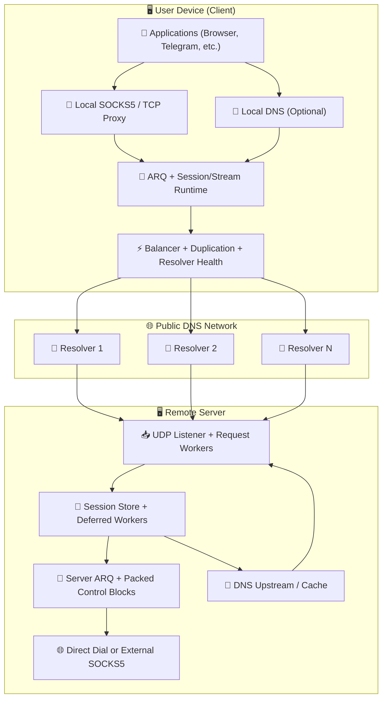
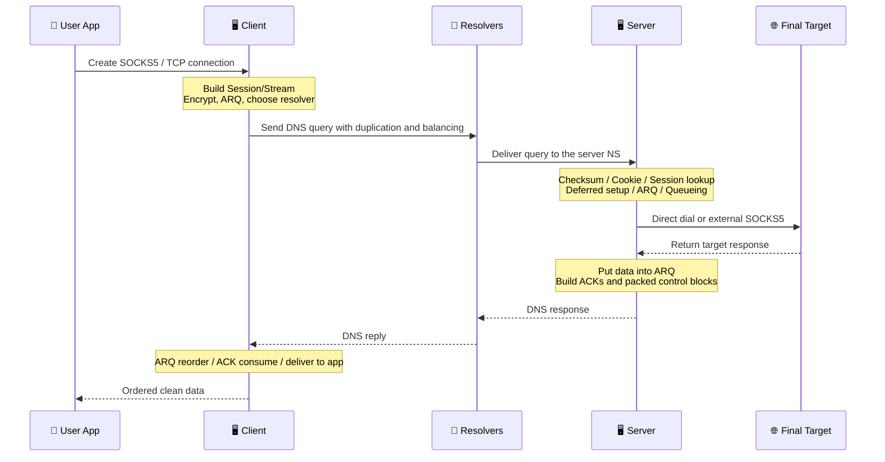

# MasterDnsVPN Project 🔐

## | 🇮🇷 [فارسی](https://github.com/masterking32/MasterDnsVPN/blob/main/README_FA.MD) | 🇬🇧 [English](https://github.com/masterking32/MasterDnsVPN/blob/main/README.MD) | 🇷🇺 [Русский](https://github.com/masterking32/MasterDnsVPN/blob/main/README_RU.MD) | 🇨🇳 [中文](https://github.com/masterking32/MasterDnsVPN/blob/main/README_ZH.MD) | 🇪🇸 [Español](https://github.com/masterking32/MasterDnsVPN/blob/main/README_ES.MD) | 🇮🇹 [Italiano](https://github.com/masterking32/MasterDnsVPN/blob/main/README_IT.MD) |

**MasterDnsVPN** es un proyecto científico y orientado a la investigación para transportar tráfico TCP a través de consultas y respuestas DNS. En su objetivo general, es similar a proyectos como DNSTT o SlipStream, pero sigue una estructura y un enfoque de implementación fundamentalmente diferentes.
Este sistema está diseñado en torno a la compatibilidad con muchos comportamientos de resolutores y condiciones de red adversas, con el objetivo de preservar la mayor estabilidad y entrega de datos posibles incluso en los peores casos.


[](https://deepwiki.com/masterking32/MasterDnsVPN)
[](https://oosmetrics.com/achievement/5c7b2ce0-0af6-4648-8ded-fd1e847096cd)
[](https://oosmetrics.com/achievement/355e590f-9b4a-4015-bb8c-a7f27b721711)
[](https://oosmetrics.com/achievement/4b98a42e-bf63-4f55-a382-0f10359a5e20)

<a href="https://trendshift.io/repositories/23688" target="_blank"></a>

### 📊 MasterDnsVPN Comparado con Proyectos Similares

| Característica | SlipStream | DNSTT | MasterDnsVPN |
| :--- | :--- | :--- | :--- |
| Tipo de protocolo | Túnel DNS avanzado | Túnel DNS clásico | Túnel DNS avanzado / VPN |
| Protocolo de transporte | QUIC | KCP + Noise | Protocolo personalizado + ARQ |
| Sobrecarga de cabecera de transporte | 🟠 ~24B | 🔴 ~59B | 🟢 ~5–7B<br>≈88% menor que DNSTT<br>≈71% menor que SlipStream |
| Estilo de cifrado | TLS 1.3 (dentro de QUIC) | Noise (Curve25519) | AES / ChaCha20 / XOR (si se usa XOR: ligero, con menor seguridad y sin sobrecarga adicional) |
| Arquitectura | Unificada (QUIC gestiona todo) | Multicapa (KCP + SMUX + Noise) | 🟢 Diseño personalizado y ligero optimizado para DNS |
| Velocidad | 🟡 Alta (hasta ~5× más rápida que DNSTT) | 🔴 Media | 🟢 Más rápida que las demás<br>Hasta ~9× más rápida que DNSTT<br>Hasta ~3,6× más rápida que SlipStream |
| Estabilidad ante pérdida de paquetes | 🟡 Buena | 🟠 Media | 🟢 Muy alta (Multipath + ARQ) |
| Soporte multirresolutor | Sí (multipath) | ❌ | Sí — avanzado (multirresolutor + duplicación) |
| Resiliencia ante censura intensa | Buena | Media | Muy fuerte (un objetivo central del proyecto) |
| Complejidad de configuración | Media | Simple | Instalación más sencilla<br>Más compleja solo si personalizas mucho los ajustes avanzados |
| Soporte SOCKS5 | Sí | Sí | Optimizado para SOCKS5 / SOCKS4 con menor sobrecarga de SOCKS |
| Soporte Shadowsocks | ✅ | ❌ | Indirectamente: el modo TCP Forwarding puede transportar protocolos basados en TCP<br>p. ej. Shadowsocks, VLESS/VMess, etc. |
| Multipath real | Sí (QUIC multipath) | ❌ | Sí (multirresolutor + duplicación) |
| Enrutamiento adaptativo | Limitado | ❌ | Avanzado (basado en latencia/pérdida) |
| Objetivo de diseño | Alta velocidad y eficiencia | Simplicidad y estabilidad | Sobrevivir a las redes más adversas — estabilidad, velocidad y eficiencia |
| Lenguaje de implementación | Rust | Go | La versión principal es Go<br>También existe una versión heredada en Python |
| Balanceador integrado | 🔴 | ❌ | 🟢 (8 modos de balanceo integrados) |
| Sistema de duplicación | ❌ | ❌ | Sí — aumenta el tráfico para mejorar la fiabilidad (configurable o desactivable) |
| Tolerancia de MTU | Mejor que DNSTT | - | Funciona incluso con MTU muy pequeña porque la sobrecarga del protocolo es muy baja |
| Sistema de failover | ❌ | ❌ | ✅ |
| Velocidad de descarga 10MB (Local) | 🟡 0,978s | 🔴 2,492s | 🟢 0,270s |
| Velocidad de subida 10MB (Local) | 🟡 3,249s | 🔴 16,207s | 🟢 1,746s |
| Comprobaciones de salud de resolutores y desactivación automática | ❌ | ❌ | ✅ |
| Reactivación en segundo plano de resolutores saludables | ❌ | ❌ | ✅ |
| Servicio DNS local en el cliente (para reducir el secuestro de DNS) | ❌ | ❌ | ✅ (con caché DNS robusta) |
| Resolución DNS a través de SOCKS5 | ❌ | ❌ | ✅ (con caché DNS) |
| Configuración profesional de grano fino | 🟠 | 🟠 | 🟢 Casi cada subsistema es configurable |
| No requiere software auxiliar externo | ❌ | ❌ | 🟢 No se requiere software adicional; si es necesario, aún puedes combinarlo con SOCKS o herramientas como Shadowsocks u OpenVPN |

---

### ❌ Descargo de responsabilidad

MasterDnsVPN se proporciona únicamente como un proyecto educativo y de investigación.

- **Proporcionado sin garantía:** Este software se proporciona "TAL CUAL", sin ninguna garantía expresa o implícita, incluidas las de comerciabilidad, idoneidad para un fin particular o no infracción.
- **Limitación de responsabilidad:** Los desarrolladores y colaboradores de este proyecto no aceptan ninguna responsabilidad por daños directos, indirectos, incidentales, consecuentes o de otro tipo derivados del uso de este software o de la imposibilidad de usarlo.
- **Responsabilidad del usuario:** Usar este proyecto fuera de entornos de prueba puede interrumpir o dañar el comportamiento de la red. El usuario es el único responsable de todas las consecuencias de la instalación, configuración y uso.
- **Cumplimiento legal:** Usar este proyecto para eludir las leyes locales puede acarrear consecuencias civiles o penales. Por favor, revisa las leyes y regulaciones de tu país antes de usarlo. Los desarrolladores no aceptan ninguna responsabilidad por las infracciones de leyes locales, nacionales o internacionales por parte de los usuarios.
- **Términos de la licencia:** El uso, copia, distribución o modificación de este software se rige por la licencia del archivo `LICENSE` de este repositorio. Cualquier uso fuera de esos términos está prohibido.

---

## Canal de Anuncios y Soporte 📢

Para conocer las últimas noticias, lanzamientos y novedades del proyecto, sigue nuestro canal de Telegram: [Canal de Telegram](https://t.me/masterdnsvpn)

---

### Si te gusta este proyecto, apóyalo dándole una estrella en GitHub (⭐). Ayuda a que el proyecto sea descubierto.

---

### Apoyo Económico Opcional 💸

- Red TON:

`masterking32.ton`

- Redes compatibles con EVM (ETH y cadenas compatibles):

`0x517f07305D6ED781A089322B6cD93d1461bF8652`

- Red TRC20 (TRON):

`TLApdY8APWkFHHoxebxGY8JhMeChiETqFH`

Toda contribución y todo comentario son apreciados. El apoyo ayuda directamente al desarrollo y la mejora continuos.

---

## Características y Ventajas Clave ✨

Una breve descripción de las principales capacidades de MasterDnsVPN:

- **Resistencia a la censura y supervivencia en redes adversas:** 🛡️ Diseñado para funcionar en redes filtradas, enlaces inestables y entornos con MTU estricta.
- **Protocolo personalizado ligero:** 🔄 Usa un protocolo personalizado con lógica de retransmisión para reducir la sobrecarga y aumentar la carga útil DNS aprovechable.
- **Multipath y duplicación de paquetes:** 📡 Envía tráfico a través de múltiples rutas y admite la duplicación selectiva para aumentar la probabilidad de entrega en redes inestables.
- **Selección inteligente de resolutores y comprobaciones de salud:** ⚡ Selecciona resolutores según su calidad y salud, y gestiona automáticamente los resolutores problemáticos.
- **Descubrimiento y sincronización de MTU:** 🧰 Detecta la MTU práctica de las rutas operativas y se alinea en torno a ella para reducir la fragmentación y mejorar la estabilidad.
- **Soporte y optimización de SOCKS5 / SOCKS4:** 🧦 Gestión optimizada del proxy local para aplicaciones comunes.
- **Bloques de control empaquetados y menor sobrecarga de control:** 📦 Agrupa el tráfico de ACK/control para reducir el parloteo de control.
- **Compresión opcional y empaquetado de solicitudes:** 🗜️ Reduce el número de solicitudes y mejora la eficiencia en condiciones de MTU pequeña.
- **Cifrado flexible:** 🔐 Admite múltiples métodos de cifrado para equilibrar velocidad y seguridad.
- **DNS local opcional del lado del cliente y caché:** 📛 Puede exponer un servicio DNS local, reducir la latencia y limitar las oportunidades de secuestro.
- **Control de recursos escalable:** ⚙️ Puede ejecutarse en servidores pequeños o ajustarse para cargas más pesadas.

Esta lista es solo un resumen de alto nivel. Las secciones relacionadas a continuación explican cada área con más detalle.

---

## 🌐 Probado en Combate Durante un Apagón Total de Internet

MasterDnsVPN no es solo un proyecto teórico. Está probado en combate y se ha demostrado que funciona en entornos donde internet global está completamente cortado.

Recientemente, durante el apagón de internet de 88 días en Irán, las autoridades no solo bloquearon VPN o filtraron sitios web, sino que cortaron por completo el ancho de banda internacional. Con el 99% de la conexión con el mundo exterior físicamente cortada, los usuarios quedaron atrapados dentro de una intranet local cerrada.

Las herramientas de elusión estándar son inútiles cuando no hay internet internacional al que conectarse. Sin embargo, durante este cierre masivo, MasterDnsVPN destacó como uno de los muy pocos salvavidas que realmente mantuvo a los usuarios conectados a la red global.

**¿Cómo sobrevivió a un apagón total?**
En lugar de actuar como una VPN estándar, MasterDnsVPN se basa en técnicas inteligentes de tunelización DNS para atravesar el apagón:
* **Múltiples resolutores:** Enruta el tráfico a través de varios resolutores DNS, asegurando que la conexión nunca dependa de una única ruta fácilmente bloqueable.
* **Cifrado y división de datos:** Cifra tus datos y los divide en fragmentos diminutos y dispersos.
* **Disfrazado como tráfico legítimo:** Envuelve estos fragmentos de datos dentro de consultas DNS estándar, perfectamente normales.
* **Eludiendo las trampas locales:** Como el tráfico se ve exactamente igual que las solicitudes DNS básicas y cotidianas, los firewalls lo dejan pasar. Los datos se resuelven y llegan al mundo exterior, incluso si la red te obliga a usar sus propios resolutores locales restringidos y controlados por el gobierno.

Esta combinación exacta es lo que permitió a MasterDnsVPN mantener una conexión estable cuando el mundo exterior estaba completamente bloqueado.

---

# Configuración e Inicio 🧑‍💻

## Sección 1: 🖥️ Configuración del Servidor

### Sección 1.1: 🌐 Configuración y Preparación del Dominio (Requisito previo)

Para recibir solicitudes DNS directamente en tu servidor, debes delegarle un subdominio. En resumen, crea dos registros: un registro `A` que apunte a la IP de tu servidor y un registro `NS` que delegue el subdominio del túnel a ese registro A.

#### Paso 1.1.1: 🅰️ Crear un registro A (Dirección del servidor)

- **Tipo:** `A`
- **Nombre:** un nombre corto como `ns`
- **Valor:** la dirección IPv4 de tu servidor

> Ejemplo: `ns.example.com -> 1.2.3.4`

> Nota sobre Cloudflare: si el dominio usa Cloudflare, abre la página `DNS` y haz clic en el icono de nube junto al registro `A` para que se vuelva gris (`DNS only`). No debe permanecer proxificado.

#### Paso 1.1.2: 🏷️ Crear un registro NS (Delegar el subdominio)

- **Tipo:** `NS`
- **Nombre:** el subdominio del túnel, por ejemplo `v`
- **Valor / Destino:** `ns.example.com`

> Ejemplo: `v.example.com -> ns.example.com`

> Nota sobre Cloudflare: añade el registro `NS` con normalidad. Cloudflare no proxifica los registros NS, pero asegúrate de que el registro A `ns` ya esté configurado como `DNS only`.

#### Sección 1.1.3: 💡 Una breve nota sobre la MTU

Los nombres de dominio más cortos dejan más espacio para datos reales dentro de cada solicitud DNS. Para mejor rendimiento, mantén los nombres cortos. Si usas Cloudflare, mantén igualmente los registros relevantes en modo `DNS only`.

---

### Sección 1.2: 🐧 Instalación Rápida del Servidor en Linux

#### Paso 1.2.1: Instalación automática (Script)

Si quieres desplegar el servidor en Linux, el método más fácil es el script de instalación automática. Ejecuta este comando en el servidor:

```bash
bash <(curl -Ls https://raw.githubusercontent.com/masterking32/MasterDnsVPN/main/server_linux_install.sh)
```

El script gestiona la instalación y configuración automáticamente. Cuando termina, el servidor se inicia y la **clave de cifrado** se muestra en el registro de la terminal y también se escribe en `encrypt_key.txt` junto al ejecutable. Guarda esta clave en un lugar seguro.

#### Paso 1.2.2: Notas importantes tras la instalación

- Durante la instalación, se te pedirá un dominio. Debe ser el mismo subdominio delegado que configuraste en el registro `NS`, por ejemplo `v.example.com`.
- Tras crear los registros DNS, espera a la propagación. Esto puede tardar de unos minutos a varias horas, y en algunos casos hasta 48 horas dependiendo del TTL y del proveedor de DNS.
- Para verificar la configuración DNS, puedes usar herramientas como `dig` o `nslookup`, por ejemplo `dig v.example.com NS` o `nslookup -type=ns v.example.com`. Para una consulta directa al nuevo servidor de nombres: `dig @ns.example.com v.example.com A`.
- Si el firewall del servidor está activado, permite el puerto UDP 53. Ejemplo para `ufw`:

```bash
sudo ufw allow 53/udp
sudo ufw reload
```

Para `firewalld`:

```bash
sudo firewall-cmd --add-port=53/udp --permanent
sudo firewall-cmd --reload
```

- Si el puerto `53` ya está ocupado por otro servicio, como `systemd-resolved`, consulta la sección de resolución de problemas "Solucionar el puerto 53 en uso".
- La clave de cifrado (`encrypt_key.txt`) se muestra después de la instalación. Cópiala y guárdala en un lugar seguro porque el cliente la necesita para conectarse.

---

## Sección 2: 🚀 Instalación y Ejecución (Cliente y Servidor)

Puedes instalar y ejecutar este proyecto de dos maneras:

1. Usar los binarios precompilados (recomendado para la mayoría de los usuarios)
2. Ejecutar directamente desde el código fuente con **Go** (recomendado para desarrolladores)

---

### Sección 2.1: Usar Releases Precompiladas (✅ Recomendado)

Por comodidad, en la página de releases se publican binarios precompilados de cliente y servidor. Descarga el archivo correcto para tu sistema operativo y descomprímelo.

> 💡 **Nota:** Los archivos de release normalmente incluyen el binario más archivos de configuración de ejemplo.

#### Enlaces de Descarga del Cliente 📥

| Sistema Operativo | Arquitectura | Adecuado para | Descarga directa |
| :--- | :--- | :--- | :--- |
| Windows 🪟 | `AMD64` (64 bits) | Windows 10 y 11 | [Descargar Cliente Windows ⬇️](https://github.com/masterking32/MasterDnsVPN/releases/latest/download/MasterDnsVPN_Client_Windows_AMD64.zip) |
| Windows 🪟 | `x86` (32 bits) | Sistemas Windows antiguos de 32 bits | [Descargar Cliente Windows x86 ⬇️](https://github.com/masterking32/MasterDnsVPN/releases/latest/download/MasterDnsVPN_Client_Windows_X86.zip) |
| Windows 🪟 | `ARM64` | Windows en dispositivos ARM | [Descargar Cliente Windows ARM64 ⬇️](https://github.com/masterking32/MasterDnsVPN/releases/latest/download/MasterDnsVPN_Client_Windows_ARM64.zip) |
| macOS 🍎 | `ARM64` | Macs con Apple Silicon (M1 / M2 / M3) | [Descargar Cliente macOS ⬇️](https://github.com/masterking32/MasterDnsVPN/releases/latest/download/MasterDnsVPN_Client_MacOS_ARM64.zip) |
| macOS 🍎 | `AMD64` | Macs con Intel | [Descargar Cliente macOS Intel ⬇️](https://github.com/masterking32/MasterDnsVPN/releases/latest/download/MasterDnsVPN_Client_MacOS_AMD64.zip) |
| Linux 🐧 | `AMD64` (64 bits) | Distribuciones modernas (Ubuntu 22.04+, Debian 12+) | [Descargar Cliente Linux ⬇️](https://github.com/masterking32/MasterDnsVPN/releases/latest/download/MasterDnsVPN_Client_Linux_AMD64.zip) |
| Linux 🐧 | `x86` (32 bits) | Sistemas Linux antiguos de 32 bits | [Descargar Cliente Linux x86 ⬇️](https://github.com/masterking32/MasterDnsVPN/releases/latest/download/MasterDnsVPN_Client_Linux_X86.zip) |
| Linux (Legacy) 🐧 | `AMD64` (64 bits) | Distribuciones antiguas (Ubuntu 20.04, Debian 11) | [Descargar Cliente Linux Legacy ⬇️](https://github.com/masterking32/MasterDnsVPN/releases/latest/download/MasterDnsVPN_Client_Linux-Legacy_AMD64.zip) |
| Linux (Legacy) 🐧 | `ARM64` | Sistemas Linux ARM64 antiguos que necesitan mayor compatibilidad | [Descargar Cliente Linux Legacy ARM64 ⬇️](https://github.com/masterking32/MasterDnsVPN/releases/latest/download/MasterDnsVPN_Client_Linux-Legacy_ARM64.zip) |
| Linux (ARM) 🐧 | `ARM64` | Servidores ARM, Raspberry Pi y placas similares | [Descargar Cliente Linux ARM ⬇️](https://github.com/masterking32/MasterDnsVPN/releases/latest/download/MasterDnsVPN_Client_Linux_ARM64.zip) |
| Linux (ARM) 🐧 | `ARMv7` | Placas ARM de 32 bits y dispositivos Linux embebidos antiguos | [Descargar Cliente Linux ARMv7 ⬇️](https://github.com/masterking32/MasterDnsVPN/releases/latest/download/MasterDnsVPN_Client_Linux_ARMV7.zip) |
| Linux (ARM) 🐧 | `ARMv6` | Placas ARM antiguas y dispositivos Linux ligeros | [Descargar Cliente Linux ARMv6 ⬇️](https://github.com/masterking32/MasterDnsVPN/releases/latest/download/MasterDnsVPN_Client_Linux_ARMV6.zip) |
| Linux (ARM) 🐧 | `ARMv5` | Dispositivos ARM muy antiguos y sistemas Linux embebidos | [Descargar Cliente Linux ARMv5 ⬇️](https://github.com/masterking32/MasterDnsVPN/releases/latest/download/MasterDnsVPN_Client_Linux_ARMV5.zip) |
| Linux 🐧 | `RISCV64` | Placas y servidores Linux RISC-V | [Descargar Cliente Linux RISCV64 ⬇️](https://github.com/masterking32/MasterDnsVPN/releases/latest/download/MasterDnsVPN_Client_Linux_RISCV64.zip) |
| Linux (MIPS) 🐧 | `MIPS` | Linux MIPS big-endian y plataformas de routers | [Descargar Cliente Linux MIPS ⬇️](https://github.com/masterking32/MasterDnsVPN/releases/latest/download/MasterDnsVPN_Client_Linux_MIPS.zip) |
| Linux (MIPS) 🐧 | `MIPSLE` | Linux MIPS little-endian y plataformas de routers | [Descargar Cliente Linux MIPSLE ⬇️](https://github.com/masterking32/MasterDnsVPN/releases/latest/download/MasterDnsVPN_Client_Linux_MIPSLE.zip) |
| Linux (MIPS) 🐧 | `MIPS64` | Sistemas Linux MIPS big-endian de 64 bits | [Descargar Cliente Linux MIPS64 ⬇️](https://github.com/masterking32/MasterDnsVPN/releases/latest/download/MasterDnsVPN_Client_Linux_MIPS64.zip) |
| Linux (MIPS) 🐧 | `MIPS64LE` | Sistemas Linux MIPS little-endian de 64 bits | [Descargar Cliente Linux MIPS64LE ⬇️](https://github.com/masterking32/MasterDnsVPN/releases/latest/download/MasterDnsVPN_Client_Linux_MIPS64LE.zip) |
| Termux / Android 📱 | `ARM64` | Teléfonos Android modernos con Termux | [Descargar Cliente Termux ARM64 ⬇️](https://github.com/masterking32/MasterDnsVPN/releases/latest/download/MasterDnsVPN_Client_Termux_ARM64.zip) |
| Termux / Android 📱 | `ARMv7` | Teléfonos Android antiguos con entornos Termux de 32 bits | [Descargar Cliente Termux ARMv7 ⬇️](https://github.com/masterking32/MasterDnsVPN/releases/latest/download/MasterDnsVPN_Client_Termux_ARMV7.zip) |

#### Enlaces de Descarga del Servidor 📤

*(Úsalos si no quieres el instalador automático de Linux.)*

| Sistema Operativo | Arquitectura | Adecuado para | Descarga directa |
| :--- | :--- | :--- | :--- |
| Windows 🪟 | `AMD64` (64 bits) | Windows Server, Windows 10 y 11 | [Descargar Servidor Windows ⬇️](https://github.com/masterking32/MasterDnsVPN/releases/latest/download/MasterDnsVPN_Server_Windows_AMD64.zip) |
| Windows 🪟 | `x86` (32 bits) | Sistemas Windows antiguos de 32 bits | [Descargar Servidor Windows x86 ⬇️](https://github.com/masterking32/MasterDnsVPN/releases/latest/download/MasterDnsVPN_Server_Windows_X86.zip) |
| Windows 🪟 | `ARM64` | Windows en dispositivos ARM | [Descargar Servidor Windows ARM64 ⬇️](https://github.com/masterking32/MasterDnsVPN/releases/latest/download/MasterDnsVPN_Server_Windows_ARM64.zip) |
| Linux 🐧 | `AMD64` (64 bits) | Servidores Ubuntu 22.04+, Debian 12+ | [Descargar Servidor Linux ⬇️](https://github.com/masterking32/MasterDnsVPN/releases/latest/download/MasterDnsVPN_Server_Linux_AMD64.zip) |
| Linux 🐧 | `x86` (32 bits) | Sistemas Linux antiguos de 32 bits | [Descargar Servidor Linux x86 ⬇️](https://github.com/masterking32/MasterDnsVPN/releases/latest/download/MasterDnsVPN_Server_Linux_X86.zip) |
| Linux (Legacy) 🐧 | `AMD64` (64 bits) | Servidores antiguos (Ubuntu 20.04, Debian 11) | [Descargar Servidor Linux Legacy ⬇️](https://github.com/masterking32/MasterDnsVPN/releases/latest/download/MasterDnsVPN_Server_Linux-Legacy_AMD64.zip) |
| Linux (Legacy) 🐧 | `ARM64` | Sistemas Linux ARM64 antiguos que necesitan mayor compatibilidad | [Descargar Servidor Linux Legacy ARM64 ⬇️](https://github.com/masterking32/MasterDnsVPN/releases/latest/download/MasterDnsVPN_Server_Linux-Legacy_ARM64.zip) |
| Linux (ARM) 🐧 | `ARM64` | Servidores ARM | [Descargar Servidor Linux ARM ⬇️](https://github.com/masterking32/MasterDnsVPN/releases/latest/download/MasterDnsVPN_Server_Linux_ARM64.zip) |
| Linux (ARM) 🐧 | `ARMv7` | Servidores ARM de 32 bits y dispositivos Linux embebidos | [Descargar Servidor Linux ARMv7 ⬇️](https://github.com/masterking32/MasterDnsVPN/releases/latest/download/MasterDnsVPN_Server_Linux_ARMV7.zip) |
| Linux (ARM) 🐧 | `ARMv6` | Placas ARM antiguas y dispositivos Linux ligeros | [Descargar Servidor Linux ARMv6 ⬇️](https://github.com/masterking32/MasterDnsVPN/releases/latest/download/MasterDnsVPN_Server_Linux_ARMV6.zip) |
| Linux (ARM) 🐧 | `ARMv5` | Dispositivos ARM muy antiguos y sistemas Linux embebidos | [Descargar Servidor Linux ARMv5 ⬇️](https://github.com/masterking32/MasterDnsVPN/releases/latest/download/MasterDnsVPN_Server_Linux_ARMV5.zip) |
| Linux 🐧 | `RISCV64` | Placas y servidores Linux RISC-V | [Descargar Servidor Linux RISCV64 ⬇️](https://github.com/masterking32/MasterDnsVPN/releases/latest/download/MasterDnsVPN_Server_Linux_RISCV64.zip) |
| Linux (MIPS) 🐧 | `MIPS` | Linux MIPS big-endian y plataformas de routers | [Descargar Servidor Linux MIPS ⬇️](https://github.com/masterking32/MasterDnsVPN/releases/latest/download/MasterDnsVPN_Server_Linux_MIPS.zip) |
| Linux (MIPS) 🐧 | `MIPSLE` | Linux MIPS little-endian y plataformas de routers | [Descargar Servidor Linux MIPSLE ⬇️](https://github.com/masterking32/MasterDnsVPN/releases/latest/download/MasterDnsVPN_Server_Linux_MIPSLE.zip) |
| Linux (MIPS) 🐧 | `MIPS64` | Sistemas Linux MIPS big-endian de 64 bits | [Descargar Servidor Linux MIPS64 ⬇️](https://github.com/masterking32/MasterDnsVPN/releases/latest/download/MasterDnsVPN_Server_Linux_MIPS64.zip) |
| Linux (MIPS) 🐧 | `MIPS64LE` | Sistemas Linux MIPS little-endian de 64 bits | [Descargar Servidor Linux MIPS64LE ⬇️](https://github.com/masterking32/MasterDnsVPN/releases/latest/download/MasterDnsVPN_Server_Linux_MIPS64LE.zip) |
| macOS 🍎 | `ARM64` | Macs con Apple Silicon | [Descargar Servidor macOS ⬇️](https://github.com/masterking32/MasterDnsVPN/releases/latest/download/MasterDnsVPN_Server_MacOS_ARM64.zip) |
| macOS 🍎 | `AMD64` | Macs con Intel | [Descargar Servidor macOS Intel ⬇️](https://github.com/masterking32/MasterDnsVPN/releases/latest/download/MasterDnsVPN_Server_MacOS_AMD64.zip) |
| Termux / Android 📱 | `ARM64` | Entornos Android / Termux modernos | [Descargar Servidor Termux ARM64 ⬇️](https://github.com/masterking32/MasterDnsVPN/releases/latest/download/MasterDnsVPN_Server_Termux_ARM64.zip) |
| Termux / Android 📱 | `ARMv7` | Entornos Android antiguos / Termux de 32 bits | [Descargar Servidor Termux ARMv7 ⬇️](https://github.com/masterking32/MasterDnsVPN/releases/latest/download/MasterDnsVPN_Server_Termux_ARMV7.zip) |

---

### Sección 2.2: 📦 Imagen Docker de MasterDnsVPN

---

#### Sección 2.2.1: ⚠️ Descripción general

Esta imagen Docker ejecuta el servidor MasterDnsVPN en un entorno en contenedor y admite compilaciones multiarquitectura.

Automáticamente:

* Arranca una configuración por defecto si no existe ninguna
* Inyecta tu dominio en el primer arranque
* Almacena datos persistentes en `/data`

---

#### Sección 2.2.2: 🖥 Arquitecturas compatibles

* linux/amd64
* linux/arm/v5
* linux/arm/v7
* linux/arm64/v8
* linux/mips64le

---

#### Sección 2.2.3: 🚀 Inicio rápido

Ejecuta el contenedor con Docker:

```bash
docker run -d \
  --name masterdnsvpn \
  --restart unless-stopped \
  -e DOMAIN=v.example.com \
  -v $(pwd)/data:/data \
  -p 53:53/tcp \
  -p 53:53/udp \
  ghcr.io/masterking32/masterdnsvpn:latest
```

---

#### Sección 2.2.4: 🧪 Ejemplo con docker-compose

```yaml
services:
  masterdnsvpn:
    image: ghcr.io/masterking32/masterdnsvpn:latest
    restart: unless-stopped
    environment:
      - DOMAIN=v.example.com
    volumes:
      - ./data:/data
    ports:
      - "53:53/tcp"
      - "53:53/udp"
```

---

#### Sección 2.2.5: ⚙️ Variables de entorno requeridas

| Variable | Descripción                             |
| -------- | --------------------------------------- |
| DOMAIN   | Tu dominio DNS (requerido en el primer arranque) |

> ⚠️ Si `DOMAIN` no está definido en el primer arranque, el contenedor se detendrá con un error.

---

#### Sección 2.2.6: 📁 Datos persistentes

Almacenados en `/data`:

* `server_config.toml`
* `encrypt_key.txt`

Puedes montarlo como volumen:

```bash
-v ./data:/data
```

---

#### Sección 2.2.7: 🔧 Uso en MikroTik / RouterOS

Para contenedores MikroTik:

* Usa la última versión v7 de MikroTik RouterOS
* Haz NAT de destino del puerto UDP/TCP 53 hacia tu contenedor
* Configuración completa de contenedores en MikroTik: https://help.mikrotik.com/docs/spaces/ROS/pages/84901929/Container

Ejemplo:

```bash
/container mounts
add dst=/data list=MasterDnsVPN src=/containers/mounts/MasterDnsVPN

/container envs
add key=DOMAIN list=MasterDnsVPN value=v.example.com

/container add check-certificate=no dns=1.1.1.1 envlists=MasterDnsVPN hostname=MasterDnsVPN interface=MasterDnsVPN layer-dir="" mountlists=MasterDnsVPN name=MasterDnsVPN remote-image=ghcr.io/masterking32/masterdnsvpn:latest root-dir=/containers/data/MasterDnsVPN start-on-boot=yes
```

---

#### Sección 2.2.8: 📌 Notas

* El puerto DNS `53` es obligatorio (UDP/TCP)
* NO ejecutes otro servicio DNS en el mismo host
* Diseñado para uso en producción pero aún ligero
* No requiere systemd ni modificaciones del host

---

### Sección 2.3: 🪟 Preparar y Ejecutar el Cliente en Windows

- Tras descargar el paquete de Windows, descomprímelo.
- Abre `client_config.toml` con un editor de texto como el Bloc de notas.
- Reemplaza los valores por defecto con tu dominio real, clave de cifrado y lista de resolutores.
- Ejecuta el ejecutable del cliente.
- Configura tu navegador o aplicación para usar el proxy SOCKS5 local en `127.0.0.1:18000` a menos que hayas cambiado los valores por defecto.

---

### Sección 2.4: 🐧 Preparar y Ejecutar en Linux / macOS

Tras descargar el paquete en Linux:

```bash
sudo apt update
sudo apt install unzip nano
```

Descomprime el archivo:

```bash
unzip MasterDnsVPN_Client_Linux_AMD64.zip
ls
```

Da permiso de ejecución si es necesario:

```bash
chmod +x MasterDnsVPN_Client_Linux_AMD64
chmod +x MasterDnsVPN_Server_Linux_AMD64
```

Edita la configuración:

```bash
nano client_config.toml
nano server_config.toml
```

Luego ejecuta:

```bash
./MasterDnsVPN_Client_Linux_AMD64
./MasterDnsVPN_Server_Linux_AMD64
```

---

### Sección 2.5: 🧑‍💻 Ejecutar Directamente desde el Código Fuente (Go)

> ⚠️ Esta sección está destinada a desarrolladores o usuarios que quieran ejecutar directamente el código fuente actual de Go.

#### Requisito previo

- Go `1.24` o más reciente

#### Compilar desde el código fuente

```bash
git clone https://github.com/masterking32/MasterDnsVPN.git
cd MasterDnsVPN

go build -o masterdnsvpn-client ./cmd/client
go build -o masterdnsvpn-server ./cmd/server
```

En Windows:

```powershell
git clone https://github.com/masterking32/MasterDnsVPN.git
cd MasterDnsVPN

go build -o masterdnsvpn-client.exe .\cmd\client
go build -o masterdnsvpn-server.exe .\cmd\server
```

#### Crear los archivos de configuración

En Linux y macOS:

```bash
cp client_config.toml.simple client_config.toml
cp server_config.toml.simple server_config.toml
cp client_resolvers.simple client_resolvers.txt
```

En Windows:

```powershell
Copy-Item client_config.toml.simple client_config.toml
Copy-Item server_config.toml.simple server_config.toml
Copy-Item client_resolvers.simple client_resolvers.txt
```

#### Ejecutar el servidor y el cliente

```bash
./masterdnsvpn-server -config server_config.toml
./masterdnsvpn-client -config client_config.toml
```

En Windows:

```powershell
.\masterdnsvpn-server.exe -config server_config.toml
.\masterdnsvpn-client.exe -config client_config.toml
```

#### Parámetros de línea de comandos

Ambos binarios admiten estos argumentos:

| Parámetro | Descripción |
| :--- | :--- |
| `-config` | Ruta al archivo de configuración |
| `-log` | Ruta opcional a un archivo de registro |
| `-version` | Imprime la versión y sale |

Ejemplo:

```bash
./masterdnsvpn-server -config server_config.toml -log server.log
./masterdnsvpn-client -config client_config.toml -log client.log
```

---

# Sección 3: Archivos de Configuración y Estructura 🛠️

## Sección 3.1: Archivos Importantes del Proyecto 📂

| Archivo | Propósito |
| :--- | :--- |
| `client_config.toml` | Configuración principal del cliente |
| `server_config.toml` | Configuración principal del servidor |
| `client_resolvers.txt` | Lista de resolutores |
| `encrypt_key.txt` | Clave de cifrado compartida del lado del servidor |
| `client_config.toml.simple` | Configuración de cliente de ejemplo completa para la versión actual de Go |
| `server_config.toml.simple` | Configuración de servidor de ejemplo completa para la versión actual de Go |

Formatos aceptados en `client_resolvers.txt`:

- `IP`
- `IP:PORT`
- `CIDR`
- `CIDR:PORT`

Ejemplo:

```text
8.8.8.8
1.1.1.1:53
9.9.9.0/24
208.67.222.0/24:5353
```

---

## Sección 3.2: Lista de Verificación Rápida del Cliente 🚀

Estos elementos son obligatorios en el cliente:

1. **`ENCRYPTION_KEY`** debe coincidir con el contenido del `encrypt_key.txt` del servidor
2. **`DOMAINS`** debe coincidir con el dominio del servidor
3. **`client_resolvers.txt`** debe contener resolutores operativos
4. Para uso normal, mantén **`PROTOCOL_TYPE = "SOCKS5"`**

---

## Sección 3.3: Lista de Verificación Rápida del Servidor ⚙️

Estos ajustes son críticos en el servidor:

1. Establece **`DOMAIN`** en tu dominio de túnel delegado
2. **`DATA_ENCRYPTION_METHOD`** debe coincidir con el cliente
3. **`ENCRYPTION_KEY_FILE`** define la ruta al archivo de clave del servidor
4. Si quieres conexiones salientes directas, mantén **`USE_EXTERNAL_SOCKS5 = false`**
5. Si quieres encadenar a través de un proxy SOCKS5 ascendente, establece `USE_EXTERNAL_SOCKS5 = true` y rellena `FORWARD_IP` / `FORWARD_PORT`

---

## Sección 3.4: 📘 Variables de Configuración del Cliente (`client_config.toml`)

### 3.4.1) 🧭 Identidad y Seguridad del Túnel

| Parámetro | Valor de ejemplo | Valores permitidos / Comportamiento real | Explicación completa |
| :--- | :--- | :--- | :--- |
| `PROTOCOL_TYPE` | `"SOCKS5"` | `"SOCKS5"` o `"TCP"` | Elige el modo de servicio local que expone el cliente.<br>`SOCKS5` es el modo por defecto y recomendado para uso normal.<br>`TCP` es útil cuando quieres reenviar tráfico a un único destino remoto fijo en lugar de ofrecer un proxy SOCKS a las aplicaciones. |
| `DOMAINS` | `["v.example.com"]` | Lista de cadenas no vacía | Estos son los dominios del túnel usados para construir las solicitudes DNS.<br>Cada dominio aquí debe pertenecer al mismo túnel que configuraste en el servidor.<br>Si esta lista es incorrecta, el cliente puede construir consultas DNS válidas que el servidor simplemente ignorará. |
| `DATA_ENCRYPTION_METHOD` | `1` | `0..5` | Debe coincidir con el servidor.<br>`0=None`, `1=XOR`, `2=ChaCha20`, `3=AES-128-GCM`, `4=AES-192-GCM`, `5=AES-256-GCM`.<br>XOR es ligero pero más débil. Los modos AEAD son más fuertes pero tienen más sobrecarga. |
| `ENCRYPTION_KEY` | `""` | Cadena | Secreto compartido usado por el códec del cliente.<br>Debe ser exactamente igual que la clave de cifrado del lado del servidor.<br>Si la clave es incorrecta, los paquetes pueden interpretarse como basura y el túnel no funcionará. |

### 3.4.2) 🧦 Proxy Local

| Parámetro | Valor de ejemplo | Valores permitidos / Comportamiento real | Explicación completa |
| :--- | :--- | :--- | :--- |
| `LISTEN_IP` | `"127.0.0.1"` | Cadena de IP válida | Dirección donde el cliente escucha a los usuarios del proxy local.<br>Usa `127.0.0.1` para uso normal solo local.<br>Si algunas aplicaciones prefieren el localhost IPv6 en tu sistema, usar `localhost` puede ser una mejor opción solo local.<br>Usa `0.0.0.0` solo si quieres compartir el proxy en la red y entiendes las implicaciones de seguridad. |
| `LISTEN_PORT` | `18000` | `0..65535` | Puerto del proxy local.<br>Tus aplicaciones deben usar este puerto para enviar tráfico al túnel. |
| `SOCKS5_AUTH` | `false` | `true/false` | Activa la autenticación por usuario/contraseña en el proxy SOCKS5 local.<br>Si vinculas a `0.0.0.0`, se recomienda encarecidamente activarla. |
| `SOCKS5_USER` | `"master_dns_vpn"` | Hasta 255 bytes | Nombre de usuario del proxy SOCKS5 local.<br>Se usa solo si `SOCKS5_AUTH=true`. |
| `SOCKS5_PASS` | `"master_dns_vpn"` | Hasta 255 bytes | Contraseña del proxy SOCKS5 local.<br>Se usa solo si `SOCKS5_AUTH=true`. |

### 3.4.3) 📛 DNS Local

| Parámetro | Valor de ejemplo | Valores permitidos / Comportamiento real | Explicación completa |
| :--- | :--- | :--- | :--- |
| `LOCAL_DNS_ENABLED` | `false` | `true/false` | Si está activado, el cliente expone un servicio DNS local y puede resolver DNS a través del túnel.<br>Esto es útil para reducir el secuestro de DNS o cuando quieres que las aplicaciones usen el túnel también para DNS. |
| `LOCAL_DNS_IP` | `"127.0.0.1"` | Cadena de IP válida | Dirección de vinculación del escuchador DNS local. |
| `LOCAL_DNS_PORT` | `53` | `0..65535` | Puerto del servicio DNS local.<br>El puerto `53` es el estándar, pero en algunos sistemas puede estar ya en uso por otro servicio. |
| `LOCAL_DNS_CACHE_MAX_RECORDS` | `5000` | Si es `<1`, se aplica el valor de reserva | Número máximo de registros en la caché DNS local.<br>Un valor mayor reduce las búsquedas DNS repetidas pero usa más memoria. |
| `LOCAL_DNS_CACHE_TTL_SECONDS` | `28800.0` | Si es `<=0`, se aplica el valor de reserva | Cuánto tiempo permanecen en la caché local los registros DNS exitosos. |
| `LOCAL_DNS_PENDING_TIMEOUT_SECONDS` | `300.0` | Si es `<=0`, se aplica el valor de reserva | Si una consulta DNS local está en curso, las consultas seguidoras pueden esperarla en lugar de lanzar otra solicitud ascendente.<br>Este valor define cuánto tiempo pueden esperar. |
| `LOCAL_DNS_CACHE_PERSIST_TO_FILE` | `true` | `true/false` | Si está activado, la caché DNS local puede escribirse en disco para reutilizarla entre ejecuciones. |
| `LOCAL_DNS_CACHE_FLUSH_INTERVAL_SECONDS` | `60.0` | Si es `<=0`, se aplica el valor de reserva | Con qué frecuencia se vuelca a disco la caché DNS local persistida. |
| `DNS_RESPONSE_FRAGMENT_TIMEOUT_SECONDS` | `10.0` | Si es `<=0`, se aplica el valor de reserva | Cuánto tiempo espera el cliente los fragmentos de respuesta del túnel DNS que faltan antes de rendirse. |

### 3.4.4) ⚡ Selección de Resolutores, Duplicación, Salud y Failover

| Parámetro | Valor de ejemplo | Valores permitidos / Comportamiento real | Explicación completa |
| :--- | :--- | :--- | :--- |
| `RESOLVER_BALANCING_STRATEGY` | `2` | `0..8` | Elige cómo se seleccionan los resolutores.<br>`0/2` = Round Robin, `1` = Aleatorio, `3` = Menor pérdida, `4` = Menor latencia, `5` = Puntuación híbrida, `6` = Pérdida y luego latencia, `7` = Menor pérdida superior aleatorio, `8` = Menor pérdida superior Round Robin.<br>El modo híbrido usa una puntuación combinada ponderada. El modo de pérdida y luego latencia primero preselecciona por pérdida, luego prefiere menor latencia dentro de ese nivel y rota entre los candidatos principales casi iguales. El modo superior aleatorio elige al azar entre el mejor nivel de pérdida para que la carga no se quede en un solo resolutor. El modo superior Round Robin recorre el mismo nivel superior de pérdida con rotación determinista. |
| `PACKET_DUPLICATION_COUNT` | `2` | se limita al rango válido en el código | Número de duplicaciones de paquetes salientes normales.<br>Valores más altos aumentan el coste de tráfico pero mejoran la supervivencia en enlaces débiles. |
| `SETUP_PACKET_DUPLICATION_COUNT` | `2` | se limita al rango válido en el código | Similar a `PACKET_DUPLICATION_COUNT`, pero usado para paquetes sensibles a la configuración, como la creación de streams y otros eventos de control críticos. |
| `STREAM_RESOLVER_FAILOVER_RESEND_THRESHOLD` | `2` | Si es `<1`, se aplica el valor de reserva | Si un stream acumula presión de reenvío repetida sobre el mismo resolutor preferido, el cliente puede hacer failover de ese stream a otro resolutor.<br>Este umbral controla la rapidez con que ocurre. |
| `STREAM_RESOLVER_FAILOVER_COOLDOWN` | `2.5` | Si es `<=0`, se aplica el valor de reserva | Retardo mínimo entre dos failovers para el mismo stream.<br>Esto evita una oscilación inestable entre resolutores. |
| `RECHECK_INACTIVE_SERVERS_ENABLED` | `true` | `true/false` | Activa las revisiones en segundo plano de los resolutores actualmente desactivados o no saludables.<br>Si se desactiva, una vez que un resolutor queda inutilizable, permanecerá desactivado hasta el reinicio o la reconstrucción manual. |
| `AUTO_DISABLE_TIMEOUT_SERVERS` | `true` | `true/false` | Activa la desactivación automática de resolutores que siguen agotando el tiempo de espera y no muestran actividad exitosa. |
| `AUTO_DISABLE_TIMEOUT_WINDOW_SECONDS` | `30.0` | Si es `<=0`, se aplica el valor de reserva | Ventana de tiempo usada para decidir si un resolutor solo presenta timeouts.<br>Si todas las observaciones en esta ventana son timeouts, puede desactivarse. |
| `BASE_ENCODE_DATA` | `false` | `true/false` | Si está activado, las cargas útiles se codifican en un formato base-safe antes de tunelizarlas.<br>Esto suele reducir la eficiencia de la carga útil, pero puede ayudar en entornos de resolutores estrictos. |

### 3.4.5) 🗜️ Compresión

| Parámetro | Valor de ejemplo | Valores permitidos / Comportamiento real | Explicación completa |
| :--- | :--- | :--- | :--- |
| `UPLOAD_COMPRESSION_TYPE` | `0` | `0..3` | `0=OFF`, `1=ZSTD`, `2=LZ4`, `3=ZLIB`.<br>Controla la compresión del lado del cliente para las cargas útiles salientes. |
| `DOWNLOAD_COMPRESSION_TYPE` | `0` | `0..3` | Tipo de compresión esperado o preferido para las cargas útiles de servidor a cliente. |
| `COMPRESSION_MIN_SIZE` | `120` | Si no es válido, se aplica el valor de reserva | Tamaño mínimo de carga útil antes de intentar la compresión.<br>Los paquetes muy pequeños a menudo crecen en lugar de encogerse, así que esto evita trabajo de compresión inútil. |

### 3.4.6) 🧪 Descubrimiento de MTU y Pruebas Iniciales

| Parámetro | Valor de ejemplo | Valores permitidos / Comportamiento real | Explicación completa |
| :--- | :--- | :--- | :--- |
| `MIN_UPLOAD_MTU` | `38` | entero positivo | MTU de subida más pequeña que el cliente acepta durante la prueba de resolutores. El mínimo impuesto es el tamaño de la carga útil de inicio de sesión (10). |
| `MIN_DOWNLOAD_MTU` | `100` | entero positivo | MTU de descarga más pequeña que el cliente acepta durante la prueba de resolutores. El mínimo impuesto es el tamaño de la carga útil de aceptación de sesión (20). |
| `MAX_UPLOAD_MTU` | `150` | entero positivo | Límite superior para la prueba de MTU de subida. |
| `MAX_DOWNLOAD_MTU` | `500` | entero positivo | Límite superior para la prueba de MTU de descarga. |
| `MTU_TEST_RETRIES` | `2` | si no es válido, se aplica el valor de reserva | Número de reintentos por cada sondeo de MTU. |
| `MTU_TEST_TIMEOUT` | `2.0` | si no es válido, se aplica el valor de reserva | Tiempo de espera para un único sondeo de MTU. |
| `MTU_TEST_PARALLELISM` | `16` | si no es válido, se aplica el valor de reserva | Número de resolutores probados en paralelo durante el escaneo de MTU.<br>Valores más altos escanean más rápido pero usan más CPU/red y pueden producir más fallos ruidosos. |
| `SAVE_MTU_SERVERS_TO_FILE` | `false` | `true/false` | Si está activado, los resultados de resolutores exitosos se escriben en un archivo de salida. |
| `MTU_SERVERS_FILE_NAME` | `"masterdnsvpn_success_test_{time}.log"` | cadena | Plantilla del nombre del archivo de salida para los resolutores con MTU probada con éxito. |
| `MTU_SERVERS_FILE_FORMAT` | `"{IP} ({DOMAIN}) - UP: {UP_MTU} DOWN: {DOWN-MTU}"` | cadena | Formato de salida usado en el archivo de resultados de MTU. |
| `MTU_USING_SECTION_SEPARATOR_TEXT` | `""` | cadena | Texto separador opcional insertado en el archivo de salida de MTU. |
| `MTU_REMOVED_SERVER_LOG_FORMAT` | `"Resolver {IP} ({DOMAIN}) removed at {TIME} due to {CAUSE}"` | cadena | Formato de registro/salida cuando un resolutor se elimina del conjunto válido. |
| `MTU_ADDED_SERVER_LOG_FORMAT` | `"Resolver {IP} ({DOMAIN}) added back at {TIME} (UP {UP_MTU}, DOWN {DOWN_MTU})"` | cadena | Formato de registro/salida cuando un resolutor se restaura. |
| `MTU_REACTIVE_ADDED_SERVER_LOG_FORMAT` | `"Resolver {IP} ({DOMAIN}) added back at {TIME} after reactive recheck (UP {UP_MTU}, DOWN {DOWN_MTU})"` | cadena | Formato de registro/salida cuando un resolutor se restaura mediante las comprobaciones de salud en segundo plano. |

### 3.4.7) 🧵 Workers, Colas y Temporizadores de Runtime

| Parámetro | Valor de ejemplo | Valores permitidos / Comportamiento real | Explicación completa |
| :--- | :--- | :--- | :--- |
| `RX_TX_WORKERS` | `4` | si no es válido, se aplica el valor de reserva | Número de workers compartidos de runtime usados tanto para lecturas como para escrituras del túnel UDP. |
| `TUNNEL_PROCESS_WORKERS` | `6` | si no es válido, se aplica el valor de reserva | Número de workers que procesan los paquetes del túnel tras la lectura. |
| `TUNNEL_PACKET_TIMEOUT_SECONDS` | `10.0` | si no es válido, se aplica el valor de reserva | Tiempo de espera global para la gestión de paquetes del túnel. |
| `DISPATCHER_IDLE_POLL_INTERVAL_SECONDS` | `0.020` | si no es válido, se aplica el valor de reserva | Cuando no hay nada que enviar, el dispatcher duerme este intervalo antes de volver a sondear. |
| `RX_CHANNEL_SIZE` | `4096` | si no es válido, se aplica el valor de reserva | Capacidad del canal de paquetes entrantes del túnel. |
| `SOCKS_UDP_ASSOCIATE_READ_TIMEOUT_SECONDS` | `30.0` | si no es válido, se aplica el valor de reserva | Tiempo de espera de lectura para el modo SOCKS UDP associate. |
| `CLIENT_TERMINAL_STREAM_RETENTION_SECONDS` | `45.0` | si no es válido, se aplica el valor de reserva | Cuánto tiempo permanecen los streams terminales en la contabilidad del cliente antes de la limpieza completa. |
| `CLIENT_CANCELLED_SETUP_RETENTION_SECONDS` | `120.0` | si no es válido, se aplica el valor de reserva | Tiempo de retención de los streams de configuración cancelados antes de completarse. |
| `SESSION_INIT_RETRY_BASE_SECONDS` | `1.0` | si no es válido, se aplica el valor de reserva | Retardo base para los reintentos de inicio de sesión. |
| `SESSION_INIT_RETRY_STEP_SECONDS` | `1.0` | si no es válido, se aplica el valor de reserva | Incremento de paso usado en la programación de reintentos. |
| `SESSION_INIT_RETRY_LINEAR_AFTER` | `5` | si no es válido, se aplica el valor de reserva | Tras este número de reintentos, el backoff de reintentos se vuelve más lineal. |
| `SESSION_INIT_RETRY_MAX_SECONDS` | `60.0` | si no es válido, se aplica el valor de reserva | Retardo máximo de reintento para la inicialización de sesión. |
| `SESSION_INIT_BUSY_RETRY_INTERVAL_SECONDS` | `60.0` | si no es válido, se aplica el valor de reserva | Retardo de reintento cuando el servidor responde explícitamente con `SESSION_BUSY`. |

### 3.4.8) 📡 Ping / Keepalive

| Parámetro | Valor de ejemplo | Valores permitidos / Comportamiento real | Explicación completa |
| :--- | :--- | :--- | :--- |
| `PING_AGGRESSIVE_INTERVAL_SECONDS` | `0.100` | número positivo | Intervalo de ping más rápido usado en el estado de actividad más intenso. |
| `PING_LAZY_INTERVAL_SECONDS` | `0.750` | número positivo | Intervalo de ping de operación normal. |
| `PING_COOLDOWN_INTERVAL_SECONDS` | `2.0` | número positivo | Intervalo de ping durante el enfriamiento. |
| `PING_COLD_INTERVAL_SECONDS` | `15.0` | número positivo | Intervalo de ping cuando la sesión está fría/mayormente inactiva. |
| `PING_WARM_THRESHOLD_SECONDS` | `8.0` | número positivo | Umbral tras el cual la sesión se trata como templada. |
| `PING_COOL_THRESHOLD_SECONDS` | `20.0` | número positivo | Umbral tras el cual la sesión se trata como en enfriamiento. |
| `PING_COLD_THRESHOLD_SECONDS` | `30.0` | número positivo | Umbral tras el cual la sesión se trata como fría. |

### 3.4.9) 🔄 ARQ y Empaquetado de Paquetes

| Parámetro | Valor de ejemplo | Valores permitidos / Comportamiento real | Explicación completa |
| :--- | :--- | :--- | :--- |
| `MAX_PACKETS_PER_BATCH` | `8` | si no es válido, se aplica el valor de reserva | Número máximo de elementos de control que el cliente intenta agrupar en un turno de paquete. |
| `ARQ_WINDOW_SIZE` | `600` | rango positivo válido | Tamaño de la ventana de envío/recepción ARQ por stream. |
| `ARQ_INITIAL_RTO_SECONDS` | `1.0` | limitado en el código | Tiempo de espera de retransmisión inicial para paquetes de datos. |
| `ARQ_MAX_RTO_SECONDS` | `5.0` | limitado en el código | Tiempo de espera de retransmisión máximo para paquetes de datos. |
| `ARQ_CONTROL_INITIAL_RTO_SECONDS` | `0.5` | limitado en el código | Tiempo de espera de retransmisión inicial para paquetes de control. |
| `ARQ_CONTROL_MAX_RTO_SECONDS` | `3.0` | limitado en el código | Tiempo de espera de retransmisión máximo para paquetes de control. |
| `ARQ_MAX_CONTROL_RETRIES` | `400` | limitado en el código | Número máximo de reintentos para paquetes de control. |
| `ARQ_INACTIVITY_TIMEOUT_SECONDS` | `1800.0` | limitado en el código | Tiempo de espera por inactividad del stream. |
| `ARQ_DATA_PACKET_TTL_SECONDS` | `2400.0` | limitado en el código | TTL de los paquetes de datos antes de abandonarlos. |
| `ARQ_CONTROL_PACKET_TTL_SECONDS` | `1200.0` | limitado en el código | TTL de los paquetes de control. |
| `ARQ_MAX_DATA_RETRIES` | `1200` | limitado en el código | Reintentos máximos para paquetes de datos. |
| `ARQ_DATA_NACK_MAX_GAP` | `16` | limitado en el código | Tamaño máximo de hueco para la generación de NACK cuando los paquetes llegan desordenados. |
| `ARQ_DATA_NACK_INITIAL_DELAY_SECONDS` | `0.1` | limitado en el código | Retardo inicial antes de enviar un NACK por paquetes de datos faltantes. Controla con qué rapidez el sistema solicita retransmisiones. |
| `ARQ_DATA_NACK_REPEAT_SECONDS` | `1.0` | limitado en el código | Intervalo mínimo antes de repetir un NACK para la misma secuencia faltante. |
| `ARQ_TERMINAL_DRAIN_TIMEOUT_SECONDS` | `120.0` | limitado en el código | Tras volverse terminal un stream, cuánto tiempo espera el cliente al vaciado de la cola. |
| `ARQ_TERMINAL_ACK_WAIT_TIMEOUT_SECONDS` | `90.0` | limitado en el código | Cuánto tiempo espera el cliente el ACK terminal final. |

### 3.4.10) 🪵 Registro

| Parámetro | Valor de ejemplo | Valores permitidos / Comportamiento real | Explicación completa |
| :--- | :--- | :--- | :--- |
| `LOG_LEVEL` | `"INFO"` | normalmente `DEBUG`, `INFO`, `WARN`, `ERROR` | Controla el nivel de detalle del registro del cliente.<br>`INFO` suele ser suficiente para la operación normal.<br>Usa `DEBUG` cuando investigues la salud de resolutores, failover, ARQ o rutas de paquetes. |

---

## Sección 3.5: 📖 Configuración del Servidor (`server_config.toml`)

> ℹ️ Nota: la configuración de servidor de ejemplo contiene una clave llamada `CONFIG_VERSION`, pero el código actual de Go no la lee en `ServerConfig`. Por esa razón no se incluye en la tabla siguiente y no tiene efecto en el comportamiento real del servidor.

### 3.5.1) 🌐 Política del Túnel y Aceptación de Protocolo

| Parámetro | Valor de ejemplo en `server_config.toml.simple` | Valores permitidos / Comportamiento real | Explicación completa |
| :--- | :--- | :--- | :--- |
| `DOMAIN` | `["v.domain.com"]` | lista de cadenas | Dominio o dominios que este servidor considera pertenecientes a su túnel.<br>Deben coincidir con los `DOMAINS` del cliente, de lo contrario los paquetes del túnel no se reconocerán correctamente. |
| `PROTOCOL_TYPE` | `"SOCKS5"` | solo `"SOCKS5"` o `"TCP"` | Determina qué tipo de configuración acepta el servidor para nuevos streams.<br>En modo `SOCKS5`, el servidor espera `PACKET_SOCKS5_SYN` y toma el destino de la carga útil del cliente.<br>En modo `TCP`, la configuración ocurre a través de `PACKET_STREAM_SYN` y el servidor se conecta a `FORWARD_IP:FORWARD_PORT`. |
| `MIN_VPN_LABEL_LENGTH` | no se muestra en el ejemplo | si es `<=0`, recurre a `3` | Longitud mínima de la etiqueta de datos del túnel.<br>Esto ayuda a evitar confundir consultas DNS ordinarias con consultas del túnel.<br>Si este parámetro falta en tu README o configuración antiguos, vale la pena añadirlo porque el código lo admite. |
| `SUPPORTED_UPLOAD_COMPRESSION_TYPES` | `[0, 1, 2, 3]` | solo IDs de compresión válidos | Modos de compresión que el servidor permite solicitar a los clientes para el tráfico de subida. |
| `SUPPORTED_DOWNLOAD_COMPRESSION_TYPES` | `[0, 1, 2, 3]` | solo IDs de compresión válidos | La misma idea para el tráfico de descarga del servidor al cliente. |

### 3.5.2) 📥 Escuchador UDP y Capacidad de Entrada

| Parámetro | Valor de ejemplo | Valores permitidos / Comportamiento real | Explicación completa |
| :--- | :--- | :--- | :--- |
| `UDP_HOST` | `"0.0.0.0"` | si está vacío, se usa este valor | Dirección donde se vincula el servidor DNS.<br>`0.0.0.0` significa escuchar en todas las interfaces. |
| `UDP_PORT` | `53` | `1..65535` | Puerto UDP usado por el servidor.<br>En la mayoría de los despliegues debe permanecer en `53` para que los resolutores puedan consultarlo directamente. |
| `UDP_READERS` | `4` | valor automático por defecto si es `<=0` | Número de goroutines que leen directamente del socket UDP.<br>Un número mayor puede ayudar en servidores muy concurridos, pero a partir de cierto punto solo aumenta el cambio de contexto. |
| `DNS_REQUEST_WORKERS` | `8` | valor automático por defecto si es `<=0` | Número de workers que toman solicitudes de la cola de entrada y las pasan a la capa de sesión/decodificación. |
| `MAX_CONCURRENT_REQUESTS` | `16384` | valor de reserva si es `<=0` | Capacidad de la cola de solicitudes entrantes.<br>Si esta cola se llena, los paquetes se descartan y el servidor emite registros de sobrecarga limitados por tasa. |
| `SOCKET_BUFFER_SIZE` | `4194304` | valor de reserva si es `<=0` | Tamaño de búfer de socket del sistema operativo solicitado para el escuchador UDP.<br>Esto importa para las ráfagas intensas de tráfico entrante. |
| `MAX_PACKET_SIZE` | `65535` | valor de reserva si es `<=0` | Tamaño del búfer de paquete más grande que asigna el pool de paquetes. |
| `DROP_LOG_INTERVAL_SECONDS` | `2.0` | valor de reserva si es `<=0` | Intervalo mínimo entre registros repetidos de sobrecarga/descarte, para evitar el spam de registros bajo presión. |

### 3.5.3) 🧠 Runtime de Sesión Diferida

| Parámetro | Valor de ejemplo | Valores permitidos / Comportamiento real | Explicación completa |
| :--- | :--- | :--- | :--- |
| `DEFERRED_SESSION_WORKERS` | `4` | limitado hasta `128` | Número de workers de sesión diferida.<br>Estos workers gestionan tareas sensibles al orden y con mucha configuración, como la configuración de streams, la conexión SOCKS y algunas tareas de ensamblaje DNS.<br>Demasiado pocos pueden ralentizar la configuración de streams; demasiados pueden crear contención innecesaria. |
| `DEFERRED_SESSION_QUEUE_LIMIT` | `4096` | limitado a `256..14336` | Capacidad de cola para el trabajo de sesión diferida.<br>Si se llena, las nuevas tareas de configuración o diferidas pueden rechazarse. |
| `SESSION_ORPHAN_QUEUE_INITIAL_CAPACITY` | auto | derivado internamente | El dimensionamiento inicial de la cola de huérfanos/control se deriva automáticamente del número de workers del servidor y la presión de agrupamiento. |
| `STREAM_QUEUE_INITIAL_CAPACITY` | auto | derivado internamente | La capacidad inicial de la cola por stream se deriva automáticamente del tamaño de la ventana ARQ y la presión de empaquetado. |
| `DNS_FRAGMENT_STORE_CAPACITY` | auto | derivado internamente | La capacidad del almacén de fragmentos del túnel DNS se deriva automáticamente de la concurrencia de solicitudes y el número de workers. |
| `SOCKS5_FRAGMENT_STORE_CAPACITY` | auto | derivado internamente | La capacidad del almacén de fragmentos de configuración SOCKS5 se deriva automáticamente de la presión de sesión diferida y la concurrencia. |

### 3.5.4) 🍪 Ciclo de Vida de Sesión / Stream y Seguimiento de Cookies Inválidas

| Parámetro | Valor de ejemplo | Valores permitidos / Comportamiento real | Explicación completa |
| :--- | :--- | :--- | :--- |
| `INVALID_COOKIE_WINDOW_SECONDS` | `2.0` | valor de reserva si es `<=0` | Ventana de tiempo usada para contar los errores de cookie inválida.<br>Esto ayuda al servidor a detectar sesiones rotas o clientes que usan repetidamente una cookie incorrecta. |
| `INVALID_COOKIE_ERROR_THRESHOLD` | `10` | valor de reserva si es `<=0` | Si los errores de cookie inválida alcanzan este umbral dentro de la ventana anterior, el servidor responde de forma más agresiva. |
| `SESSION_TIMEOUT_SECONDS` | `300.0` | valor de reserva si es `<=0` | Si una sesión no tiene actividad durante este tiempo, el servidor la expira y la limpia. |
| `SESSION_CLEANUP_INTERVAL_SECONDS` | `30.0` | valor de reserva si es `<=0` | Con qué frecuencia se ejecuta el bucle periódico de limpieza de sesiones. |
| `CLOSED_SESSION_RETENTION_SECONDS` | `600.0` | valor de reserva si es `<=0` | Cuánto tiempo se conservan los metadatos de sesiones cerradas para que los paquetes tardíos aún puedan reconocerse. |
| `SESSION_INIT_REUSE_TTL_SECONDS` | `600.0` | limitado a `1..86400` segundos | Cuánto tiempo se conservan las firmas de inicio de sesión para su reutilización y una protección simple contra replays. |
| `RECENTLY_CLOSED_STREAM_TTL_SECONDS` | `600.0` | limitado a `1..86400` segundos | Cuánto tiempo permanecen los streams recientemente cerrados en la tabla de "recientemente cerrados" para que los paquetes SYN tardíos no los reactiven. |
| `RECENTLY_CLOSED_STREAM_CAP` | `2000` | limitado a `1..1000000` | Número máximo de entradas de streams recientemente cerrados que conserva el servidor. |
| `TERMINAL_STREAM_RETENTION_SECONDS` | `45.0` | limitado a `1..86400` segundos | Cuánto tiempo permanecen los streams terminales antes del barrido final. |

### 3.5.5) 📛 Upstream del Túnel DNS

| Parámetro | Valor de ejemplo | Valores permitidos / Comportamiento real | Explicación completa |
| :--- | :--- | :--- | :--- |
| `DNS_UPSTREAM_SERVERS` | `["1.1.1.1:53", "1.0.0.1:53"]` | valor de reserva si está vacío | Cuando el cliente envía una solicitud DNS real a través del túnel, el servidor la reenvía a estos resolutores ascendentes.<br>Esta sección es solo para DNS-sobre-túnel, no para el transporte del túnel en sí. |
| `DNS_UPSTREAM_TIMEOUT` | `4.0` | valor de reserva si es `<=0` | Tiempo de espera para cada intercambio con el upstream DNS real. |
| `DNS_INFLIGHT_WAIT_TIMEOUT_SECONDS` | `60.0` | limitado a `0.1..120` segundos | Si llegan varias consultas DNS idénticas al mismo tiempo, solo se realiza una búsqueda ascendente y el resto espera como seguidoras.<br>Este valor controla cuánto tiempo esperan las seguidoras el resultado de la búsqueda principal. |
| `DNS_FRAGMENT_ASSEMBLY_TIMEOUT` | `300.0` | valor de reserva si es `<=0` | Cuánto tiempo espera el servidor a que lleguen todos los fragmentos de una consulta DNS tunelizada. |
| `DNS_CACHE_MAX_RECORDS` | `50000` | valor de reserva si es `<1` | Tamaño máximo de la caché DNS interna del servidor para consultas DNS tunelizadas. |
| `DNS_CACHE_TTL_SECONDS` | `300.0` | valor de reserva si es `<=0` | TTL de la caché DNS interna del lado del servidor. |

### 3.5.6) 🌐 Reenvío y SOCKS Externo

| Parámetro | Valor de ejemplo | Valores permitidos / Comportamiento real | Explicación completa |
| :--- | :--- | :--- | :--- |
| `SOCKS_CONNECT_TIMEOUT` | `120.0` | valor de reserva si es `<=0` | Tiempo de espera para la conexión saliente del servidor al destino final o a un servidor SOCKS5 externo.<br>El ejemplo muestra un valor más alto, pero el valor de reserva del código real es `8` segundos. |
| `USE_EXTERNAL_SOCKS5` | `false` | `true/false` | Si es `true`, el servidor envía el tráfico saliente a través de un servidor SOCKS5 externo en lugar de conectarse directamente.<br>Esto es útil principalmente para encadenar u ocultar la salida del servidor. |
| `SOCKS5_AUTH` | `false` | `true/false` | Si el servidor SOCKS5 externo requiere autenticación por usuario/contraseña. |
| `SOCKS5_USER` | `"admin"` | hasta 255 bytes | Nombre de usuario del servidor SOCKS5 externo. |
| `SOCKS5_PASS` | `"123456"` | hasta 255 bytes | Contraseña del servidor SOCKS5 externo.<br>Si la autenticación está activada y el usuario/contraseña son inválidos, la configuración pasa a ser inválida. |
| `FORWARD_IP` | `""` | cadena | En modo `TCP`, este es el destino saliente fijo.<br>En modo `SOCKS5` con `USE_EXTERNAL_SOCKS5=true`, esta es la dirección del propio servidor SOCKS5 ascendente. |
| `FORWARD_PORT` | `0` | `0..65535` | Puerto del endpoint anterior.<br>Si `USE_EXTERNAL_SOCKS5=true`, este debe ser un valor válido distinto de cero. |

### 3.5.7) 🔐 Seguridad

| Parámetro | Valor de ejemplo | Valores permitidos / Comportamiento real | Explicación completa |
| :--- | :--- | :--- | :--- |
| `DATA_ENCRYPTION_METHOD` | `1` | `0..5` | Debe coincidir con el cliente.<br>Si se proporciona un valor inválido, el código actual lo normaliza de nuevo a `1`. |
| `ENCRYPTION_KEY_FILE` | `"encrypt_key.txt"` | ruta relativa o absoluta | Ruta al archivo de clave de cifrado del servidor.<br>Si es relativa, se resuelve en relación con el directorio de configuración.<br>Si está vacía, el valor de reserva es `encrypt_key.txt`. |

### 3.5.8) 🔄 ARQ, Empaquetado y TTLs de Control

| Parámetro | Valor de ejemplo | Valores permitidos / Comportamiento real | Explicación completa |
| :--- | :--- | :--- | :--- |
| `MAX_PACKETS_PER_BATCH` | `5` | valor de reserva si es `<1` | Número máximo de bloques de control que el servidor intenta empaquetar en una respuesta.<br>Nota importante: si el valor es inválido, el valor de reserva del código real es `20`. |
| `PACKET_BLOCK_CONTROL_DUPLICATION` | `1` | limitado a `1..16` | Cuántos turnos adicionales debe repetirse el último bloque de control empaquetado.<br>`1` significa efectivamente que la duplicación está desactivada.<br>Esto es útil en enlaces con pérdidas para que los datos críticos de ACK/cierre lleguen de forma más fiable. |
| `STREAM_SETUP_ACK_TTL_SECONDS` | `400.0` | limitado a `1..86400` segundos | TTL de los paquetes ACK relacionados con la configuración de streams. |
| `STREAM_RESULT_PACKET_TTL_SECONDS` | `300.0` | limitado a `1..86400` segundos | TTL de los paquetes de resultado, como éxito/fallo de conexión, que deben llegar al cliente. |
| `STREAM_FAILURE_PACKET_TTL_SECONDS` | `120.0` | limitado a `1..86400` segundos | TTL de los paquetes de fallo por errores de configuración o de salida. |
| `ARQ_WINDOW_SIZE` | `800` | limitado a `1..16384` | Tamaño de la ventana ARQ por stream en el servidor. |
| `ARQ_INITIAL_RTO_SECONDS` | `1` | limitado a `0.05..60` segundos | Tiempo de espera de retransmisión inicial para paquetes de datos. |
| `ARQ_MAX_RTO_SECONDS` | `5.0` | limitado a `[ARQ_INITIAL_RTO_SECONDS, 120]` | Tiempo de espera de retransmisión máximo para paquetes de datos. |
| `ARQ_CONTROL_INITIAL_RTO_SECONDS` | `0.5` | limitado a `0.05..60` segundos | Tiempo de espera de retransmisión inicial para paquetes de control. |
| `ARQ_CONTROL_MAX_RTO_SECONDS` | `3.0` | limitado a `[ARQ_CONTROL_INITIAL_RTO_SECONDS, 120]` | Tiempo de espera de retransmisión máximo para paquetes de control. |
| `ARQ_MAX_CONTROL_RETRIES` | `300` | limitado a `5..5000` | Reintentos máximos para paquetes de control. |
| `ARQ_INACTIVITY_TIMEOUT_SECONDS` | `1800.0` | limitado a `30..86400` segundos | Tiempo de espera por inactividad de los streams. |
| `ARQ_DATA_PACKET_TTL_SECONDS` | `2400.0` | limitado a `30..86400` segundos | TTL de los paquetes de datos. |
| `ARQ_CONTROL_PACKET_TTL_SECONDS` | `1200.0` | limitado a `30..86400` segundos | TTL de los paquetes de control. |
| `ARQ_MAX_DATA_RETRIES` | `1200` | limitado a `60..100000` | Reintentos máximos para paquetes de datos. |
| `ARQ_DATA_NACK_MAX_GAP` | `16` | limitado a `0..255` | Si llegan paquetes desordenados, esto controla cuán grande puede reportarse un hueco faltante con NACK. |
| `ARQ_DATA_NACK_INITIAL_DELAY_SECONDS` | `0.3` | limitado en el código | Retardo inicial antes de enviar un NACK por paquetes de datos faltantes. Controla con qué rapidez el sistema solicita retransmisiones. |
| `ARQ_DATA_NACK_REPEAT_SECONDS` | `1.0` | limitado a `0.1..30` segundos | Para una secuencia faltante, esto define cuán pronto puede emitirse de nuevo un NACK repetido. |
| `ARQ_TERMINAL_DRAIN_TIMEOUT_SECONDS` | `120.0` | limitado a `10..3600` segundos | Tras volverse terminal un stream, cuánto tiempo espera el servidor a que se vacíen las colas. |
| `ARQ_TERMINAL_ACK_WAIT_TIMEOUT_SECONDS` | `90.0` | limitado a `5..3600` segundos | Tras el cierre terminal, cuánto tiempo espera el servidor el ACK final. |

### 3.5.9) 🪵 Registro

| Parámetro | Valor de ejemplo | Valores permitidos / Comportamiento real | Explicación completa |
| :--- | :--- | :--- | :--- |
| `LOG_LEVEL` | `"INFO"` | normalmente `DEBUG`, `INFO`, `WARN`, `ERROR` | Nivel de registro del servidor.<br>Para el uso normal en producción, `INFO` suele ser suficiente.<br>Para una investigación profunda de sesiones, workers diferidos o comportamiento ARQ, usa temporalmente `DEBUG`. |

### 3.5.10) Sincronización de Política de Sesión

Durante `SESSION_INIT`, el servidor puede añadir un bloque de política compacto a `SESSION_ACCEPT`.
El cliente aplica estos límites inmediatamente, antes de que comience el runtime normal.

- Los valores `max` impuestos por el servidor reducen el cliente solo cuando el valor solicitado es mayor.
- Los valores `min` impuestos por el servidor elevan el cliente solo cuando el valor solicitado es menor.
- Los límites de MTU se imponen en ambos lados:
  - El servidor limita la MTU de sesión aceptada durante el init.
  - El cliente también limita sus ajustes de runtime locales tras la decodificación.
- El estado derivado del runtime, como el número de workers, las colas, los almacenes de fragmentos y el dimensionamiento de bloques empaquetados, se reconstruye a partir de los valores sincronizados efectivos.
- Los servidores heredados que aún envían la antigua carga útil de `SESSION_ACCEPT` de 7 bytes siguen siendo compatibles; la sincronización de política simplemente se omite.

---

## Sección 3.6: 🧪 Probar, Encontrar y Escanear Resolutores

Encontrar resolutores adecuados es una de las partes más importantes de cualquier proyecto de túnel DNS. En este proyecto, el cliente puede encontrar automáticamente resolutores saludables y probar su MTU.
Puedes usar esta función del cliente para descubrir resolutores saludables, probar tus propios resolutores o escanear rangos de resolutores.
Solo coloca todas las IPs línea por línea en `client_resolvers.txt`.

Luego haz una copia de seguridad de tu `client_config.toml` actual, ábrelo con un editor de texto y reemplaza los siguientes valores por estos sugeridos:

- Baja el techo de MTU para que encuentres todos los servidores que realmente se comportan como servidores DNS, y haz que Min y Max sean iguales para acelerar el escaneo evitando el sondeo automático de tipo búsqueda binaria.

```toml
MIN_UPLOAD_MTU=30
MIN_DOWNLOAD_MTU=40
MAX_UPLOAD_MTU=30
MAX_DOWNLOAD_MTU=40
```

- Aumenta el número de comprobaciones de resolutores en paralelo:

```toml
MTU_TEST_PARALLELISM = 200
```

- Guarda los resultados de resolutores saludables en un archivo de texto para revisarlos más tarde:

```toml
SAVE_MTU_SERVERS_TO_FILE = true
```

- Cambia el formato de salida para que solo se escriba la IP, lo que facilita su reutilización:

```toml
MTU_SERVERS_FILE_FORMAT = "{IP}"
```

- Reduce los reintentos y el tiempo de espera para acelerar el escaneo. Con estos ajustes puedes perderte algunos resolutores ligeramente más lentos pero aún saludables, así que auméntalos si quieres resultados más precisos.

```toml
MTU_TEST_RETRIES = 1
MTU_TEST_TIMEOUT = 1.0
```

> ⚠️ **Nota importante:** Ya debes tener un servidor en ejecución y debes colocar su clave y dominio en `client_config.toml` antes de hacer esto. De lo contrario, el cliente no podrá realizar las pruebas de MTU correctamente y probablemente marcará todos los resolutores como inválidos.

Ahora ejecuta el programa y espera a que terminen las pruebas. Tras completarse el proceso, cierra el programa. Encontrarás la lista de resolutores guardada en un nuevo archivo `.txt` junto al archivo principal, y luego podrás usarla como tu nuevo `client_resolvers.txt`.

Después de eso, vuelve a tus ajustes anteriores y usa los resolutores saludables que descubriste para obtener el mejor rendimiento.

---

## Sección 3.7: ⚡ Mejor Comprensión de la MTU y Ajuste Rápido Práctico

Este proyecto depende en gran medida de una MTU adecuada. Si estableces la MTU demasiado alta:

- fallan más resolutores
- el arranque se alarga
- aumentan la fragmentación y la pérdida

Si la estableces demasiado baja:

- la velocidad disminuye
- pero la estabilidad mejora

### Sugerencia práctica

1. Empieza con la configuración de ejemplo.
2. Deja que el cliente pruebe los resolutores.
3. Revisa los resultados de MTU y el número de resolutores válidos.
4. Si la calidad es pobre, baja un poco `MIN_UPLOAD_MTU` y `MIN_DOWNLOAD_MTU`.
5. Si quieres un arranque más rápido, estrecha el rango de MTU `MIN/MAX` y acércalos entre sí.

---

## Sección 4: Guía de Uso en Móvil (Android e iPhone) 📱

Como actualmente no hay ninguna aplicación oficial de Android o iOS publicada directamente por nosotros, aún puedes usar el túnel en el móvil con uno de estos métodos. También puedes usar clientes de Android creados por otros desarrolladores que se presentan en la Sección 5.1.

### Método 1: Comparte el proxy desde tu ordenador 📶

1. Establece `LISTEN_IP` en `0.0.0.0`
2. Ejecuta el cliente en tu ordenador
3. Pon tu teléfono y ordenador en la misma red
4. Configura un proxy **SOCKS5** en el teléfono usando la IP del ordenador y `LISTEN_PORT`

### Método 2: Ejecuta el cliente en un servidor intermedio 🏗️

1. Ejecuta el servidor principal en el destino final
2. Ejecuta el cliente en un servidor intermedio
3. Establece `LISTEN_IP` en `0.0.0.0`
4. Conecta el teléfono al proxy SOCKS5 de ese servidor intermedio

### Método 3: Combínalo con otros paneles o servicios 🛠️

Si ya tienes otro panel o servicio en un servidor, puedes apuntar su ruta saliente al SOCKS5 local del cliente MasterDnsVPN y usarlo como ruta de salida.

### ⚠️ Notas Importantes de Seguridad para Móvil

- Si `LISTEN_IP = "0.0.0.0"`, activa la autenticación SOCKS5 o asegúrate de que tu red es de confianza. De lo contrario, cualquiera en esa red puede usar tu túnel. Se recomienda encarecidamente usar usuario/contraseña en un SOCKS5 expuesto a internet.
- También puedes cambiar el `LISTEN_PORT` por defecto para que quede menos expuesto a los escaneos automáticos.
- Si los dispositivos no pueden conectarse, revisa el firewall del sistema.

---

## Sección 5: Notas Adicionales e Información Extra 🖥️

### Sección 5.1: Proyectos de la Comunidad Relacionados con MasterDnsVPN 🧩

En esta sección, presentamos algunos proyectos relacionados con MasterDnsVPN que han sido desarrollados por otras personas. Pueden ser útiles para uso práctico, inspiración o experimentación. Ten en cuenta que estos proyectos son independientes de MasterDnsVPN en sí y pueden comportarse de forma diferente o incluir sus propias características y decisiones de diseño adicionales.

Si usas estos proyectos o te beneficias de sus ideas, considera apoyar a sus desarrolladores dando una estrella a sus repositorios de GitHub. Si encuentras problemas o tienes sugerencias, lo mejor es abrir un issue o, si es posible, contribuir con un pull request directamente a esos proyectos.

Puedes revisar estos proyectos relacionados aquí:

- [MDV HN Edition Android Client](https://github.com/Hidden-Node/MasterDnsVPN-AndroidClient)
  Una aplicación de Android construida en torno a MasterDnsVPN que permite conectarse a servidores MasterDnsVPN desde un teléfono. Este proyecto es desarrollado de forma independiente por Hidden Node.

- [MasterDnsVPN GG Android Client](https://github.com/RevocGG/MasterDnsVPN-AndroidGG)
  Otro cliente de Android construido en torno a MasterDnsVPN. Este proyecto es desarrollado de forma independiente por RevocGG.

- [Persian Config Builder for MasterDnsVPN](https://github.com/datacoder-io/MasterDnsVPN-ConfigMaker) - [Web Config Builder](https://datacoder-io.github.io/MasterDnsVPN-ConfigMaker)
  Una herramienta que ayuda a crear archivos de configuración de MasterDnsVPN con explicaciones en persa y una interfaz guiada. Este proyecto es desarrollado de forma independiente por datacoder-io.

- [MasterDnsWeb (Web Management Client)](https://github.com/abolix/MasterDnsWeb)
  Un cliente de gestión basado en web para MasterDnsVPN, diseñado para facilitar la gestión de una o varias instancias al mismo tiempo. Desarrollado de forma independiente por Abolix.

- [KevinNet DNS](https://github.com/kamalalhagh/kevinnet-dns)
  Una herramienta complementaria para MasterDnsVPN que descubre y valida resolutores DNS operativos, especialmente para usuarios en Irán. Genera archivos de configuración listos para usar y realiza una verificación de túnel de extremo a extremo. Este proyecto es desarrollado de forma independiente por Kevin Haji.

---

### Sección 5.2: Solucionar el Puerto 53 en Uso (Servidor Linux) 🛑

En la mayoría de las distribuciones de Linux, el puerto `53` ya está ocupado por `systemd-resolved`. Si el servidor no arranca:

```bash
sudo nano /etc/systemd/resolved.conf
```

Establece este valor:

```text
DNSStubListener=no
```

Luego:

```bash
sudo systemctl restart systemd-resolved
```

> ⚠️ **Advertencia importante:** No puedes ejecutar varios proyectos de túnel DNS al mismo tiempo en el mismo servidor en el puerto `53`.

---

### Sección 5.3: Integrar con 3X-UI y Usar como Outbound en Otros Paneles 🧩

Puedes usar el cliente MasterDnsVPN como un proxy local dentro de paneles como 3X-UI o cualquier otro sistema que admita proxies de salida locales.
Sigue estos pasos:

- Ejecuta el cliente MasterDnsVPN en el mismo servidor donde se ejecuta tu panel.
- En 3X-UI, ve a **Inbound** y crea un nuevo inbound (VLESS/VMess o cualquier protocolo que quieras).
- Abre **Xray Configs**, luego ve a la pestaña **Outbound**.
- Haz clic en **Add Outbound** para crear un nuevo outbound.
- Establece **Protocol** en **Socks**.
- Elige una etiqueta (por ejemplo: `MasterDnsVPN-Out`).
- En **Address**, introduce la IP local del cliente MasterDnsVPN (normalmente `127.0.0.1`).
- En **Port**, introduce el `LISTEN_PORT` que estableciste en `client_config.toml` (por ejemplo `18000`).
- Si la autenticación SOCKS está activada en MasterDnsVPN, introduce aquí el mismo usuario/contraseña.
- Haz clic en **Add Outbound** para guardarlo.
- Ve a la pestaña **Routing Rules** y haz clic en **Add Rule**.
- En **Inbound Tags**, elige el inbound que creaste.
- En **Outbound Tags**, selecciona la etiqueta `MasterDnsVPN-Out`.
- Haz clic en **Save** y **Restart Xray**.

Ahora todo el tráfico de ese inbound pasará por MasterDnsVPN y saldrá a través de tu túnel DNS.

---

## Sección 6: 🛠️ Arquitectura del Sistema y Cómo Funciona

**MasterDnsVPN** combina Multiplexación de Sesiones, Balanceo de Resolutores, Duplicación de Paquetes, una capa ARQ personalizada y un Runtime de Sesión Diferida sobre UDP/DNS para evitar las limitaciones habituales de los túneles ordinarios.

### Sección 6.1: 🌐 Diagrama de Arquitectura de Alto Nivel



### Sección 6.2: 🔄 Ciclo de Vida y Flujo de los Paquetes



### Sección 6.3: 🧠 Conceptos Centrales Usados por el Sistema

| Concepto | Descripción |
| :--- | :--- |
| **Session** | Una conexión global entre cliente y servidor |
| **Stream** | Una conexión lógica independiente transportada dentro de una sesión |
| **Resolver Runtime** | Selección de resolutores, duplicación, seguimiento de salud, desactivación automática y revisión |
| **ARQ** | Ordenamiento, ACK, retransmisión, timeout y gestión terminal |
| **Deferred Session Runtime** | Tareas sensibles al orden, como la configuración, la gestión de consultas DNS y los flujos de paquetes sensibles |
| **Packed Control Blocks** | Múltiples paquetes pequeños de ACK o control empaquetados en un solo bloque |
| **Synced MTU** | La MTU compartida elegida en todo el pool de resolutores saludables |

---

## Sección 7: ⚙️ Notas Técnicas Avanzadas

- ⚡ **Conexión directa o SOCKS5 externo:** Si `USE_EXTERNAL_SOCKS5 = false`, el servidor se conecta directamente al destino. Si es `true`, encadena a través de un proxy SOCKS5 externo. En el uso general normalmente no necesitas un servidor SOCKS5 externo, así que esto puede permanecer desactivado.
- 🧠 **Failover de resolutor por stream:** Si un stream se queda atascado en un resolutor débil, su resolutor preferido puede pasar a otro.
- 📦 **Bloques de control empaquetados repetidos:** El servidor puede repetir el último bloque de control empaquetado durante turnos adicionales para que los paquetes importantes de ACK/cierre tengan más posibilidades de sobrevivir en enlaces con pérdidas.
- 🔒 **Generación de clave del lado del servidor:** Si `encrypt_key.txt` no existe, el servidor lo crea durante el arranque.

---

## 🤝 Contribuir

Damos la bienvenida a todas las contribuciones. Si tienes una idea, un informe de error o una mejora de rendimiento, abre un Issue o un Pull Request.

[Issues](https://github.com/masterking32/MasterDnsVPN/issues)

[Pull Requests](https://github.com/masterking32/MasterDnsVPN/pulls)

---

## 📄 Licencia

Este proyecto se publica bajo la licencia **MIT**. Para más detalles, consulta el archivo `LICENSE`.

---

## 👨‍💻 Desarrollador

Desarrollado con ❤️ por: [**MasterkinG32**](https://github.com/masterking32)
