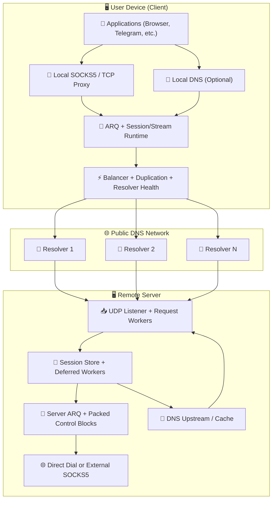
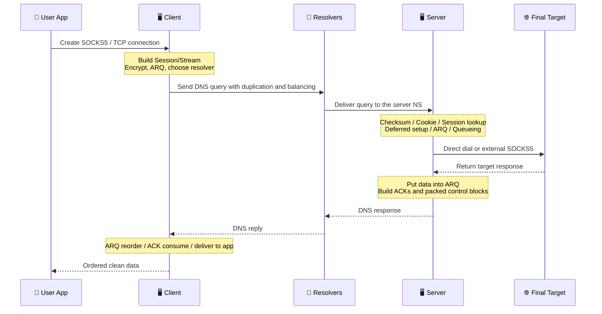

# MasterDnsVPN Project 🔐

## | 🇮🇷 [فارسی](https://github.com/masterking32/MasterDnsVPN/blob/main/README_FA.MD) | 🇬🇧 [English](https://github.com/masterking32/MasterDnsVPN/blob/main/README.MD) | 🇷🇺 [Русский](https://github.com/masterking32/MasterDnsVPN/blob/main/README_RU.MD) | 🇨🇳 [中文](https://github.com/masterking32/MasterDnsVPN/blob/main/README_ZH.MD) | 🇪🇸 [Español](https://github.com/masterking32/MasterDnsVPN/blob/main/README_ES.MD) | 🇮🇹 [Italiano](https://github.com/masterking32/MasterDnsVPN/blob/main/README_IT.MD) |

**MasterDnsVPN** è un progetto a carattere scientifico e di ricerca per trasportare traffico TCP attraverso query e risposte DNS. Nell'obiettivo generale, è simile a progetti come DNSTT o SlipStream, ma segue una struttura e un approccio implementativo fondamentalmente diversi.
Questo sistema è progettato attorno alla compatibilità con molti comportamenti dei resolver e con condizioni di rete avverse, con l'obiettivo di preservare la massima stabilità possibile e la consegna dei dati anche nei casi peggiori.


[](https://deepwiki.com/masterking32/MasterDnsVPN)
[](https://oosmetrics.com/achievement/5c7b2ce0-0af6-4648-8ded-fd1e847096cd)
[](https://oosmetrics.com/achievement/355e590f-9b4a-4015-bb8c-a7f27b721711)
[](https://oosmetrics.com/achievement/4b98a42e-bf63-4f55-a382-0f10359a5e20)

<a href="https://trendshift.io/repositories/23688" target="_blank"></a>

### 📊 MasterDnsVPN a Confronto con Progetti Simili

| Caratteristica | SlipStream | DNSTT | MasterDnsVPN |
| :--- | :--- | :--- | :--- |
| Tipo di protocollo | Tunnel DNS avanzato | Tunnel DNS classico | Tunnel DNS avanzato / VPN |
| Protocollo di trasporto | QUIC | KCP + Noise | Protocollo personalizzato + ARQ |
| Overhead dell'header di trasporto | 🟠 ~24B | 🔴 ~59B | 🟢 ~5–7B<br>≈88% inferiore a DNSTT<br>≈71% inferiore a SlipStream |
| Tipo di cifratura | TLS 1.3 (all'interno di QUIC) | Noise (Curve25519) | AES / ChaCha20 / XOR (se si usa XOR: leggero con sicurezza inferiore e senza overhead aggiuntivo) |
| Architettura | Unificata (QUIC gestisce tutto) | A più livelli (KCP + SMUX + Noise) | 🟢 Design personalizzato leggero ottimizzato per DNS |
| Velocità | 🟡 Alta (fino a ~5× più veloce di DNSTT) | 🔴 Media | 🟢 Più veloce degli altri<br>Fino a ~9× più veloce di DNSTT<br>Fino a ~3,6× più veloce di SlipStream |
| Stabilità in caso di perdita di pacchetti | 🟡 Buona | 🟠 Media | 🟢 Molto alta (Multipath + ARQ) |
| Supporto multi-resolver | Sì (multipath) | ❌ | Sì — avanzato (multi-resolver + duplicazione) |
| Resilienza sotto forte censura | Buona | Media | Molto forte (un obiettivo centrale del progetto) |
| Complessità di configurazione | Media | Semplice | Installazione più facile<br>Più complessa solo se si personalizzano pesantemente le impostazioni avanzate |
| Supporto SOCKS5 | Sì | Sì | Ottimizzato per SOCKS5 / SOCKS4 con overhead SOCKS ridotto |
| Supporto Shadowsocks | ✅ | ❌ | Indirettamente: la modalità TCP Forwarding può trasportare protocolli basati su TCP<br>ad es. Shadowsocks, VLESS/VMess, ecc. |
| Multipath reale | Sì (multipath QUIC) | ❌ | Sì (multi-resolver + duplicazione) |
| Routing adattivo | Limitato | ❌ | Avanzato (basato su latenza/perdita) |
| Obiettivo di progettazione | Alta velocità ed efficienza | Semplicità e stabilità | Sopravvivere alle reti più ostili — stabilità, velocità ed efficienza |
| Linguaggio di implementazione | Rust | Go | La versione principale è in Go<br>Esiste anche una versione Python legacy |
| Bilanciatore integrato | 🔴 | ❌ | 🟢 (8 modalità di bilanciamento integrate) |
| Sistema di duplicazione | ❌ | ❌ | Sì — aumenta il traffico per migliorare l'affidabilità (configurabile o disattivabile) |
| Tolleranza all'MTU | Migliore di DNSTT | - | Funziona anche con MTU molto piccolo perché l'overhead del protocollo è molto basso |
| Sistema di failover | ❌ | ❌ | ✅ |
| Velocità di download 10MB (Locale) | 🟡 0,978s | 🔴 2,492s | 🟢 0,270s |
| Velocità di upload 10MB (Locale) | 🟡 3,249s | 🔴 16,207s | 🟢 1,746s |
| Controlli di salute dei resolver e disattivazione automatica | ❌ | ❌ | ✅ |
| Riattivazione in background dei resolver sani | ❌ | ❌ | ✅ |
| Servizio DNS locale sul client (per ridurre il DNS hijacking) | ❌ | ❌ | ✅ (con potente caching DNS) |
| Risoluzione DNS tramite SOCKS5 | ❌ | ❌ | ✅ (con caching DNS) |
| Configurazione professionale di precisione | 🟠 | 🟠 | 🟢 Quasi ogni sottosistema è configurabile |
| Nessun software ausiliario esterno richiesto | ❌ | ❌ | 🟢 Non è richiesto alcun software aggiuntivo; se necessario, è comunque possibile combinarlo con SOCKS o strumenti come Shadowsocks o OpenVPN |

---

### ❌ Disclaimer

MasterDnsVPN è fornito esclusivamente come progetto educativo e di ricerca.

- **Fornito senza garanzia:** Questo software è fornito "COSÌ COM'È", senza alcuna garanzia espressa o implicita, inclusa la commerciabilità, l'idoneità per uno scopo particolare o la non violazione di diritti.
- **Limitazione di responsabilità:** Gli sviluppatori e i collaboratori di questo progetto non si assumono alcuna responsabilità per eventuali danni diretti, indiretti, incidentali, consequenziali o di altro tipo derivanti dall'uso di questo software o dall'impossibilità di utilizzarlo.
- **Responsabilità dell'utente:** L'utilizzo di questo progetto al di fuori di ambienti di test può alterare o danneggiare il comportamento della rete. L'utente è l'unico responsabile di tutte le conseguenze derivanti dall'installazione, dalla configurazione e dall'uso.
- **Conformità legale:** L'utilizzo di questo progetto per aggirare le leggi locali può comportare conseguenze civili o penali. Si prega di esaminare le leggi e i regolamenti del proprio Paese prima dell'uso. Gli sviluppatori non si assumono alcuna responsabilità per violazioni di leggi locali, nazionali o internazionali da parte degli utenti.
- **Termini di licenza:** L'uso, la copia, la distribuzione o la modifica di questo software sono regolati dalla licenza presente nel file `LICENSE` di questo repository. Qualsiasi uso al di fuori di tali termini è proibito.

---

## Canale di Annunci e Supporto 📢

Per le ultime notizie, i rilasci e gli aggiornamenti del progetto, segui il nostro canale Telegram: [Canale Telegram](https://t.me/masterdnsvpn)

---

### Se ti piace questo progetto, supportalo mettendo una stella su GitHub (⭐). Aiuta il progetto a farsi conoscere.

---

### Supporto Economico Facoltativo 💸

- Rete TON:

`masterking32.ton`

- Reti compatibili EVM (ETH e chain compatibili):

`0x517f07305D6ED781A089322B6cD93d1461bF8652`

- Rete TRC20 (TRON):

`TLApdY8APWkFHHoxebxGY8JhMeChiETqFH`

Ogni contributo e ogni feedback è apprezzato. Il supporto aiuta direttamente lo sviluppo e il miglioramento continui.

---

## Caratteristiche e Vantaggi Principali ✨

Una breve panoramica delle principali capacità di MasterDnsVPN:

- **Resistenza alla censura e sopravvivenza in reti ostili:** 🛡️ Progettato per funzionare su reti filtrate, collegamenti instabili e ambienti con MTU rigorosi.
- **Protocollo personalizzato leggero:** 🔄 Utilizza un protocollo personalizzato con logica di ritrasmissione per ridurre l'overhead e aumentare il payload DNS utilizzabile.
- **Multipath e duplicazione dei pacchetti:** 📡 Invia il traffico attraverso percorsi multipli e supporta la duplicazione selettiva per aumentare la probabilità di consegna su reti instabili.
- **Selezione intelligente dei resolver e controlli di salute:** ⚡ Seleziona i resolver in base a qualità e salute, e gestisce automaticamente i resolver problematici.
- **Rilevamento e sincronizzazione dell'MTU:** 🧰 Rileva l'MTU pratico dei percorsi funzionanti e si allinea ad esso per ridurre la frammentazione e migliorare la stabilità.
- **Supporto e ottimizzazione SOCKS5 / SOCKS4:** 🧦 Gestione ottimizzata del proxy locale per le applicazioni più comuni.
- **Blocchi di controllo impacchettati e minore overhead di controllo:** 📦 Raggruppa il traffico ACK/di controllo per ridurre il chiacchiericcio di controllo.
- **Compressione e impacchettamento delle richieste facoltativi:** 🗜️ Riduce il numero di richieste e migliora l'efficienza in condizioni di MTU ridotto.
- **Cifratura flessibile:** 🔐 Supporta diversi metodi di cifratura per bilanciare velocità e sicurezza.
- **DNS locale lato client e caching facoltativi:** 📛 Può esporre un servizio DNS locale, ridurre la latenza e limitare le opportunità di hijacking.
- **Controllo scalabile delle risorse:** ⚙️ Può funzionare su piccoli server o essere ottimizzato per carichi più pesanti.

Questo elenco è solo un riepilogo ad alto livello. Le sezioni correlate qui sotto spiegano ciascuna area in maggior dettaglio.

---

## 🌐 Collaudato Durante un Totale Blackout di Internet

MasterDnsVPN non è solo un progetto teorico. È collaudato sul campo e ha dimostrato di funzionare in ambienti in cui Internet globale è completamente reciso.

Recentemente, durante il blackout di Internet di 88 giorni in Iran, le autorità non si sono limitate a bloccare le VPN o a filtrare i siti web—hanno completamente staccato la spina alla banda internazionale. Con il 99% della connessione verso il mondo esterno fisicamente tagliato, gli utenti sono rimasti intrappolati in una intranet locale chiusa.

Gli strumenti di elusione standard sono inutili quando non c'è alcun Internet internazionale a cui connettersi. Eppure, durante questo enorme blocco, MasterDnsVPN si è distinto come una delle pochissime ancore di salvezza che hanno effettivamente mantenuto gli utenti connessi al web globale.

**Come è sopravvissuto a un blocco totale?**
Invece di comportarsi come una VPN standard, MasterDnsVPN si affida a tecniche intelligenti di tunneling DNS per penetrare il blackout:
* **Resolver multipli:** Instrada il traffico attraverso vari resolver DNS, garantendo che la connessione non dipenda mai da un singolo percorso facilmente bloccabile.
* **Cifratura e suddivisione dei dati:** Cifra i tuoi dati e li scompone in frammenti minuscoli e sparsi.
* **Mascheramento come traffico legittimo:** Avvolge questi frammenti di dati all'interno di query DNS standard e perfettamente normali.
* **Aggiramento delle trappole locali:** Poiché il traffico assomiglia esattamente a richieste DNS di base e quotidiane, i firewall lo lasciano passare. I dati vengono risolti e raggiungono il mondo esterno—anche se la rete ti costringe a usare i loro resolver locali ristretti e controllati dal governo.

È esattamente questa combinazione che ha permesso a MasterDnsVPN di mantenere una connessione stabile quando il mondo esterno era completamente bloccato.

---

# Installazione e Primi Passi 🧑‍💻

## Sezione 1: 🖥️ Configurazione del Server

### Sezione 1.1: 🌐 Configurazione e Preparazione del Dominio (Prerequisito)

Per ricevere le richieste DNS direttamente sul tuo server, devi delegargli un sottodominio. In breve, crea due record: un record `A` che punti all'IP del tuo server e un record `NS` che deleghi il sottodominio del tunnel a quel record A.

#### Passo 1.1.1: 🅰️ Crea un Record A (Indirizzo del Server)

- **Tipo:** `A`
- **Nome:** un nome breve come `ns`
- **Valore:** l'indirizzo IPv4 del tuo server

> Esempio: `ns.example.com -> 1.2.3.4`

> Nota Cloudflare: se il dominio usa Cloudflare, apri la pagina `DNS` e clicca sull'icona della nuvola accanto al record `A` in modo che diventi grigia (`DNS only`). Non deve rimanere proxato.

#### Passo 1.1.2: 🏷️ Crea un Record NS (Delega il Sottodominio)

- **Tipo:** `NS`
- **Nome:** il sottodominio del tunnel, ad esempio `v`
- **Valore / Target:** `ns.example.com`

> Esempio: `v.example.com -> ns.example.com`

> Nota Cloudflare: aggiungi il record `NS` normalmente. Cloudflare non proxa i record NS, ma assicurati che il record A `ns` sia già impostato su `DNS only`.

#### Sezione 1.1.3: 💡 Una Breve Nota sull'MTU

Nomi di dominio più corti lasciano più spazio per i dati effettivi all'interno di ogni richiesta DNS. Per un throughput migliore, mantieni i nomi corti. Se usi Cloudflare, mantieni comunque i record pertinenti in modalità `DNS only`.

---

### Sezione 1.2: 🐧 Installazione Rapida del Server su Linux

#### Passo 1.2.1: Installazione Automatica (Script)

Se vuoi distribuire il server su Linux, il metodo più semplice è lo script di installazione automatica. Esegui questo comando sul server:

```bash
bash <(curl -Ls https://raw.githubusercontent.com/masterking32/MasterDnsVPN/main/server_linux_install.sh)
```

Lo script gestisce l'installazione e la configurazione automaticamente. Al termine, il server si avvia e la **chiave di cifratura** viene mostrata nel log del terminale e anche scritta nel file `encrypt_key.txt` accanto all'eseguibile. Conserva questa chiave al sicuro.

#### Passo 1.2.2: Note Importanti Dopo l'Installazione

- Durante l'installazione ti verrà chiesto un dominio. Deve essere lo stesso sottodominio delegato che hai configurato nel record `NS`, ad esempio `v.example.com`.
- Dopo aver creato i record DNS, attendi la propagazione. Questa può richiedere da pochi minuti a diverse ore, e in alcuni casi fino a 48 ore a seconda del TTL e del provider DNS.
- Per verificare la configurazione DNS, puoi usare strumenti come `dig` o `nslookup`, ad esempio `dig v.example.com NS` o `nslookup -type=ns v.example.com`. Per una query diretta al nuovo nameserver: `dig @ns.example.com v.example.com A`.
- Se il firewall del server è abilitato, consenti la porta UDP 53. Esempio per `ufw`:

```bash
sudo ufw allow 53/udp
sudo ufw reload
```

Per `firewalld`:

```bash
sudo firewall-cmd --add-port=53/udp --permanent
sudo firewall-cmd --reload
```

- Se la porta `53` è già occupata da un altro servizio, come `systemd-resolved`, consulta la sezione di risoluzione dei problemi "Risolvere la Porta 53 Già in Uso".
- La chiave di cifratura (`encrypt_key.txt`) viene mostrata dopo l'installazione. Copiala e conservala al sicuro perché il client ne ha bisogno per connettersi.

---

## Sezione 2: 🚀 Installazione e Avvio (Client e Server)

Puoi installare ed eseguire questo progetto in due modi:

1. Usare i binari precompilati (consigliato per la maggior parte degli utenti)
2. Eseguire direttamente dal sorgente con **Go** (consigliato per gli sviluppatori)

---

### Sezione 2.1: Usare i Rilasci Precompilati (✅ Consigliato)

Per comodità, i binari precompilati di client e server sono pubblicati nella pagina dei rilasci. Scarica l'archivio corretto per il tuo sistema operativo ed estrailo.

> 💡 **Nota:** Gli archivi dei rilasci di solito includono il binario più dei file di configurazione di esempio.

#### Link di Download del Client 📥

| Sistema Operativo | Architettura | Adatto Per | Download Diretto |
| :--- | :--- | :--- | :--- |
| Windows 🪟 | `AMD64` (64-bit) | Windows 10 e 11 | [Scarica Client Windows ⬇️](https://github.com/masterking32/MasterDnsVPN/releases/latest/download/MasterDnsVPN_Client_Windows_AMD64.zip) |
| Windows 🪟 | `x86` (32-bit) | Sistemi Windows a 32-bit più vecchi | [Scarica Client Windows x86 ⬇️](https://github.com/masterking32/MasterDnsVPN/releases/latest/download/MasterDnsVPN_Client_Windows_X86.zip) |
| Windows 🪟 | `ARM64` | Dispositivi Windows su ARM | [Scarica Client Windows ARM64 ⬇️](https://github.com/masterking32/MasterDnsVPN/releases/latest/download/MasterDnsVPN_Client_Windows_ARM64.zip) |
| macOS 🍎 | `ARM64` | Mac con Apple Silicon (M1 / M2 / M3) | [Scarica Client macOS ⬇️](https://github.com/masterking32/MasterDnsVPN/releases/latest/download/MasterDnsVPN_Client_MacOS_ARM64.zip) |
| macOS 🍎 | `AMD64` | Mac con Intel | [Scarica Client macOS Intel ⬇️](https://github.com/masterking32/MasterDnsVPN/releases/latest/download/MasterDnsVPN_Client_MacOS_AMD64.zip) |
| Linux 🐧 | `AMD64` (64-bit) | Distribuzioni moderne (Ubuntu 22.04+, Debian 12+) | [Scarica Client Linux ⬇️](https://github.com/masterking32/MasterDnsVPN/releases/latest/download/MasterDnsVPN_Client_Linux_AMD64.zip) |
| Linux 🐧 | `x86` (32-bit) | Sistemi Linux a 32-bit più vecchi | [Scarica Client Linux x86 ⬇️](https://github.com/masterking32/MasterDnsVPN/releases/latest/download/MasterDnsVPN_Client_Linux_X86.zip) |
| Linux (Legacy) 🐧 | `AMD64` (64-bit) | Distribuzioni più vecchie (Ubuntu 20.04, Debian 11) | [Scarica Client Linux Legacy ⬇️](https://github.com/masterking32/MasterDnsVPN/releases/latest/download/MasterDnsVPN_Client_Linux-Legacy_AMD64.zip) |
| Linux (Legacy) 🐧 | `ARM64` | Sistemi Linux ARM64 più vecchi che necessitano di maggiore compatibilità | [Scarica Client Linux Legacy ARM64 ⬇️](https://github.com/masterking32/MasterDnsVPN/releases/latest/download/MasterDnsVPN_Client_Linux-Legacy_ARM64.zip) |
| Linux (ARM) 🐧 | `ARM64` | Server ARM, Raspberry Pi e schede simili | [Scarica Client Linux ARM ⬇️](https://github.com/masterking32/MasterDnsVPN/releases/latest/download/MasterDnsVPN_Client_Linux_ARM64.zip) |
| Linux (ARM) 🐧 | `ARMv7` | Schede ARM a 32-bit e dispositivi Linux embedded più vecchi | [Scarica Client Linux ARMv7 ⬇️](https://github.com/masterking32/MasterDnsVPN/releases/latest/download/MasterDnsVPN_Client_Linux_ARMV7.zip) |
| Linux (ARM) 🐧 | `ARMv6` | Schede ARM più vecchie e dispositivi Linux leggeri | [Scarica Client Linux ARMv6 ⬇️](https://github.com/masterking32/MasterDnsVPN/releases/latest/download/MasterDnsVPN_Client_Linux_ARMV6.zip) |
| Linux (ARM) 🐧 | `ARMv5` | Dispositivi ARM molto vecchi e sistemi Linux embedded | [Scarica Client Linux ARMv5 ⬇️](https://github.com/masterking32/MasterDnsVPN/releases/latest/download/MasterDnsVPN_Client_Linux_ARMV5.zip) |
| Linux 🐧 | `RISCV64` | Schede e server Linux RISC-V | [Scarica Client Linux RISCV64 ⬇️](https://github.com/masterking32/MasterDnsVPN/releases/latest/download/MasterDnsVPN_Client_Linux_RISCV64.zip) |
| Linux (MIPS) 🐧 | `MIPS` | Linux MIPS big-endian e piattaforme router | [Scarica Client Linux MIPS ⬇️](https://github.com/masterking32/MasterDnsVPN/releases/latest/download/MasterDnsVPN_Client_Linux_MIPS.zip) |
| Linux (MIPS) 🐧 | `MIPSLE` | Linux MIPS little-endian e piattaforme router | [Scarica Client Linux MIPSLE ⬇️](https://github.com/masterking32/MasterDnsVPN/releases/latest/download/MasterDnsVPN_Client_Linux_MIPSLE.zip) |
| Linux (MIPS) 🐧 | `MIPS64` | Sistemi Linux MIPS big-endian a 64-bit | [Scarica Client Linux MIPS64 ⬇️](https://github.com/masterking32/MasterDnsVPN/releases/latest/download/MasterDnsVPN_Client_Linux_MIPS64.zip) |
| Linux (MIPS) 🐧 | `MIPS64LE` | Sistemi Linux MIPS little-endian a 64-bit | [Scarica Client Linux MIPS64LE ⬇️](https://github.com/masterking32/MasterDnsVPN/releases/latest/download/MasterDnsVPN_Client_Linux_MIPS64LE.zip) |
| Termux / Android 📱 | `ARM64` | Telefoni Android moderni con Termux | [Scarica Client Termux ARM64 ⬇️](https://github.com/masterking32/MasterDnsVPN/releases/latest/download/MasterDnsVPN_Client_Termux_ARM64.zip) |
| Termux / Android 📱 | `ARMv7` | Telefoni Android più vecchi con ambienti Termux a 32-bit | [Scarica Client Termux ARMv7 ⬇️](https://github.com/masterking32/MasterDnsVPN/releases/latest/download/MasterDnsVPN_Client_Termux_ARMV7.zip) |

#### Link di Download del Server 📤

*(Usali se non vuoi l'installer automatico per Linux.)*

| Sistema Operativo | Architettura | Adatto Per | Download Diretto |
| :--- | :--- | :--- | :--- |
| Windows 🪟 | `AMD64` (64-bit) | Windows Server, Windows 10 e 11 | [Scarica Server Windows ⬇️](https://github.com/masterking32/MasterDnsVPN/releases/latest/download/MasterDnsVPN_Server_Windows_AMD64.zip) |
| Windows 🪟 | `x86` (32-bit) | Sistemi Windows a 32-bit più vecchi | [Scarica Server Windows x86 ⬇️](https://github.com/masterking32/MasterDnsVPN/releases/latest/download/MasterDnsVPN_Server_Windows_X86.zip) |
| Windows 🪟 | `ARM64` | Dispositivi Windows su ARM | [Scarica Server Windows ARM64 ⬇️](https://github.com/masterking32/MasterDnsVPN/releases/latest/download/MasterDnsVPN_Server_Windows_ARM64.zip) |
| Linux 🐧 | `AMD64` (64-bit) | Server Ubuntu 22.04+, Debian 12+ | [Scarica Server Linux ⬇️](https://github.com/masterking32/MasterDnsVPN/releases/latest/download/MasterDnsVPN_Server_Linux_AMD64.zip) |
| Linux 🐧 | `x86` (32-bit) | Sistemi Linux a 32-bit più vecchi | [Scarica Server Linux x86 ⬇️](https://github.com/masterking32/MasterDnsVPN/releases/latest/download/MasterDnsVPN_Server_Linux_X86.zip) |
| Linux (Legacy) 🐧 | `AMD64` (64-bit) | Server più vecchi (Ubuntu 20.04, Debian 11) | [Scarica Server Linux Legacy ⬇️](https://github.com/masterking32/MasterDnsVPN/releases/latest/download/MasterDnsVPN_Server_Linux-Legacy_AMD64.zip) |
| Linux (Legacy) 🐧 | `ARM64` | Sistemi Linux ARM64 più vecchi che necessitano di maggiore compatibilità | [Scarica Server Linux Legacy ARM64 ⬇️](https://github.com/masterking32/MasterDnsVPN/releases/latest/download/MasterDnsVPN_Server_Linux-Legacy_ARM64.zip) |
| Linux (ARM) 🐧 | `ARM64` | Server ARM | [Scarica Server Linux ARM ⬇️](https://github.com/masterking32/MasterDnsVPN/releases/latest/download/MasterDnsVPN_Server_Linux_ARM64.zip) |
| Linux (ARM) 🐧 | `ARMv7` | Server ARM a 32-bit e dispositivi Linux embedded | [Scarica Server Linux ARMv7 ⬇️](https://github.com/masterking32/MasterDnsVPN/releases/latest/download/MasterDnsVPN_Server_Linux_ARMV7.zip) |
| Linux (ARM) 🐧 | `ARMv6` | Schede ARM più vecchie e dispositivi Linux leggeri | [Scarica Server Linux ARMv6 ⬇️](https://github.com/masterking32/MasterDnsVPN/releases/latest/download/MasterDnsVPN_Server_Linux_ARMV6.zip) |
| Linux (ARM) 🐧 | `ARMv5` | Dispositivi ARM molto vecchi e sistemi Linux embedded | [Scarica Server Linux ARMv5 ⬇️](https://github.com/masterking32/MasterDnsVPN/releases/latest/download/MasterDnsVPN_Server_Linux_ARMV5.zip) |
| Linux 🐧 | `RISCV64` | Schede e server Linux RISC-V | [Scarica Server Linux RISCV64 ⬇️](https://github.com/masterking32/MasterDnsVPN/releases/latest/download/MasterDnsVPN_Server_Linux_RISCV64.zip) |
| Linux (MIPS) 🐧 | `MIPS` | Linux MIPS big-endian e piattaforme router | [Scarica Server Linux MIPS ⬇️](https://github.com/masterking32/MasterDnsVPN/releases/latest/download/MasterDnsVPN_Server_Linux_MIPS.zip) |
| Linux (MIPS) 🐧 | `MIPSLE` | Linux MIPS little-endian e piattaforme router | [Scarica Server Linux MIPSLE ⬇️](https://github.com/masterking32/MasterDnsVPN/releases/latest/download/MasterDnsVPN_Server_Linux_MIPSLE.zip) |
| Linux (MIPS) 🐧 | `MIPS64` | Sistemi Linux MIPS big-endian a 64-bit | [Scarica Server Linux MIPS64 ⬇️](https://github.com/masterking32/MasterDnsVPN/releases/latest/download/MasterDnsVPN_Server_Linux_MIPS64.zip) |
| Linux (MIPS) 🐧 | `MIPS64LE` | Sistemi Linux MIPS little-endian a 64-bit | [Scarica Server Linux MIPS64LE ⬇️](https://github.com/masterking32/MasterDnsVPN/releases/latest/download/MasterDnsVPN_Server_Linux_MIPS64LE.zip) |
| macOS 🍎 | `ARM64` | Mac con Apple Silicon | [Scarica Server macOS ⬇️](https://github.com/masterking32/MasterDnsVPN/releases/latest/download/MasterDnsVPN_Server_MacOS_ARM64.zip) |
| macOS 🍎 | `AMD64` | Mac con Intel | [Scarica Server macOS Intel ⬇️](https://github.com/masterking32/MasterDnsVPN/releases/latest/download/MasterDnsVPN_Server_MacOS_AMD64.zip) |
| Termux / Android 📱 | `ARM64` | Ambienti Android / Termux moderni | [Scarica Server Termux ARM64 ⬇️](https://github.com/masterking32/MasterDnsVPN/releases/latest/download/MasterDnsVPN_Server_Termux_ARM64.zip) |
| Termux / Android 📱 | `ARMv7` | Ambienti Android / Termux a 32-bit più vecchi | [Scarica Server Termux ARMv7 ⬇️](https://github.com/masterking32/MasterDnsVPN/releases/latest/download/MasterDnsVPN_Server_Termux_ARMV7.zip) |

---

### Sezione 2.2: 📦 Immagine Docker di MasterDnsVPN

---

#### Sezione 2.2.1: ⚠️ Panoramica

Questa immagine Docker esegue il server MasterDnsVPN in un ambiente containerizzato e supporta build multi-architettura.

Automaticamente:

* Avvia una configurazione predefinita se non ne esiste alcuna
* Inietta il tuo dominio al primo avvio
* Memorizza i dati persistenti in `/data`

---

#### Sezione 2.2.2: 🖥 Architetture Supportate

* linux/amd64
* linux/arm/v5
* linux/arm/v7
* linux/arm64/v8
* linux/mips64le

---

#### Sezione 2.2.3: 🚀 Avvio Rapido

Esegui il container con Docker:

```bash
docker run -d \
  --name masterdnsvpn \
  --restart unless-stopped \
  -e DOMAIN=v.example.com \
  -v $(pwd)/data:/data \
  -p 53:53/tcp \
  -p 53:53/udp \
  ghcr.io/masterking32/masterdnsvpn:latest
```

---

#### Sezione 2.2.4: 🧪 Esempio con docker-compose

```yaml
services:
  masterdnsvpn:
    image: ghcr.io/masterking32/masterdnsvpn:latest
    restart: unless-stopped
    environment:
      - DOMAIN=v.example.com
    volumes:
      - ./data:/data
    ports:
      - "53:53/tcp"
      - "53:53/udp"
```

---

#### Sezione 2.2.5: ⚙️ Variabili d'Ambiente Richieste

| Variabile | Descrizione                             |
| -------- | --------------------------------------- |
| DOMAIN   | Il tuo dominio DNS (richiesto al primo avvio) |

> ⚠️ Se `DOMAIN` non è impostato al primo avvio, il container si arresterà con un errore.

---

#### Sezione 2.2.6: 📁 Dati Persistenti

Memorizzati in `/data`:

* `server_config.toml`
* `encrypt_key.txt`

Puoi montarlo come volume:

```bash
-v ./data:/data
```

---

#### Sezione 2.2.7: 🔧 Utilizzo con MikroTik / RouterOS

Per i container MikroTik:

* Usa l'ultima versione v7 di MikroTik RouterOS
* Imposta il Destination NAT della porta UDP/TCP 53 verso il tuo container
* Configurazione completa dei container MikroTik: https://help.mikrotik.com/docs/spaces/ROS/pages/84901929/Container

Esempio:

```bash
/container mounts
add dst=/data list=MasterDnsVPN src=/containers/mounts/MasterDnsVPN

/container envs
add key=DOMAIN list=MasterDnsVPN value=v.example.com

/container add check-certificate=no dns=1.1.1.1 envlists=MasterDnsVPN hostname=MasterDnsVPN interface=MasterDnsVPN layer-dir="" mountlists=MasterDnsVPN name=MasterDnsVPN remote-image=ghcr.io/masterking32/masterdnsvpn:latest root-dir=/containers/data/MasterDnsVPN start-on-boot=yes
```

---

#### Sezione 2.2.8: 📌 Note

* La porta DNS `53` è richiesta (UDP/TCP)
* NON eseguire un altro servizio DNS sullo stesso host
* Progettato per l'uso in produzione ma comunque leggero
* Non sono richieste modifiche a systemd o all'host

---

### Sezione 2.3: 🪟 Preparare ed Eseguire il Client su Windows

- Dopo aver scaricato il pacchetto Windows, estrailo.
- Apri `client_config.toml` con un editor di testo come Notepad.
- Sostituisci i valori predefiniti con il tuo dominio reale, la chiave di cifratura e l'elenco dei resolver.
- Esegui l'eseguibile del client.
- Configura il browser o l'app per usare il proxy SOCKS5 locale all'indirizzo `127.0.0.1:18000`, a meno che tu non abbia cambiato i valori predefiniti.

---

### Sezione 2.4: 🐧 Preparazione ed Esecuzione su Linux / macOS

Dopo aver scaricato il pacchetto su Linux:

```bash
sudo apt update
sudo apt install unzip nano
```

Estrai l'archivio:

```bash
unzip MasterDnsVPN_Client_Linux_AMD64.zip
ls
```

Concedi i permessi di esecuzione se necessario:

```bash
chmod +x MasterDnsVPN_Client_Linux_AMD64
chmod +x MasterDnsVPN_Server_Linux_AMD64
```

Modifica la configurazione:

```bash
nano client_config.toml
nano server_config.toml
```

Poi esegui:

```bash
./MasterDnsVPN_Client_Linux_AMD64
./MasterDnsVPN_Server_Linux_AMD64
```

---

### Sezione 2.5: 🧑‍💻 Esecuzione Diretta dal Sorgente (Go)

> ⚠️ Questa sezione è destinata agli sviluppatori o agli utenti che desiderano eseguire direttamente il sorgente Go attuale.

#### Prerequisito

- Go `1.24` o più recente

#### Compilazione dal sorgente

```bash
git clone https://github.com/masterking32/MasterDnsVPN.git
cd MasterDnsVPN

go build -o masterdnsvpn-client ./cmd/client
go build -o masterdnsvpn-server ./cmd/server
```

Su Windows:

```powershell
git clone https://github.com/masterking32/MasterDnsVPN.git
cd MasterDnsVPN

go build -o masterdnsvpn-client.exe .\cmd\client
go build -o masterdnsvpn-server.exe .\cmd\server
```

#### Crea i file di configurazione

Su Linux e macOS:

```bash
cp client_config.toml.simple client_config.toml
cp server_config.toml.simple server_config.toml
cp client_resolvers.simple client_resolvers.txt
```

Su Windows:

```powershell
Copy-Item client_config.toml.simple client_config.toml
Copy-Item server_config.toml.simple server_config.toml
Copy-Item client_resolvers.simple client_resolvers.txt
```

#### Esegui il server e il client

```bash
./masterdnsvpn-server -config server_config.toml
./masterdnsvpn-client -config client_config.toml
```

Su Windows:

```powershell
.\masterdnsvpn-server.exe -config server_config.toml
.\masterdnsvpn-client.exe -config client_config.toml
```

#### Parametri da riga di comando

Entrambi i binari supportano questi argomenti:

| Parametro | Descrizione |
| :--- | :--- |
| `-config` | Percorso del file di configurazione |
| `-log` | Percorso facoltativo di un file di log |
| `-version` | Stampa la versione ed esce |

Esempio:

```bash
./masterdnsvpn-server -config server_config.toml -log server.log
./masterdnsvpn-client -config client_config.toml -log client.log
```

---

# Sezione 3: File di Configurazione e Struttura 🛠️

## Sezione 3.1: File Importanti del Progetto 📂

| File | Scopo |
| :--- | :--- |
| `client_config.toml` | Configurazione principale del client |
| `server_config.toml` | Configurazione principale del server |
| `client_resolvers.txt` | Elenco dei resolver |
| `encrypt_key.txt` | Chiave di cifratura condivisa lato server |
| `client_config.toml.simple` | Configurazione client di esempio completa per l'attuale versione Go |
| `server_config.toml.simple` | Configurazione server di esempio completa per l'attuale versione Go |

Formati accettati in `client_resolvers.txt`:

- `IP`
- `IP:PORT`
- `CIDR`
- `CIDR:PORT`

Esempio:

```text
8.8.8.8
1.1.1.1:53
9.9.9.0/24
208.67.222.0/24:5353
```

---

## Sezione 3.2: Checklist Rapida del Client 🚀

Questi elementi sono richiesti sul client:

1. **`ENCRYPTION_KEY`** deve corrispondere al contenuto del file `encrypt_key.txt` del server
2. **`DOMAINS`** deve corrispondere al dominio del server
3. **`client_resolvers.txt`** deve contenere resolver funzionanti
4. Per l'uso normale, mantieni **`PROTOCOL_TYPE = "SOCKS5"`**

---

## Sezione 3.3: Checklist Rapida del Server ⚙️

Queste impostazioni sono critiche sul server:

1. Imposta **`DOMAIN`** sul tuo dominio del tunnel delegato
2. **`DATA_ENCRYPTION_METHOD`** deve corrispondere a quello del client
3. **`ENCRYPTION_KEY_FILE`** definisce il percorso del file della chiave del server
4. Se vuoi connessioni in uscita dirette, mantieni **`USE_EXTERNAL_SOCKS5 = false`**
5. Se vuoi concatenare attraverso un proxy SOCKS5 a monte, imposta `USE_EXTERNAL_SOCKS5 = true` e compila `FORWARD_IP` / `FORWARD_PORT`

---

## Sezione 3.4: 📘 Variabili di Configurazione del Client (`client_config.toml`)

### 3.4.1) 🧭 Identità e Sicurezza del Tunnel

| Parametro | Valore di Esempio | Valori Consentiti / Comportamento Reale | Spiegazione Completa |
| :--- | :--- | :--- | :--- |
| `PROTOCOL_TYPE` | `"SOCKS5"` | `"SOCKS5"` o `"TCP"` | Sceglie la modalità del servizio locale esposta dal client.<br>`SOCKS5` è la modalità predefinita e consigliata per l'uso normale.<br>`TCP` è utile quando vuoi inoltrare il traffico verso un unico target remoto fisso anziché fornire alle applicazioni un proxy SOCKS. |
| `DOMAINS` | `["v.example.com"]` | Elenco di stringhe non vuoto | Questi sono i domini del tunnel usati per costruire le richieste DNS.<br>Ogni dominio qui deve appartenere allo stesso tunnel che hai configurato sul server.<br>Se questo elenco è errato, il client può costruire query DNS valide che il server semplicemente ignorerà. |
| `DATA_ENCRYPTION_METHOD` | `1` | `0..5` | Deve corrispondere a quello del server.<br>`0=None`, `1=XOR`, `2=ChaCha20`, `3=AES-128-GCM`, `4=AES-192-GCM`, `5=AES-256-GCM`.<br>XOR è leggero ma più debole. Le modalità AEAD sono più robuste ma hanno maggiore overhead. |
| `ENCRYPTION_KEY` | `""` | Stringa | Segreto condiviso usato dal codec del client.<br>Deve essere esattamente identico alla chiave di cifratura lato server.<br>Se la chiave è errata, i pacchetti potrebbero essere interpretati come dati incomprensibili e il tunnel non funzionerà. |

### 3.4.2) 🧦 Proxy Locale

| Parametro | Valore di Esempio | Valori Consentiti / Comportamento Reale | Spiegazione Completa |
| :--- | :--- | :--- | :--- |
| `LISTEN_IP` | `"127.0.0.1"` | Stringa IP valida | Indirizzo su cui il client resta in ascolto per gli utenti del proxy locale.<br>Usa `127.0.0.1` per il normale utilizzo solo locale.<br>Se alcune applicazioni preferiscono il localhost IPv6 sul tuo sistema, usare `localhost` può essere una scelta solo locale migliore.<br>Usa `0.0.0.0` solo se vuoi condividere il proxy sulla rete e comprendi le implicazioni di sicurezza. |
| `LISTEN_PORT` | `18000` | `0..65535` | Porta per il proxy locale.<br>Le tue applicazioni devono usare questa porta per inviare traffico nel tunnel. |
| `SOCKS5_AUTH` | `false` | `true/false` | Abilita l'autenticazione con nome utente/password sul proxy SOCKS5 locale.<br>Se ti leghi a `0.0.0.0`, abilitarla è fortemente consigliato. |
| `SOCKS5_USER` | `"master_dns_vpn"` | Fino a 255 byte | Nome utente per il proxy SOCKS5 locale.<br>Usato solo se `SOCKS5_AUTH=true`. |
| `SOCKS5_PASS` | `"master_dns_vpn"` | Fino a 255 byte | Password per il proxy SOCKS5 locale.<br>Usata solo se `SOCKS5_AUTH=true`. |

### 3.4.3) 📛 DNS Locale

| Parametro | Valore di Esempio | Valori Consentiti / Comportamento Reale | Spiegazione Completa |
| :--- | :--- | :--- | :--- |
| `LOCAL_DNS_ENABLED` | `false` | `true/false` | Se abilitato, il client espone un servizio DNS locale e può risolvere il DNS attraverso il tunnel.<br>Questo è utile per ridurre il DNS hijacking o quando vuoi che anche le applicazioni usino il tunnel per il DNS. |
| `LOCAL_DNS_IP` | `"127.0.0.1"` | Stringa IP valida | Indirizzo di bind per il listener DNS locale. |
| `LOCAL_DNS_PORT` | `53` | `0..65535` | Porta del servizio DNS locale.<br>La porta `53` è standard, ma su alcuni sistemi potrebbe essere già usata da un altro servizio. |
| `LOCAL_DNS_CACHE_MAX_RECORDS` | `5000` | Se `<1`, si applica il fallback | Numero massimo di record nella cache DNS locale.<br>Un valore più grande riduce le ricerche DNS ripetute ma usa più memoria. |
| `LOCAL_DNS_CACHE_TTL_SECONDS` | `28800.0` | Se `<=0`, si applica il fallback | Per quanto tempo i record DNS riusciti rimangono nella cache locale. |
| `LOCAL_DNS_PENDING_TIMEOUT_SECONDS` | `300.0` | Se `<=0`, si applica il fallback | Se una query DNS locale è in corso, le query successive possono attenderla invece di lanciare un'altra richiesta a monte.<br>Questo valore definisce per quanto tempo possono attendere. |
| `LOCAL_DNS_CACHE_PERSIST_TO_FILE` | `true` | `true/false` | Se abilitato, la cache DNS locale può essere scritta su disco per il riutilizzo tra le esecuzioni. |
| `LOCAL_DNS_CACHE_FLUSH_INTERVAL_SECONDS` | `60.0` | Se `<=0`, si applica il fallback | Con quale frequenza la cache DNS locale persistita viene scaricata su disco. |
| `DNS_RESPONSE_FRAGMENT_TIMEOUT_SECONDS` | `10.0` | Se `<=0`, si applica il fallback | Per quanto tempo il client attende i frammenti mancanti della risposta del tunnel DNS prima di rinunciare. |

### 3.4.4) ⚡ Selezione dei Resolver, Duplicazione, Salute e Failover

| Parametro | Valore di Esempio | Valori Consentiti / Comportamento Reale | Spiegazione Completa |
| :--- | :--- | :--- | :--- |
| `RESOLVER_BALANCING_STRATEGY` | `2` | `0..8` | Sceglie come vengono selezionati i resolver.<br>`0/2` = Round Robin, `1` = Random, `3` = Least Loss, `4` = Lowest Latency, `5` = Hybrid Score, `6` = Loss Then Latency, `7` = Least Loss Top Random, `8` = Least Loss Top Round Robin.<br>La modalità ibrida usa un punteggio combinato ponderato. La modalità loss-then-latency seleziona prima una rosa in base alla perdita, poi predilige la latenza inferiore all'interno di quella fascia e ruota tra i migliori candidati quasi equivalenti. La modalità top-random sceglie casualmente tra la migliore fascia di perdita affinché il carico non si concentri su un unico resolver. La modalità top-round-robin scorre la stessa migliore fascia di perdita con una rotazione deterministica. |
| `PACKET_DUPLICATION_COUNT` | `2` | limitato all'intervallo valido nel codice | Conteggio normale di duplicazione dei pacchetti in uscita.<br>Valori più alti aumentano il costo di traffico ma migliorano la sopravvivenza su collegamenti deboli. |
| `SETUP_PACKET_DUPLICATION_COUNT` | `2` | limitato all'intervallo valido nel codice | Simile a `PACKET_DUPLICATION_COUNT`, ma usato per i pacchetti sensibili al setup come la creazione degli stream e altri eventi di controllo critici. |
| `STREAM_RESOLVER_FAILOVER_RESEND_THRESHOLD` | `2` | Se `<1`, si applica il fallback | Se uno stream accumula ripetuta pressione di reinvio sullo stesso resolver preferito, il client può eseguire il failover di quello stream su un altro resolver.<br>Questa soglia controlla la rapidità con cui ciò avviene. |
| `STREAM_RESOLVER_FAILOVER_COOLDOWN` | `2.5` | Se `<=0`, si applica il fallback | Ritardo minimo tra due failover per lo stesso stream.<br>Questo previene oscillazioni instabili tra i resolver. |
| `RECHECK_INACTIVE_SERVERS_ENABLED` | `true` | `true/false` | Abilita i ricontrolli in background per i resolver attualmente disabilitati o non sani.<br>Se disabilitato, una volta che un resolver diventa inutilizzabile, rimarrà disabilitato fino al riavvio o alla ricostruzione manuale. |
| `AUTO_DISABLE_TIMEOUT_SERVERS` | `true` | `true/false` | Abilita la disabilitazione automatica dei resolver che continuano ad andare in timeout e non mostrano alcuna attività riuscita. |
| `AUTO_DISABLE_TIMEOUT_WINDOW_SECONDS` | `30.0` | Se `<=0`, si applica il fallback | Finestra temporale usata per decidere se un resolver presenta solo timeout.<br>Se tutte le osservazioni in questa finestra sono timeout, può essere disabilitato. |
| `BASE_ENCODE_DATA` | `false` | `true/false` | Se abilitato, i payload vengono codificati in un formato base-safe prima del tunneling.<br>Questo di solito riduce l'efficienza del payload, ma può aiutare in ambienti con resolver rigorosi. |

### 3.4.5) 🗜️ Compressione

| Parametro | Valore di Esempio | Valori Consentiti / Comportamento Reale | Spiegazione Completa |
| :--- | :--- | :--- | :--- |
| `UPLOAD_COMPRESSION_TYPE` | `0` | `0..3` | `0=OFF`, `1=ZSTD`, `2=LZ4`, `3=ZLIB`.<br>Controlla la compressione lato client per i payload in uscita. |
| `DOWNLOAD_COMPRESSION_TYPE` | `0` | `0..3` | Tipo di compressione previsto o preferito per i payload dal server al client. |
| `COMPRESSION_MIN_SIZE` | `120` | Se non valido, si applica il fallback | Dimensione minima del payload prima che venga tentata la compressione.<br>I pacchetti molto piccoli spesso crescono invece di ridursi, quindi questo evita un lavoro di compressione inutile. |

### 3.4.6) 🧪 Rilevamento dell'MTU e Test Iniziale

| Parametro | Valore di Esempio | Valori Consentiti / Comportamento Reale | Spiegazione Completa |
| :--- | :--- | :--- | :--- |
| `MIN_UPLOAD_MTU` | `38` | intero positivo | MTU di upload minimo che il client accetta durante il test dei resolver. Il minimo imposto è la dimensione del payload di session-init (10). |
| `MIN_DOWNLOAD_MTU` | `100` | intero positivo | MTU di download minimo che il client accetta durante il test dei resolver. Il minimo imposto è la dimensione del payload di session-accept (20). |
| `MAX_UPLOAD_MTU` | `150` | intero positivo | Limite superiore per il test dell'MTU di upload. |
| `MAX_DOWNLOAD_MTU` | `500` | intero positivo | Limite superiore per il test dell'MTU di download. |
| `MTU_TEST_RETRIES` | `2` | se non valido, si applica il fallback | Numero di tentativi per ciascun probe MTU. |
| `MTU_TEST_TIMEOUT` | `2.0` | se non valido, si applica il fallback | Timeout per un singolo probe MTU. |
| `MTU_TEST_PARALLELISM` | `16` | se non valido, si applica il fallback | Numero di resolver testati in parallelo durante la scansione dell'MTU.<br>Valori più alti scansionano più velocemente ma usano più CPU/rete e possono produrre più fallimenti spurî. |
| `SAVE_MTU_SERVERS_TO_FILE` | `false` | `true/false` | Se abilitato, i risultati dei resolver riusciti vengono scritti in un file di output. |
| `MTU_SERVERS_FILE_NAME` | `"masterdnsvpn_success_test_{time}.log"` | stringa | Modello del nome del file di output per i resolver testati con successo per l'MTU. |
| `MTU_SERVERS_FILE_FORMAT` | `"{IP} ({DOMAIN}) - UP: {UP_MTU} DOWN: {DOWN-MTU}"` | stringa | Formato di output usato nel file dei risultati MTU. |
| `MTU_USING_SECTION_SEPARATOR_TEXT` | `""` | stringa | Testo separatore facoltativo inserito nel file di output MTU. |
| `MTU_REMOVED_SERVER_LOG_FORMAT` | `"Resolver {IP} ({DOMAIN}) removed at {TIME} due to {CAUSE}"` | stringa | Formato di log/output quando un resolver viene rimosso dall'insieme valido. |
| `MTU_ADDED_SERVER_LOG_FORMAT` | `"Resolver {IP} ({DOMAIN}) added back at {TIME} (UP {UP_MTU}, DOWN {DOWN_MTU})"` | stringa | Formato di log/output quando un resolver viene ripristinato. |
| `MTU_REACTIVE_ADDED_SERVER_LOG_FORMAT` | `"Resolver {IP} ({DOMAIN}) added back at {TIME} after reactive recheck (UP {UP_MTU}, DOWN {DOWN_MTU})"` | stringa | Formato di log/output quando un resolver viene ripristinato dai controlli di salute in background. |

### 3.4.7) 🧵 Worker, Code e Timer di Runtime

| Parametro | Valore di Esempio | Valori Consentiti / Comportamento Reale | Spiegazione Completa |
| :--- | :--- | :--- | :--- |
| `RX_TX_WORKERS` | `4` | se non valido, si applica il fallback | Numero di worker di runtime condivisi usati sia per le letture sia per le scritture del tunnel UDP. |
| `TUNNEL_PROCESS_WORKERS` | `6` | se non valido, si applica il fallback | Numero di worker che elaborano i pacchetti del tunnel dopo la lettura. |
| `TUNNEL_PACKET_TIMEOUT_SECONDS` | `10.0` | se non valido, si applica il fallback | Timeout complessivo per la gestione dei pacchetti del tunnel. |
| `DISPATCHER_IDLE_POLL_INTERVAL_SECONDS` | `0.020` | se non valido, si applica il fallback | Quando non c'è nulla da inviare, il dispatcher dorme per questo intervallo prima di ricontrollare. |
| `RX_CHANNEL_SIZE` | `4096` | se non valido, si applica il fallback | Capacità del canale dei pacchetti del tunnel in entrata. |
| `SOCKS_UDP_ASSOCIATE_READ_TIMEOUT_SECONDS` | `30.0` | se non valido, si applica il fallback | Timeout di lettura per la modalità SOCKS UDP associate. |
| `CLIENT_TERMINAL_STREAM_RETENTION_SECONDS` | `45.0` | se non valido, si applica il fallback | Per quanto tempo gli stream terminali rimangono nella contabilità del client prima della pulizia completa. |
| `CLIENT_CANCELLED_SETUP_RETENTION_SECONDS` | `120.0` | se non valido, si applica il fallback | Tempo di conservazione per gli stream di setup annullati prima del completamento. |
| `SESSION_INIT_RETRY_BASE_SECONDS` | `1.0` | se non valido, si applica il fallback | Ritardo base per i tentativi di session-init. |
| `SESSION_INIT_RETRY_STEP_SECONDS` | `1.0` | se non valido, si applica il fallback | Incremento dello step usato nella pianificazione dei tentativi. |
| `SESSION_INIT_RETRY_LINEAR_AFTER` | `5` | se non valido, si applica il fallback | Dopo questo numero di tentativi, il backoff dei tentativi diventa più lineare. |
| `SESSION_INIT_RETRY_MAX_SECONDS` | `60.0` | se non valido, si applica il fallback | Ritardo massimo dei tentativi per l'inizializzazione della sessione. |
| `SESSION_INIT_BUSY_RETRY_INTERVAL_SECONDS` | `60.0` | se non valido, si applica il fallback | Ritardo dei tentativi quando il server risponde esplicitamente con `SESSION_BUSY`. |

### 3.4.8) 📡 Ping / Keepalive

| Parametro | Valore di Esempio | Valori Consentiti / Comportamento Reale | Spiegazione Completa |
| :--- | :--- | :--- | :--- |
| `PING_AGGRESSIVE_INTERVAL_SECONDS` | `0.100` | numero positivo | Intervallo di ping più veloce usato nello stato di attività più intenso. |
| `PING_LAZY_INTERVAL_SECONDS` | `0.750` | numero positivo | Intervallo di ping operativo normale. |
| `PING_COOLDOWN_INTERVAL_SECONDS` | `2.0` | numero positivo | Intervallo di ping durante il cooldown. |
| `PING_COLD_INTERVAL_SECONDS` | `15.0` | numero positivo | Intervallo di ping quando la sessione è fredda/per lo più inattiva. |
| `PING_WARM_THRESHOLD_SECONDS` | `8.0` | numero positivo | Soglia dopo la quale la sessione è considerata calda. |
| `PING_COOL_THRESHOLD_SECONDS` | `20.0` | numero positivo | Soglia dopo la quale la sessione è considerata in raffreddamento. |
| `PING_COLD_THRESHOLD_SECONDS` | `30.0` | numero positivo | Soglia dopo la quale la sessione è considerata fredda. |

### 3.4.9) 🔄 ARQ e Impacchettamento dei Pacchetti

| Parametro | Valore di Esempio | Valori Consentiti / Comportamento Reale | Spiegazione Completa |
| :--- | :--- | :--- | :--- |
| `MAX_PACKETS_PER_BATCH` | `8` | se non valido, si applica il fallback | Numero massimo di elementi di controllo che il client cerca di raggruppare in un singolo turno di pacchetto. |
| `ARQ_WINDOW_SIZE` | `600` | intervallo positivo valido | Dimensione della finestra di invio/ricezione ARQ per stream. |
| `ARQ_INITIAL_RTO_SECONDS` | `1.0` | limitato nel codice | Timeout di ritrasmissione iniziale per i pacchetti dati. |
| `ARQ_MAX_RTO_SECONDS` | `5.0` | limitato nel codice | Timeout di ritrasmissione massimo per i pacchetti dati. |
| `ARQ_CONTROL_INITIAL_RTO_SECONDS` | `0.5` | limitato nel codice | Timeout di ritrasmissione iniziale per i pacchetti di controllo. |
| `ARQ_CONTROL_MAX_RTO_SECONDS` | `3.0` | limitato nel codice | Timeout di ritrasmissione massimo per i pacchetti di controllo. |
| `ARQ_MAX_CONTROL_RETRIES` | `400` | limitato nel codice | Numero massimo di tentativi per i pacchetti di controllo. |
| `ARQ_INACTIVITY_TIMEOUT_SECONDS` | `1800.0` | limitato nel codice | Timeout di inattività dello stream. |
| `ARQ_DATA_PACKET_TTL_SECONDS` | `2400.0` | limitato nel codice | TTL per i pacchetti dati prima che vengano abbandonati. |
| `ARQ_CONTROL_PACKET_TTL_SECONDS` | `1200.0` | limitato nel codice | TTL per i pacchetti di controllo. |
| `ARQ_MAX_DATA_RETRIES` | `1200` | limitato nel codice | Numero massimo di tentativi per i pacchetti dati. |
| `ARQ_DATA_NACK_MAX_GAP` | `16` | limitato nel codice | Dimensione massima del gap per la generazione di NACK quando i pacchetti arrivano fuori ordine. |
| `ARQ_DATA_NACK_INITIAL_DELAY_SECONDS` | `0.1` | limitato nel codice | Ritardo iniziale prima dell'invio di un NACK per i pacchetti dati mancanti. Controlla con quanta prontezza il sistema richiede le ritrasmissioni. |
| `ARQ_DATA_NACK_REPEAT_SECONDS` | `1.0` | limitato nel codice | Intervallo minimo prima di ripetere un NACK per la stessa sequenza mancante. |
| `ARQ_TERMINAL_DRAIN_TIMEOUT_SECONDS` | `120.0` | limitato nel codice | Dopo che uno stream diventa terminale, per quanto tempo il client attende lo svuotamento della coda. |
| `ARQ_TERMINAL_ACK_WAIT_TIMEOUT_SECONDS` | `90.0` | limitato nel codice | Per quanto tempo il client attende l'ACK terminale finale. |

### 3.4.10) 🪵 Logging

| Parametro | Valore di Esempio | Valori Consentiti / Comportamento Reale | Spiegazione Completa |
| :--- | :--- | :--- | :--- |
| `LOG_LEVEL` | `"INFO"` | di solito `DEBUG`, `INFO`, `WARN`, `ERROR` | Controlla la verbosità del log del client.<br>`INFO` è di solito sufficiente per il funzionamento normale.<br>Usa `DEBUG` quando indaghi sulla salute dei resolver, sul failover, sull'ARQ o sui percorsi dei pacchetti. |

---

## Sezione 3.5: 📖 Configurazione del Server (`server_config.toml`)

> ℹ️ Nota: la configurazione server di esempio contiene una chiave chiamata `CONFIG_VERSION`, ma l'attuale codice Go non la legge in `ServerConfig`. Per questo motivo non è inclusa nella tabella sottostante e non ha alcun effetto sul comportamento reale del server.

### 3.5.1) 🌐 Politica del Tunnel e Accettazione del Protocollo

| Parametro | Valore di Esempio in `server_config.toml.simple` | Valori Consentiti / Comportamento Reale | Spiegazione Completa |
| :--- | :--- | :--- | :--- |
| `DOMAIN` | `["v.domain.com"]` | elenco di stringhe | Dominio o domini che questo server considera appartenenti al suo tunnel.<br>Devono corrispondere a `DOMAINS` del client, altrimenti i pacchetti del tunnel non verranno riconosciuti correttamente. |
| `PROTOCOL_TYPE` | `"SOCKS5"` | solo `"SOCKS5"` o `"TCP"` | Determina quale tipo di setup il server accetta per i nuovi stream.<br>In modalità `SOCKS5`, il server si aspetta `PACKET_SOCKS5_SYN` e prende il target dal payload del client.<br>In modalità `TCP`, il setup avviene tramite `PACKET_STREAM_SYN` e il server si connette a `FORWARD_IP:FORWARD_PORT`. |
| `MIN_VPN_LABEL_LENGTH` | non mostrato nell'esempio | se `<=0`, fallback a `3` | Lunghezza minima dell'etichetta dei dati del tunnel.<br>Questo aiuta a evitare di confondere le normali query DNS con le query del tunnel.<br>Se questo parametro manca nel tuo vecchio README o nella tua configurazione, vale la pena aggiungerlo perché il codice lo supporta. |
| `SUPPORTED_UPLOAD_COMPRESSION_TYPES` | `[0, 1, 2, 3]` | solo ID di compressione validi | Modalità di compressione che il server consente ai client di richiedere per il traffico di upload. |
| `SUPPORTED_DOWNLOAD_COMPRESSION_TYPES` | `[0, 1, 2, 3]` | solo ID di compressione validi | Stessa idea per il traffico di download dal server al client. |

### 3.5.2) 📥 Listener UDP e Capacità di Ingresso

| Parametro | Valore di Esempio | Valori Consentiti / Comportamento Reale | Spiegazione Completa |
| :--- | :--- | :--- | :--- |
| `UDP_HOST` | `"0.0.0.0"` | se vuoto, viene usato questo valore | Indirizzo su cui il server DNS si lega.<br>`0.0.0.0` significa ascoltare su tutte le interfacce. |
| `UDP_PORT` | `53` | `1..65535` | Porta UDP usata dal server.<br>Nella maggior parte delle distribuzioni questa dovrebbe rimanere `53` così che i resolver possano interrogarla direttamente. |
| `UDP_READERS` | `4` | predefinito automatico se `<=0` | Numero di goroutine che leggono direttamente dal socket UDP.<br>Un numero maggiore può essere d'aiuto su server molto trafficati, ma oltre un certo punto aumenta solo il context switching. |
| `DNS_REQUEST_WORKERS` | `8` | predefinito automatico se `<=0` | Numero di worker che prelevano le richieste dalla coda di ingresso e le passano al livello di sessione/decodifica. |
| `MAX_CONCURRENT_REQUESTS` | `16384` | fallback se `<=0` | Capacità della coda delle richieste in entrata.<br>Se questa coda si riempie, i pacchetti vengono scartati e il server emette log di sovraccarico a frequenza limitata. |
| `SOCKET_BUFFER_SIZE` | `4194304` | fallback se `<=0` | Dimensione del buffer del socket richiesta al sistema operativo per il listener UDP.<br>Questo è importante per i picchi pesanti di traffico in entrata. |
| `MAX_PACKET_SIZE` | `65535` | fallback se `<=0` | Dimensione del buffer del pacchetto più grande che il pool di pacchetti alloca. |
| `DROP_LOG_INTERVAL_SECONDS` | `2.0` | fallback se `<=0` | Intervallo minimo tra log di sovraccarico/scarto ripetuti, per evitare lo spam di log durante la pressione. |

### 3.5.3) 🧠 Runtime delle Sessioni Differite

| Parametro | Valore di Esempio | Valori Consentiti / Comportamento Reale | Spiegazione Completa |
| :--- | :--- | :--- | :--- |
| `DEFERRED_SESSION_WORKERS` | `4` | limitato fino a `128` | Numero di worker delle sessioni differite.<br>Questi worker gestiscono attività sensibili all'ordinamento e ad alto carico di setup come la creazione degli stream, la connessione SOCKS e alcune attività di assemblaggio DNS.<br>Troppo pochi possono rallentare il setup degli stream; troppi possono creare contesa inutile. |
| `DEFERRED_SESSION_QUEUE_LIMIT` | `4096` | limitato a `256..14336` | Capacità della coda per il lavoro delle sessioni differite.<br>Se si riempie, nuove attività di setup o differite potrebbero essere rifiutate. |
| `SESSION_ORPHAN_QUEUE_INITIAL_CAPACITY` | auto | derivato internamente | Il dimensionamento iniziale della coda orfana/di controllo è derivato automaticamente dal numero di worker del server e dalla pressione di batching. |
| `STREAM_QUEUE_INITIAL_CAPACITY` | auto | derivato internamente | La capacità iniziale della coda per stream è derivata automaticamente dalla dimensione della finestra ARQ e dalla pressione di impacchettamento. |
| `DNS_FRAGMENT_STORE_CAPACITY` | auto | derivato internamente | La capacità dello store dei frammenti del tunnel DNS è derivata automaticamente dalla concorrenza delle richieste e dal numero di worker. |
| `SOCKS5_FRAGMENT_STORE_CAPACITY` | auto | derivato internamente | La capacità dello store dei frammenti di setup SOCKS5 è derivata automaticamente dalla pressione delle sessioni differite e dalla concorrenza. |

### 3.5.4) 🍪 Ciclo di Vita di Sessione/Stream e Tracciamento dei Cookie Non Validi

| Parametro | Valore di Esempio | Valori Consentiti / Comportamento Reale | Spiegazione Completa |
| :--- | :--- | :--- | :--- |
| `INVALID_COOKIE_WINDOW_SECONDS` | `2.0` | fallback se `<=0` | Finestra temporale usata per contare gli errori di cookie non valido.<br>Questo aiuta il server a rilevare sessioni interrotte o client che usano ripetutamente un cookie errato. |
| `INVALID_COOKIE_ERROR_THRESHOLD` | `10` | fallback se `<=0` | Se gli errori di cookie non valido raggiungono questa soglia all'interno della finestra sopra, il server risponde in modo più aggressivo. |
| `SESSION_TIMEOUT_SECONDS` | `300.0` | fallback se `<=0` | Se una sessione non ha attività per questo tempo, il server la fa scadere e la pulisce. |
| `SESSION_CLEANUP_INTERVAL_SECONDS` | `30.0` | fallback se `<=0` | Con quale frequenza viene eseguito il ciclo periodico di pulizia delle sessioni. |
| `CLOSED_SESSION_RETENTION_SECONDS` | `600.0` | fallback se `<=0` | Per quanto tempo vengono conservati i metadati delle sessioni chiuse così che i pacchetti in ritardo possano ancora essere riconosciuti. |
| `SESSION_INIT_REUSE_TTL_SECONDS` | `600.0` | limitato a `1..86400` secondi | Per quanto tempo le firme di session-init vengono conservate per il riutilizzo e una semplice protezione contro il replay. |
| `RECENTLY_CLOSED_STREAM_TTL_SECONDS` | `600.0` | limitato a `1..86400` secondi | Per quanto tempo gli stream chiusi di recente rimangono nella tabella "recently closed" così che i pacchetti SYN in ritardo non li riattivino. |
| `RECENTLY_CLOSED_STREAM_CAP` | `2000` | limitato a `1..1000000` | Numero massimo di voci di stream chiusi di recente che il server conserva. |
| `TERMINAL_STREAM_RETENTION_SECONDS` | `45.0` | limitato a `1..86400` secondi | Per quanto tempo gli stream terminali rimangono prima dello sweep finale. |

### 3.5.5) 📛 Upstream del Tunnel DNS

| Parametro | Valore di Esempio | Valori Consentiti / Comportamento Reale | Spiegazione Completa |
| :--- | :--- | :--- | :--- |
| `DNS_UPSTREAM_SERVERS` | `["1.1.1.1:53", "1.0.0.1:53"]` | fallback se vuoto | Quando il client invia una vera richiesta DNS attraverso il tunnel, il server la inoltra a questi resolver upstream.<br>Questa sezione riguarda solo il DNS-over-tunnel, non il trasporto del tunnel stesso. |
| `DNS_UPSTREAM_TIMEOUT` | `4.0` | fallback se `<=0` | Timeout per ogni scambio con il vero upstream DNS. |
| `DNS_INFLIGHT_WAIT_TIMEOUT_SECONDS` | `60.0` | limitato a `0.1..120` secondi | Se diverse query DNS identiche arrivano contemporaneamente, viene eseguita una sola ricerca upstream e le altre attendono come follower.<br>Questo valore controlla per quanto tempo i follower attendono il risultato della ricerca principale. |
| `DNS_FRAGMENT_ASSEMBLY_TIMEOUT` | `300.0` | fallback se `<=0` | Per quanto tempo il server attende l'arrivo di tutti i frammenti di una query DNS tunnellata. |
| `DNS_CACHE_MAX_RECORDS` | `50000` | fallback se `<1` | Dimensione massima della cache DNS interna del server per le query DNS tunnellate. |
| `DNS_CACHE_TTL_SECONDS` | `300.0` | fallback se `<=0` | TTL della cache DNS interna lato server. |

### 3.5.6) 🌐 Forwarding e SOCKS Esterno

| Parametro | Valore di Esempio | Valori Consentiti / Comportamento Reale | Spiegazione Completa |
| :--- | :--- | :--- | :--- |
| `SOCKS_CONNECT_TIMEOUT` | `120.0` | fallback se `<=0` | Timeout per la connessione in uscita del server verso il target finale o verso un server SOCKS5 esterno.<br>L'esempio mostra un valore più alto, ma il fallback del codice reale è `8` secondi. |
| `USE_EXTERNAL_SOCKS5` | `false` | `true/false` | Se `true`, il server invia il traffico in uscita attraverso un server SOCKS5 esterno anziché connettersi direttamente.<br>Questo è utile principalmente per il chaining o per nascondere l'egress del server. |
| `SOCKS5_AUTH` | `false` | `true/false` | Indica se il server SOCKS5 esterno richiede l'autenticazione con nome utente/password. |
| `SOCKS5_USER` | `"admin"` | fino a 255 byte | Nome utente per il server SOCKS5 esterno. |
| `SOCKS5_PASS` | `"123456"` | fino a 255 byte | Password per il server SOCKS5 esterno.<br>Se l'autenticazione è abilitata e nome utente/password non sono validi, la configurazione diventa non valida. |
| `FORWARD_IP` | `""` | stringa | In modalità `TCP`, questo è il target in uscita fisso.<br>In modalità `SOCKS5` con `USE_EXTERNAL_SOCKS5=true`, questo è l'indirizzo del server SOCKS5 upstream stesso. |
| `FORWARD_PORT` | `0` | `0..65535` | Porta dell'endpoint sopra.<br>Se `USE_EXTERNAL_SOCKS5=true`, deve essere un valore valido diverso da zero. |

### 3.5.7) 🔐 Sicurezza

| Parametro | Valore di Esempio | Valori Consentiti / Comportamento Reale | Spiegazione Completa |
| :--- | :--- | :--- | :--- |
| `DATA_ENCRYPTION_METHOD` | `1` | `0..5` | Deve corrispondere a quello del client.<br>Se viene fornito un valore non valido, l'attuale codice lo normalizza nuovamente a `1`. |
| `ENCRYPTION_KEY_FILE` | `"encrypt_key.txt"` | percorso relativo o assoluto | Percorso del file della chiave di cifratura del server.<br>Se è relativo, viene risolto rispetto alla directory di configurazione.<br>Se è vuoto, il fallback è `encrypt_key.txt`. |

### 3.5.8) 🔄 ARQ, Impacchettamento e TTL di Controllo

| Parametro | Valore di Esempio | Valori Consentiti / Comportamento Reale | Spiegazione Completa |
| :--- | :--- | :--- | :--- |
| `MAX_PACKETS_PER_BATCH` | `5` | fallback se `<1` | Numero massimo di blocchi di controllo che il server cerca di impacchettare in una risposta.<br>Nota importante: se il valore non è valido, il fallback del codice reale è `20`. |
| `PACKET_BLOCK_CONTROL_DUPLICATION` | `1` | limitato a `1..16` | Quanti turni extra dovrebbe essere ripetuto l'ultimo blocco di controllo impacchettato.<br>`1` significa di fatto che la duplicazione è disattivata.<br>Questo è utile su collegamenti con perdite così che i dati critici di ACK/chiusura arrivino in modo più affidabile. |
| `STREAM_SETUP_ACK_TTL_SECONDS` | `400.0` | limitato a `1..86400` secondi | TTL dei pacchetti ACK relativi al setup degli stream. |
| `STREAM_RESULT_PACKET_TTL_SECONDS` | `300.0` | limitato a `1..86400` secondi | TTL dei pacchetti di risultato come successo/fallimento della connessione che devono raggiungere il client. |
| `STREAM_FAILURE_PACKET_TTL_SECONDS` | `120.0` | limitato a `1..86400` secondi | TTL dei pacchetti di fallimento per errori di setup o in uscita. |
| `ARQ_WINDOW_SIZE` | `800` | limitato a `1..16384` | Dimensione della finestra ARQ per stream sul server. |
| `ARQ_INITIAL_RTO_SECONDS` | `1` | limitato a `0.05..60` secondi | Timeout di ritrasmissione iniziale per i pacchetti dati. |
| `ARQ_MAX_RTO_SECONDS` | `5.0` | limitato a `[ARQ_INITIAL_RTO_SECONDS, 120]` | Timeout di ritrasmissione massimo per i pacchetti dati. |
| `ARQ_CONTROL_INITIAL_RTO_SECONDS` | `0.5` | limitato a `0.05..60` secondi | Timeout di ritrasmissione iniziale per i pacchetti di controllo. |
| `ARQ_CONTROL_MAX_RTO_SECONDS` | `3.0` | limitato a `[ARQ_CONTROL_INITIAL_RTO_SECONDS, 120]` | Timeout di ritrasmissione massimo per i pacchetti di controllo. |
| `ARQ_MAX_CONTROL_RETRIES` | `300` | limitato a `5..5000` | Numero massimo di tentativi per i pacchetti di controllo. |
| `ARQ_INACTIVITY_TIMEOUT_SECONDS` | `1800.0` | limitato a `30..86400` secondi | Timeout di inattività per gli stream. |
| `ARQ_DATA_PACKET_TTL_SECONDS` | `2400.0` | limitato a `30..86400` secondi | TTL per i pacchetti dati. |
| `ARQ_CONTROL_PACKET_TTL_SECONDS` | `1200.0` | limitato a `30..86400` secondi | TTL per i pacchetti di controllo. |
| `ARQ_MAX_DATA_RETRIES` | `1200` | limitato a `60..100000` | Numero massimo di tentativi per i pacchetti dati. |
| `ARQ_DATA_NACK_MAX_GAP` | `16` | limitato a `0..255` | Se arrivano pacchetti fuori ordine, questo controlla quanto può essere grande un gap mancante segnalato con NACK. |
| `ARQ_DATA_NACK_INITIAL_DELAY_SECONDS` | `0.3` | limitato nel codice | Ritardo iniziale prima dell'invio di un NACK per i pacchetti dati mancanti. Controlla con quanta prontezza il sistema richiede le ritrasmissioni. |
| `ARQ_DATA_NACK_REPEAT_SECONDS` | `1.0` | limitato a `0.1..30` secondi | Per una sequenza mancante, questo definisce quanto presto può essere emesso nuovamente un NACK ripetuto. |
| `ARQ_TERMINAL_DRAIN_TIMEOUT_SECONDS` | `120.0` | limitato a `10..3600` secondi | Dopo che uno stream diventa terminale, per quanto tempo il server attende lo svuotamento delle code. |
| `ARQ_TERMINAL_ACK_WAIT_TIMEOUT_SECONDS` | `90.0` | limitato a `5..3600` secondi | Dopo la chiusura terminale, per quanto tempo il server attende l'ACK finale. |

### 3.5.9) 🪵 Logging

| Parametro | Valore di Esempio | Valori Consentiti / Comportamento Reale | Spiegazione Completa |
| :--- | :--- | :--- | :--- |
| `LOG_LEVEL` | `"INFO"` | di solito `DEBUG`, `INFO`, `WARN`, `ERROR` | Livello di log del server.<br>Per il normale uso in produzione, `INFO` è di solito sufficiente.<br>Per un'indagine approfondita su sessioni, worker differiti o comportamento ARQ, usa temporaneamente `DEBUG`. |

### 3.5.10) Sincronizzazione della Politica di Sessione

Durante `SESSION_INIT`, il server può aggiungere un blocco di politica compatto a `SESSION_ACCEPT`.
Il client applica questi limiti immediatamente prima che inizi il runtime normale.

- I valori `max` imposti dal server riducono il client solo quando il valore richiesto è più alto.
- I valori `min` imposti dal server alzano il client solo quando il valore richiesto è più basso.
- I limiti MTU sono imposti su entrambi i lati:
  - Il server limita l'MTU della sessione accettata durante l'init.
  - Anche il client limita le sue impostazioni di runtime locali dopo la decodifica.
- Lo stato derivato dal runtime, come il numero di worker, le code, gli store dei frammenti e il dimensionamento dei blocchi impacchettati, viene ricostruito a partire dai valori sincronizzati effettivi.
- I server legacy che inviano ancora il vecchio payload `SESSION_ACCEPT` da 7 byte restano compatibili; la sincronizzazione della politica viene semplicemente saltata.

---

## Sezione 3.6: 🧪 Testare, Trovare e Scansionare i Resolver

Trovare resolver adatti è una delle parti più importanti di qualsiasi progetto di tunnel DNS. In questo progetto, il client può trovare automaticamente resolver sani e testarne l'MTU.
Puoi usare questa funzionalità del client per scoprire resolver sani, testare i tuoi resolver o scansionare intervalli di resolver.
Basta inserire tutti gli IP riga per riga in `client_resolvers.txt`.

Poi esegui il backup del tuo attuale `client_config.toml`, aprilo con un editor di testo e sostituisci i seguenti valori con questi suggeriti:

- Abbassa il limite massimo dell'MTU così da trovare tutti i server che si comportano davvero come server DNS, e rendi Min e Max uguali per velocizzare la scansione evitando il probing automatico di tipo ricerca binaria.

```toml
MIN_UPLOAD_MTU=30
MIN_DOWNLOAD_MTU=40
MAX_UPLOAD_MTU=30
MAX_DOWNLOAD_MTU=40
```

- Aumenta il numero di controlli paralleli dei resolver:

```toml
MTU_TEST_PARALLELISM = 200
```

- Salva i risultati dei resolver sani in un file di testo per una revisione successiva:

```toml
SAVE_MTU_SERVERS_TO_FILE = true
```

- Cambia il formato di output così che venga scritto solo l'IP, il che è più facile da riutilizzare:

```toml
MTU_SERVERS_FILE_FORMAT = "{IP}"
```

- Riduci i tentativi e il timeout per velocizzare la scansione. Con queste impostazioni potresti perdere alcuni resolver leggermente più lenti ma comunque sani, quindi aumentali se vuoi risultati più accurati.

```toml
MTU_TEST_RETRIES = 1
MTU_TEST_TIMEOUT = 1.0
```

> ⚠️ **Nota importante:** Devi già avere un server in esecuzione e devi inserire la sua chiave e il suo dominio in `client_config.toml` prima di fare questo. Altrimenti il client non può eseguire correttamente i test dell'MTU e probabilmente marcherà tutti i resolver come non validi.

Ora esegui il programma e attendi che i test finiscano. Al termine del processo, chiudi il programma. Troverai l'elenco dei resolver salvato in un nuovo file `.txt` accanto al file principale, e potrai poi usarlo come tuo nuovo `client_resolvers.txt`.

Dopodiché, torna alle tue impostazioni precedenti e usa i resolver sani che hai scoperto per ottenere le migliori prestazioni.

---

## Sezione 3.7: ⚡ Comprendere Meglio l'MTU e Ottimizzazione Rapida Pratica

Questo progetto dipende fortemente da un MTU adeguato. Se imposti l'MTU troppo alto:

- più resolver falliscono
- l'avvio diventa più lungo
- la frammentazione e la perdita aumentano

Se lo imposti troppo basso:

- la velocità diminuisce
- ma la stabilità migliora

### Suggerimento pratico

1. Inizia con la configurazione di esempio.
2. Lascia che il client testi i resolver.
3. Esamina i risultati dell'MTU e il numero di resolver validi.
4. Se la qualità è scarsa, abbassa leggermente `MIN_UPLOAD_MTU` e `MIN_DOWNLOAD_MTU`.
5. Se vuoi un avvio più rapido, restringi l'intervallo MTU `MIN/MAX` e avvicinali tra loro.

---

## Sezione 4: Guida all'Uso su Dispositivi Mobili (Android e iPhone) 📱

Poiché attualmente non esiste un'applicazione ufficiale Android o iOS pubblicata direttamente da noi, puoi comunque usare il tunnel su dispositivi mobili con uno di questi metodi. Puoi anche usare client Android creati da altri sviluppatori che vengono presentati nella Sezione 5.1.

### Metodo 1: Condividere il proxy dal tuo computer 📶

1. Imposta `LISTEN_IP` su `0.0.0.0`
2. Esegui il client sul tuo computer
3. Metti il telefono e il computer sulla stessa rete
4. Configura un proxy **SOCKS5** sul telefono usando l'IP del computer e `LISTEN_PORT`

### Metodo 2: Eseguire il client su un server intermedio 🏗️

1. Esegui il server principale sulla destinazione finale
2. Esegui il client su un server intermedio
3. Imposta `LISTEN_IP` su `0.0.0.0`
4. Connetti il telefono al proxy SOCKS5 su quel server intermedio

### Metodo 3: Combinarlo con altri pannelli o servizi 🛠️

Se hai già un altro pannello o servizio su un server, puoi puntare il suo percorso in uscita verso il SOCKS5 locale del client MasterDnsVPN e usarlo come percorso di uscita.

### ⚠️ Note Importanti sulla Sicurezza per i Dispositivi Mobili

- Se `LISTEN_IP = "0.0.0.0"`, abilita l'autenticazione SOCKS5 o assicurati che la tua rete sia attendibile. Altrimenti chiunque su quella rete può usare il tuo tunnel. Usare nome utente/password su un SOCKS5 esposto a Internet è fortemente consigliato.
- Puoi anche cambiare la `LISTEN_PORT` predefinita così che sia meno esposta alle scansioni automatiche.
- Se i dispositivi non riescono a connettersi, controlla il firewall di sistema.

---

## Sezione 5: Note a Margine e Informazioni Aggiuntive 🖥️

### Sezione 5.1: Progetti della Community Relativi a MasterDnsVPN 🧩

In questa sezione presentiamo alcuni progetti relativi a MasterDnsVPN che sono stati sviluppati da altre persone. Possono essere utili per l'uso pratico, l'ispirazione o la sperimentazione. Si prega di notare che questi progetti sono indipendenti da MasterDnsVPN stesso e possono comportarsi diversamente o includere proprie funzionalità aggiuntive e scelte di progettazione.

Se usi questi progetti o trai beneficio dalle loro idee, considera di supportare i loro sviluppatori mettendo una stella ai loro repository GitHub. Se incontri problemi o hai suggerimenti, è meglio aprire una issue o, se possibile, contribuire con una pull request direttamente a quei progetti.

Puoi esaminare questi progetti correlati qui:

- [MDV HN Edition Android Client](https://github.com/Hidden-Node/MasterDnsVPN-AndroidClient)
  Un'applicazione Android costruita attorno a MasterDnsVPN che consente di connettersi ai server MasterDnsVPN da un telefono. Questo progetto è sviluppato indipendentemente da Hidden Node.

- [MasterDnsVPN GG Android Client](https://github.com/RevocGG/MasterDnsVPN-AndroidGG)
  Un altro client Android costruito attorno a MasterDnsVPN. Questo progetto è sviluppato indipendentemente da RevocGG.

- [Persian Config Builder for MasterDnsVPN](https://github.com/datacoder-io/MasterDnsVPN-ConfigMaker) - [Web Config Builder](https://datacoder-io.github.io/MasterDnsVPN-ConfigMaker)
  Uno strumento che aiuta a creare file di configurazione di MasterDnsVPN con spiegazioni in persiano e un'interfaccia guidata. Questo progetto è sviluppato indipendentemente da datacoder-io.

- [MasterDnsWeb (Web Management Client)](https://github.com/abolix/MasterDnsWeb)
  Un client di gestione basato sul web per MasterDnsVPN, progettato per rendere facile la gestione di una o più istanze contemporaneamente. Sviluppato indipendentemente da Abolix.

- [KevinNet DNS](https://github.com/kamalalhagh/kevinnet-dns)
  Uno strumento complementare per MasterDnsVPN che scopre e convalida resolver DNS funzionanti, specialmente per gli utenti in Iran. Genera file di configurazione pronti all'uso ed esegue la verifica end-to-end del tunnel. Questo progetto è sviluppato indipendentemente da Kevin Haji.

---

### Sezione 5.2: Risolvere la Porta 53 Già in Uso (Server Linux) 🛑

Sulla maggior parte delle distribuzioni Linux, la porta `53` è già occupata da `systemd-resolved`. Se il server non si avvia:

```bash
sudo nano /etc/systemd/resolved.conf
```

Imposta questo valore:

```text
DNSStubListener=no
```

Poi:

```bash
sudo systemctl restart systemd-resolved
```

> ⚠️ **Avvertenza importante:** Non puoi eseguire più progetti di tunnel DNS contemporaneamente sullo stesso server sulla porta `53`.

---

### Sezione 5.3: Integrare con 3X-UI e usarlo come Outbound in altri pannelli 🧩

Puoi usare il client MasterDnsVPN come proxy locale all'interno di pannelli come 3X-UI o qualsiasi altro sistema che supporti proxy locali in uscita.
Segui questi passi:

- Esegui il client MasterDnsVPN sullo stesso server dove è in esecuzione il tuo pannello.
- In 3X-UI, vai su **Inbound** e crea un nuovo inbound (VLESS/VMess o qualsiasi protocollo desideri).
- Apri **Xray Configs**, poi vai alla scheda **Outbound**.
- Clicca **Add Outbound** per creare un nuovo outbound.
- Imposta **Protocol** su **Socks**.
- Scegli un tag (ad esempio: `MasterDnsVPN-Out`).
- In **Address**, inserisci l'IP locale del client MasterDnsVPN (di solito `127.0.0.1`).
- In **Port**, inserisci la `LISTEN_PORT` che hai impostato in `client_config.toml` (ad esempio `18000`).
- Se l'autenticazione SOCKS è abilitata in MasterDnsVPN, inserisci qui lo stesso nome utente/password.
- Clicca **Add Outbound** per salvarlo.
- Vai alla scheda **Routing Rules** e clicca **Add Rule**.
- In **Inbound Tags**, scegli l'inbound che hai creato.
- In **Outbound Tags**, seleziona il tag `MasterDnsVPN-Out`.
- Clicca **Save** e **Restart Xray**.

Ora tutto il traffico per quell'inbound passerà attraverso MasterDnsVPN e uscirà tramite il tuo tunnel DNS.

---

## Sezione 6: 🛠️ Architettura del Sistema e Come Funziona

**MasterDnsVPN** combina Session Multiplexing, Resolver Balancing, Packet Duplication, un livello ARQ personalizzato e un Deferred Session Runtime sopra UDP/DNS per evitare le solite limitazioni dei tunnel ordinari.

### Sezione 6.1: 🌐 Diagramma dell'Architettura ad Alto Livello



### Sezione 6.2: 🔄 Ciclo di Vita e Flusso dei Pacchetti



### Sezione 6.3: 🧠 Concetti Fondamentali Usati dal Sistema

| Concetto | Descrizione |
| :--- | :--- |
| **Session** | Una connessione complessiva tra client e server |
| **Stream** | Una connessione logica indipendente trasportata all'interno di una sessione |
| **Resolver Runtime** | Selezione dei resolver, duplicazione, tracciamento della salute, disabilitazione automatica e ricontrollo |
| **ARQ** | Ordinamento, ACK, ritrasmissione, timeout e gestione terminale |
| **Deferred Session Runtime** | Attività sensibili all'ordinamento come setup, gestione delle query DNS e flussi di pacchetti sensibili |
| **Packed Control Blocks** | Più piccoli pacchetti ACK o di controllo impacchettati in un unico blocco |
| **Synced MTU** | L'MTU condiviso scelto nell'intero pool di resolver sani |

---

## Sezione 7: ⚙️ Note Tecniche Avanzate

- ⚡ **Connessione diretta o SOCKS5 esterno:** Se `USE_EXTERNAL_SOCKS5 = false`, il server si connette direttamente al target. Se `true`, esegue il chaining attraverso un proxy SOCKS5 esterno. Nell'uso generale di solito non hai bisogno di un server SOCKS5 esterno, quindi questo può rimanere disabilitato.
- 🧠 **Failover dei resolver per stream:** Se uno stream rimane bloccato su un resolver debole, il suo resolver preferito può spostarsi su un altro.
- 📦 **Blocchi di controllo impacchettati ripetuti:** Il server può ripetere l'ultimo blocco di controllo impacchettato per turni extra così che i pacchetti importanti di ACK/chiusura abbiano una migliore possibilità di sopravvivere su collegamenti con perdite.
- 🔒 **Generazione della chiave lato server:** Se `encrypt_key.txt` non esiste, il server lo crea durante l'avvio.

---

## 🤝 Contribuire

Accogliamo con favore tutti i contributi. Se hai un'idea, una segnalazione di bug o un miglioramento delle prestazioni, apri una Issue o una Pull Request.

[Issues](https://github.com/masterking32/MasterDnsVPN/issues)

[Pull Requests](https://github.com/masterking32/MasterDnsVPN/pulls)

---

## 📄 Licenza

Questo progetto è pubblicato sotto licenza **MIT**. Per maggiori dettagli, consulta il file `LICENSE`.

---

## 👨‍💻 Sviluppatore

Sviluppato con ❤️ da: [**MasterkinG32**](https://github.com/masterking32)
