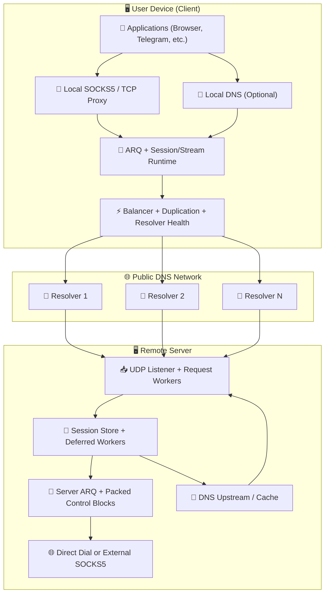
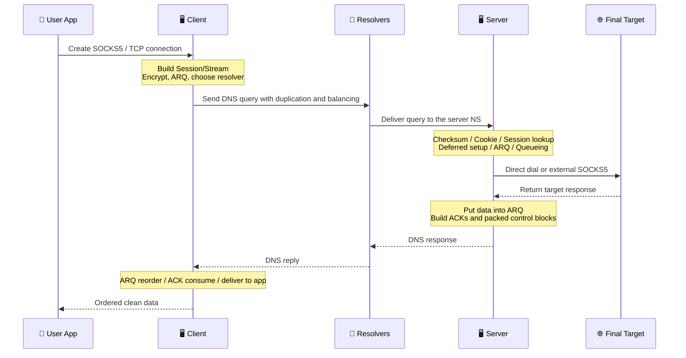

# MasterDnsVPN Project 🔐

## | 🇮🇷 [فارسی](https://github.com/masterking32/MasterDnsVPN/blob/main/README_FA.MD) | 🇬🇧 [English](https://github.com/masterking32/MasterDnsVPN/blob/main/README.MD) | 🇷🇺 [Русский](https://github.com/masterking32/MasterDnsVPN/blob/main/README_RU.MD) | 🇨🇳 [中文](https://github.com/masterking32/MasterDnsVPN/blob/main/README_ZH.MD) | 🇪🇸 [Español](https://github.com/masterking32/MasterDnsVPN/blob/main/README_ES.MD) | 🇮🇹 [Italiano](https://github.com/masterking32/MasterDnsVPN/blob/main/README_IT.MD) |

**MasterDnsVPN** 是一个面向科研的项目，旨在通过 DNS 查询和响应承载 TCP 流量。从总体目标上看，它与 DNSTT 或 SlipStream 等项目类似，但它遵循了根本不同的结构和实现思路。
本系统的设计目标是兼容多种解析器（resolver）行为以及恶劣的网络环境，力求即使在最糟糕的情况下也能保持尽可能高的稳定性和数据投递能力。


[](https://deepwiki.com/masterking32/MasterDnsVPN)
[](https://oosmetrics.com/achievement/5c7b2ce0-0af6-4648-8ded-fd1e847096cd)
[](https://oosmetrics.com/achievement/355e590f-9b4a-4015-bb8c-a7f27b721711)
[](https://oosmetrics.com/achievement/4b98a42e-bf63-4f55-a382-0f10359a5e20)

<a href="https://trendshift.io/repositories/23688" target="_blank"></a>

### 📊 MasterDnsVPN 与同类项目的对比

| 特性 | SlipStream | DNSTT | MasterDnsVPN |
| :--- | :--- | :--- | :--- |
| 协议类型 | 高级 DNS 隧道 | 经典 DNS 隧道 | 高级 DNS 隧道 / VPN |
| 传输协议 | QUIC | KCP + Noise | 自定义协议 + ARQ |
| 传输头部开销 | 🟠 约 24B | 🔴 约 59B | 🟢 约 5–7B<br>比 DNSTT 低约 88%<br>比 SlipStream 低约 71% |
| 加密方式 | TLS 1.3（QUIC 内部） | Noise（Curve25519） | AES / ChaCha20 / XOR（若使用 XOR：轻量、安全性较低且无额外开销） |
| 架构 | 统一式（QUIC 处理一切） | 多层式（KCP + SMUX + Noise） | 🟢 针对 DNS 优化的轻量自定义设计 |
| 速度 | 🟡 高（最高比 DNSTT 快约 5 倍） | 🔴 中 | 🟢 比其他项目更快<br>最高比 DNSTT 快约 9 倍<br>最高比 SlipStream 快约 3.6 倍 |
| 丢包下的稳定性 | 🟡 良好 | 🟠 中 | 🟢 极高（多路径 + ARQ） |
| 多解析器支持 | 是（多路径） | ❌ | 是 —— 高级（多解析器 + 冗余复制） |
| 重度审查下的抗封锁能力 | 良好 | 中 | 非常强（项目的核心目标） |
| 部署复杂度 | 中 | 简单 | 安装更简便<br>仅当你大量自定义高级设置时才更复杂 |
| SOCKS5 支持 | 是 | 是 | 针对 SOCKS5 / SOCKS4 优化，降低了 SOCKS 开销 |
| Shadowsocks 支持 | ✅ | ❌ | 间接支持：TCP 转发模式可承载基于 TCP 的协议<br>例如 Shadowsocks、VLESS/VMess 等 |
| 真正的多路径 | 是（QUIC 多路径） | ❌ | 是（多解析器 + 冗余复制） |
| 自适应路由 | 有限 | ❌ | 高级（基于延迟/丢包） |
| 设计目标 | 高速与高效 | 简单与稳定 | 在最恶劣的网络中存活 —— 稳定、速度与效率 |
| 实现语言 | Rust | Go | 主版本为 Go<br>同时也存在旧版 Python 版本 |
| 内置负载均衡器 | 🔴 | ❌ | 🟢（8 种内置均衡模式） |
| 冗余复制系统 | ❌ | ❌ | 是 —— 增加流量以提升可靠性（可配置或可禁用） |
| MTU 容忍度 | 优于 DNSTT | - | 即使 MTU 非常小也能工作，因为协议开销极低 |
| 故障切换系统 | ❌ | ❌ | ✅ |
| 下载速度 10MB（本地） | 🟡 0.978s | 🔴 2.492s | 🟢 0.270s |
| 上传速度 10MB（本地） | 🟡 3.249s | 🔴 16.207s | 🟢 1.746s |
| 解析器健康检查与自动禁用 | ❌ | ❌ | ✅ |
| 后台重新启用恢复健康的解析器 | ❌ | ❌ | ✅ |
| 客户端本地 DNS 服务（减少 DNS 劫持） | ❌ | ❌ | ✅（具备强力 DNS 缓存） |
| 通过 SOCKS5 进行 DNS 解析 | ❌ | ❌ | ✅（带 DNS 缓存） |
| 细粒度的专业配置 | 🟠 | 🟠 | 🟢 几乎每个子系统都可配置 |
| 无需外部辅助软件 | ❌ | ❌ | 🟢 无需额外软件；如有需要，仍可与 SOCKS 或 Shadowsocks、OpenVPN 等工具组合使用 |

---

### ❌ 免责声明

MasterDnsVPN 仅作为教育和研究项目提供。

- **不提供任何担保：** 本软件按“原样”（AS-IS）提供，不附带任何明示或暗示的担保，包括适销性、特定用途适用性或不侵权。
- **责任限制：** 本项目的开发者和贡献者对因使用本软件或无法使用本软件而引起的任何直接、间接、附带、后果性或其他损害概不负责。
- **用户责任：** 在测试环境之外使用本项目可能会扰乱或损害网络行为。用户需独自承担安装、配置和使用的一切后果。
- **法律合规：** 使用本项目绕过当地法律可能导致民事或刑事后果。请在使用前查阅你所在国家的法律法规。对于用户违反地方、国家或国际法律的行为，开发者概不负责。
- **许可条款：** 本软件的使用、复制、分发或修改受本仓库 `LICENSE` 文件中的许可协议约束。任何超出该条款的使用均被禁止。

---

## 公告与支持频道 📢

如需获取最新动态、发布信息和项目更新，请关注我们的 Telegram 频道：[Telegram Channel](https://t.me/masterdnsvpn)

---

### 如果你喜欢这个项目，请在 GitHub 上为它点亮星标（⭐）以示支持。这有助于让更多人发现本项目。

---

### 可选的资金支持 💸

- TON 网络：

`masterking32.ton`

- EVM 兼容网络（ETH 及兼容链）：

`0x517f07305D6ED781A089322B6cD93d1461bF8652`

- TRC20 网络（TRON）：

`TLApdY8APWkFHHoxebxGY8JhMeChiETqFH`

我们感谢每一份贡献和每一条反馈。你的支持将直接助力项目的持续开发与改进。

---

## 主要特性与优势 ✨

MasterDnsVPN 主要能力的简要概述：

- **抗审查与恶劣网络生存能力：** 🛡️ 设计用于在被过滤的网络、不稳定的链路以及严格的 MTU 环境中工作。
- **轻量自定义协议：** 🔄 采用带有重传逻辑的自定义协议，以降低开销并提升可用的 DNS 有效载荷。
- **多路径与数据包冗余复制：** 📡 通过多条路径发送流量，并支持选择性冗余复制，以提升在不稳定网络上的投递成功率。
- **智能解析器选择与健康检查：** ⚡ 根据质量与健康状况选择解析器，并自动管理有问题的解析器。
- **MTU 探测与同步：** 🧰 检测可用路径的实际 MTU 并据此对齐，以减少分片并提升稳定性。
- **SOCKS5 / SOCKS4 支持与优化：** 🧦 针对常见应用优化的本地代理处理。
- **打包控制块与更低的控制开销：** 📦 将 ACK/控制流量打包在一起，以减少控制信令的冗余。
- **可选的压缩与请求打包：** 🗜️ 减少请求数量，并在小 MTU 条件下提升效率。
- **灵活的加密：** 🔐 支持多种加密方法，以在速度与安全之间取得平衡。
- **可选的客户端本地 DNS 与缓存：** 📛 可对外提供本地 DNS 服务，降低延迟并减少劫持机会。
- **可伸缩的资源控制：** ⚙️ 既可运行在小型服务器上，也可针对更高负载进行调优。

此列表仅为高层次概述。下文的相关章节会更详细地解释每个领域。

---

## 🌐 在彻底的网络断网中经受实战检验

MasterDnsVPN 不只是一个理论项目。它经过实战检验，在全球互联网被完全切断的环境中也被证明可以工作。

最近，在伊朗持续 88 天的断网期间，当局不仅仅是封锁 VPN 或过滤网站——他们直接切断了国际带宽。在与外部世界的连接被物理切断 99% 的情况下，用户被困在一个封闭的本地内网之中。

当根本没有国际互联网可供连接时，标准的翻墙工具毫无用处。然而，在这场大规模断网期间，MasterDnsVPN 脱颖而出，成为极少数真正让用户保持连接到全球网络的“生命线”之一。

**它是如何在彻底断网中存活下来的？**
MasterDnsVPN 不像标准 VPN 那样工作，而是依靠智能的 DNS 隧道技术来穿透断网封锁：
* **多解析器：** 它通过多个 DNS 解析器路由流量，确保连接绝不依赖单一且容易被封锁的路径。
* **加密与数据切分：** 它对你的数据进行加密，并将其拆分成微小、分散的碎片。
* **伪装成合法流量：** 它将这些数据碎片包裹在标准且完全正常的 DNS 查询中。
* **绕过本地陷阱：** 由于流量看起来与基本的日常 DNS 请求一模一样，防火墙会允许其通过。即使网络强制你使用其自有的、受限的、由政府控制的本地解析器，数据依然会被解析并抵达外部世界。

正是这种精确的组合，使得 MasterDnsVPN 在外部世界被完全封锁时仍能维持稳定的连接。

---

# 安装与上手 🧑‍💻

## 第 1 部分：🖥️ 服务端部署

### 第 1.1 节：🌐 域名设置与准备（前置条件）

要在你的服务器上直接接收 DNS 请求，你必须将一个子域名委派给它。简而言之，需要创建两条记录：一条指向你服务器 IP 的 `A` 记录，以及一条将隧道子域名委派到该 A 记录的 `NS` 记录。

#### 步骤 1.1.1：🅰️ 创建 A 记录（服务器地址）

- **类型：** `A`
- **名称：** 一个简短的名称，例如 `ns`
- **值：** 你的服务器 IPv4 地址

> 示例：`ns.example.com -> 1.2.3.4`

> Cloudflare 提示：如果域名使用 Cloudflare，请打开 `DNS` 页面，并点击 `A` 记录旁边的云朵图标使其变为灰色（`DNS only`）。它绝不能保持被代理状态。

#### 步骤 1.1.2：🏷️ 创建 NS 记录（委派子域名）

- **类型：** `NS`
- **名称：** 隧道子域名，例如 `v`
- **值 / 目标：** `ns.example.com`

> 示例：`v.example.com -> ns.example.com`

> Cloudflare 提示：正常添加 `NS` 记录即可。Cloudflare 不会代理 NS 记录，但请确保 `ns` 这条 A 记录已被设置为 `DNS only`。

#### 第 1.1.3 节：💡 关于 MTU 的简短说明

较短的域名会在每个 DNS 请求中为实际数据留出更多空间。为了获得更好的吞吐量，请尽量保持名称简短。如果你使用 Cloudflare，仍应将相关记录保持为 `DNS only` 模式。

---

### 第 1.2 节：🐧 Linux 服务器快速安装

#### 步骤 1.2.1：自动安装（脚本）

如果你想在 Linux 上部署服务端，最简单的方法是使用自动安装脚本。在服务器上运行此命令：

```bash
bash <(curl -Ls https://raw.githubusercontent.com/masterking32/MasterDnsVPN/main/server_linux_install.sh)
```

该脚本会自动完成安装和配置。完成后，服务器会启动，**加密密钥**会显示在终端日志中，并同时写入可执行文件旁边的 `encrypt_key.txt`。请妥善保管此密钥。

#### 步骤 1.2.2：安装后的重要说明

- 安装期间，系统会询问你一个域名。它必须与你在 `NS` 记录中配置的、被委派的子域名相同，例如 `v.example.com`。
- 创建 DNS 记录后，请等待其生效传播。这可能需要几分钟到数小时，在某些情况下，视 TTL 和 DNS 提供商而定，最长可达 48 小时。
- 要验证 DNS 设置，你可以使用 `dig` 或 `nslookup` 等工具，例如 `dig v.example.com NS` 或 `nslookup -type=ns v.example.com`。如需直接向新的域名服务器查询：`dig @ns.example.com v.example.com A`。
- 如果服务器防火墙已启用，请放行 UDP 53 端口。`ufw` 示例：

```bash
sudo ufw allow 53/udp
sudo ufw reload
```

`firewalld` 示例：

```bash
sudo firewall-cmd --add-port=53/udp --permanent
sudo firewall-cmd --reload
```

- 如果 `53` 端口已被其他服务（例如 `systemd-resolved`）占用，请参阅故障排除章节“修复端口 53 已被占用”。
- 加密密钥（`encrypt_key.txt`）会在安装后显示。请将其复制并妥善保存，因为客户端需要它才能连接。

---

## 第 2 部分：🚀 安装与启动（客户端与服务端）

你可以通过两种方式安装并运行本项目：

1. 使用预编译的二进制文件（推荐给大多数用户）
2. 使用 **Go** 直接从源码运行（推荐给开发者）

---

### 第 2.1 节：使用预编译的发布版本（✅ 推荐）

为方便起见，发布页面提供了预编译的客户端和服务端二进制文件。请下载适用于你操作系统的正确压缩包并解压。

> 💡 **说明：** 发布压缩包通常包含二进制文件以及示例配置文件。

#### 客户端下载链接 📥

| 操作系统 | 架构 | 适用于 | 直接下载 |
| :--- | :--- | :--- | :--- |
| Windows 🪟 | `AMD64`（64 位） | Windows 10 和 11 | [下载 Windows 客户端 ⬇️](https://github.com/masterking32/MasterDnsVPN/releases/latest/download/MasterDnsVPN_Client_Windows_AMD64.zip) |
| Windows 🪟 | `x86`（32 位） | 较旧的 32 位 Windows 系统 | [下载 Windows x86 客户端 ⬇️](https://github.com/masterking32/MasterDnsVPN/releases/latest/download/MasterDnsVPN_Client_Windows_X86.zip) |
| Windows 🪟 | `ARM64` | ARM 架构的 Windows 设备 | [下载 Windows ARM64 客户端 ⬇️](https://github.com/masterking32/MasterDnsVPN/releases/latest/download/MasterDnsVPN_Client_Windows_ARM64.zip) |
| macOS 🍎 | `ARM64` | Apple Silicon Mac（M1 / M2 / M3） | [下载 macOS 客户端 ⬇️](https://github.com/masterking32/MasterDnsVPN/releases/latest/download/MasterDnsVPN_Client_MacOS_ARM64.zip) |
| macOS 🍎 | `AMD64` | Intel Mac | [下载 macOS Intel 客户端 ⬇️](https://github.com/masterking32/MasterDnsVPN/releases/latest/download/MasterDnsVPN_Client_MacOS_AMD64.zip) |
| Linux 🐧 | `AMD64`（64 位） | 现代发行版（Ubuntu 22.04+、Debian 12+） | [下载 Linux 客户端 ⬇️](https://github.com/masterking32/MasterDnsVPN/releases/latest/download/MasterDnsVPN_Client_Linux_AMD64.zip) |
| Linux 🐧 | `x86`（32 位） | 较旧的 32 位 Linux 系统 | [下载 Linux x86 客户端 ⬇️](https://github.com/masterking32/MasterDnsVPN/releases/latest/download/MasterDnsVPN_Client_Linux_X86.zip) |
| Linux（旧版）🐧 | `AMD64`（64 位） | 较旧的发行版（Ubuntu 20.04、Debian 11） | [下载 Linux 旧版客户端 ⬇️](https://github.com/masterking32/MasterDnsVPN/releases/latest/download/MasterDnsVPN_Client_Linux-Legacy_AMD64.zip) |
| Linux（旧版）🐧 | `ARM64` | 需要更广泛兼容性的较旧 ARM64 Linux 系统 | [下载 Linux 旧版 ARM64 客户端 ⬇️](https://github.com/masterking32/MasterDnsVPN/releases/latest/download/MasterDnsVPN_Client_Linux-Legacy_ARM64.zip) |
| Linux（ARM）🐧 | `ARM64` | ARM 服务器、Raspberry Pi 及类似开发板 | [下载 Linux ARM 客户端 ⬇️](https://github.com/masterking32/MasterDnsVPN/releases/latest/download/MasterDnsVPN_Client_Linux_ARM64.zip) |
| Linux（ARM）🐧 | `ARMv7` | 32 位 ARM 开发板及较旧的嵌入式 Linux 设备 | [下载 Linux ARMv7 客户端 ⬇️](https://github.com/masterking32/MasterDnsVPN/releases/latest/download/MasterDnsVPN_Client_Linux_ARMV7.zip) |
| Linux（ARM）🐧 | `ARMv6` | 较旧的 ARM 开发板及轻量级 Linux 设备 | [下载 Linux ARMv6 客户端 ⬇️](https://github.com/masterking32/MasterDnsVPN/releases/latest/download/MasterDnsVPN_Client_Linux_ARMV6.zip) |
| Linux（ARM）🐧 | `ARMv5` | 非常老旧的 ARM 设备及嵌入式 Linux 系统 | [下载 Linux ARMv5 客户端 ⬇️](https://github.com/masterking32/MasterDnsVPN/releases/latest/download/MasterDnsVPN_Client_Linux_ARMV5.zip) |
| Linux 🐧 | `RISCV64` | RISC-V Linux 开发板及服务器 | [下载 Linux RISCV64 客户端 ⬇️](https://github.com/masterking32/MasterDnsVPN/releases/latest/download/MasterDnsVPN_Client_Linux_RISCV64.zip) |
| Linux（MIPS）🐧 | `MIPS` | 大端 MIPS Linux 及路由器平台 | [下载 Linux MIPS 客户端 ⬇️](https://github.com/masterking32/MasterDnsVPN/releases/latest/download/MasterDnsVPN_Client_Linux_MIPS.zip) |
| Linux（MIPS）🐧 | `MIPSLE` | 小端 MIPS Linux 及路由器平台 | [下载 Linux MIPSLE 客户端 ⬇️](https://github.com/masterking32/MasterDnsVPN/releases/latest/download/MasterDnsVPN_Client_Linux_MIPSLE.zip) |
| Linux（MIPS）🐧 | `MIPS64` | 64 位大端 MIPS Linux 系统 | [下载 Linux MIPS64 客户端 ⬇️](https://github.com/masterking32/MasterDnsVPN/releases/latest/download/MasterDnsVPN_Client_Linux_MIPS64.zip) |
| Linux（MIPS）🐧 | `MIPS64LE` | 64 位小端 MIPS Linux 系统 | [下载 Linux MIPS64LE 客户端 ⬇️](https://github.com/masterking32/MasterDnsVPN/releases/latest/download/MasterDnsVPN_Client_Linux_MIPS64LE.zip) |
| Termux / Android 📱 | `ARM64` | 运行 Termux 的现代 Android 手机 | [下载 Termux ARM64 客户端 ⬇️](https://github.com/masterking32/MasterDnsVPN/releases/latest/download/MasterDnsVPN_Client_Termux_ARM64.zip) |
| Termux / Android 📱 | `ARMv7` | 运行 32 位 Termux 环境的较旧 Android 手机 | [下载 Termux ARMv7 客户端 ⬇️](https://github.com/masterking32/MasterDnsVPN/releases/latest/download/MasterDnsVPN_Client_Termux_ARMV7.zip) |

#### 服务端下载链接 📤

*（如果你不想使用自动化的 Linux 安装程序，请使用这些。）*

| 操作系统 | 架构 | 适用于 | 直接下载 |
| :--- | :--- | :--- | :--- |
| Windows 🪟 | `AMD64`（64 位） | Windows Server、Windows 10 和 11 | [下载 Windows 服务端 ⬇️](https://github.com/masterking32/MasterDnsVPN/releases/latest/download/MasterDnsVPN_Server_Windows_AMD64.zip) |
| Windows 🪟 | `x86`（32 位） | 较旧的 32 位 Windows 系统 | [下载 Windows x86 服务端 ⬇️](https://github.com/masterking32/MasterDnsVPN/releases/latest/download/MasterDnsVPN_Server_Windows_X86.zip) |
| Windows 🪟 | `ARM64` | ARM 架构的 Windows 设备 | [下载 Windows ARM64 服务端 ⬇️](https://github.com/masterking32/MasterDnsVPN/releases/latest/download/MasterDnsVPN_Server_Windows_ARM64.zip) |
| Linux 🐧 | `AMD64`（64 位） | Ubuntu 22.04+、Debian 12+ 服务器 | [下载 Linux 服务端 ⬇️](https://github.com/masterking32/MasterDnsVPN/releases/latest/download/MasterDnsVPN_Server_Linux_AMD64.zip) |
| Linux 🐧 | `x86`（32 位） | 较旧的 32 位 Linux 系统 | [下载 Linux x86 服务端 ⬇️](https://github.com/masterking32/MasterDnsVPN/releases/latest/download/MasterDnsVPN_Server_Linux_X86.zip) |
| Linux（旧版）🐧 | `AMD64`（64 位） | 较旧的服务器（Ubuntu 20.04、Debian 11） | [下载 Linux 旧版服务端 ⬇️](https://github.com/masterking32/MasterDnsVPN/releases/latest/download/MasterDnsVPN_Server_Linux-Legacy_AMD64.zip) |
| Linux（旧版）🐧 | `ARM64` | 需要更广泛兼容性的较旧 ARM64 Linux 系统 | [下载 Linux 旧版 ARM64 服务端 ⬇️](https://github.com/masterking32/MasterDnsVPN/releases/latest/download/MasterDnsVPN_Server_Linux-Legacy_ARM64.zip) |
| Linux（ARM）🐧 | `ARM64` | ARM 服务器 | [下载 Linux ARM 服务端 ⬇️](https://github.com/masterking32/MasterDnsVPN/releases/latest/download/MasterDnsVPN_Server_Linux_ARM64.zip) |
| Linux（ARM）🐧 | `ARMv7` | 32 位 ARM 服务器及嵌入式 Linux 设备 | [下载 Linux ARMv7 服务端 ⬇️](https://github.com/masterking32/MasterDnsVPN/releases/latest/download/MasterDnsVPN_Server_Linux_ARMV7.zip) |
| Linux（ARM）🐧 | `ARMv6` | 较旧的 ARM 开发板及轻量级 Linux 设备 | [下载 Linux ARMv6 服务端 ⬇️](https://github.com/masterking32/MasterDnsVPN/releases/latest/download/MasterDnsVPN_Server_Linux_ARMV6.zip) |
| Linux（ARM）🐧 | `ARMv5` | 非常老旧的 ARM 设备及嵌入式 Linux 系统 | [下载 Linux ARMv5 服务端 ⬇️](https://github.com/masterking32/MasterDnsVPN/releases/latest/download/MasterDnsVPN_Server_Linux_ARMV5.zip) |
| Linux 🐧 | `RISCV64` | RISC-V Linux 开发板及服务器 | [下载 Linux RISCV64 服务端 ⬇️](https://github.com/masterking32/MasterDnsVPN/releases/latest/download/MasterDnsVPN_Server_Linux_RISCV64.zip) |
| Linux（MIPS）🐧 | `MIPS` | 大端 MIPS Linux 及路由器平台 | [下载 Linux MIPS 服务端 ⬇️](https://github.com/masterking32/MasterDnsVPN/releases/latest/download/MasterDnsVPN_Server_Linux_MIPS.zip) |
| Linux（MIPS）🐧 | `MIPSLE` | 小端 MIPS Linux 及路由器平台 | [下载 Linux MIPSLE 服务端 ⬇️](https://github.com/masterking32/MasterDnsVPN/releases/latest/download/MasterDnsVPN_Server_Linux_MIPSLE.zip) |
| Linux（MIPS）🐧 | `MIPS64` | 64 位大端 MIPS Linux 系统 | [下载 Linux MIPS64 服务端 ⬇️](https://github.com/masterking32/MasterDnsVPN/releases/latest/download/MasterDnsVPN_Server_Linux_MIPS64.zip) |
| Linux（MIPS）🐧 | `MIPS64LE` | 64 位小端 MIPS Linux 系统 | [下载 Linux MIPS64LE 服务端 ⬇️](https://github.com/masterking32/MasterDnsVPN/releases/latest/download/MasterDnsVPN_Server_Linux_MIPS64LE.zip) |
| macOS 🍎 | `ARM64` | Apple Silicon Mac | [下载 macOS 服务端 ⬇️](https://github.com/masterking32/MasterDnsVPN/releases/latest/download/MasterDnsVPN_Server_MacOS_ARM64.zip) |
| macOS 🍎 | `AMD64` | Intel Mac | [下载 macOS Intel 服务端 ⬇️](https://github.com/masterking32/MasterDnsVPN/releases/latest/download/MasterDnsVPN_Server_MacOS_AMD64.zip) |
| Termux / Android 📱 | `ARM64` | 现代 Android / Termux 环境 | [下载 Termux ARM64 服务端 ⬇️](https://github.com/masterking32/MasterDnsVPN/releases/latest/download/MasterDnsVPN_Server_Termux_ARM64.zip) |
| Termux / Android 📱 | `ARMv7` | 较旧的 Android / 32 位 Termux 环境 | [下载 Termux ARMv7 服务端 ⬇️](https://github.com/masterking32/MasterDnsVPN/releases/latest/download/MasterDnsVPN_Server_Termux_ARMV7.zip) |

---

### 第 2.2 节：📦 MasterDnsVPN Docker 镜像

---

#### 第 2.2.1 节：⚠️ 概述

该 Docker 镜像在容器化环境中运行 MasterDnsVPN 服务端，并支持多架构构建。

它会自动：

* 在不存在配置时启动一份默认配置
* 在首次启动时注入你的域名
* 将持久化数据存储在 `/data`

---

#### 第 2.2.2 节：🖥 支持的架构

* linux/amd64
* linux/arm/v5
* linux/arm/v7
* linux/arm64/v8
* linux/mips64le

---

#### 第 2.2.3 节：🚀 快速开始

使用 Docker 运行容器：

```bash
docker run -d \
  --name masterdnsvpn \
  --restart unless-stopped \
  -e DOMAIN=v.example.com \
  -v $(pwd)/data:/data \
  -p 53:53/tcp \
  -p 53:53/udp \
  ghcr.io/masterking32/masterdnsvpn:latest
```

---

#### 第 2.2.4 节：🧪 docker-compose 示例

```yaml
services:
  masterdnsvpn:
    image: ghcr.io/masterking32/masterdnsvpn:latest
    restart: unless-stopped
    environment:
      - DOMAIN=v.example.com
    volumes:
      - ./data:/data
    ports:
      - "53:53/tcp"
      - "53:53/udp"
```

---

#### 第 2.2.5 节：⚙️ 必需的环境变量

| 变量 | 说明                             |
| -------- | --------------------------------------- |
| DOMAIN   | 你的 DNS 域名（首次运行时必需） |

> ⚠️ 如果首次启动时未设置 `DOMAIN`，容器将报错并停止。

---

#### 第 2.2.6 节：📁 持久化数据

存储在 `/data` 中：

* `server_config.toml`
* `encrypt_key.txt`

你可以将其挂载为卷：

```bash
-v ./data:/data
```

---

#### 第 2.2.7 节：🔧 MikroTik / RouterOS 用法

对于 MikroTik 容器：

* 使用最新的 v7 MikroTik RouterOS
* 将 UDP/TCP 53 端口做目标 NAT（Destination NAT）转发到你的容器
* 完整的 MikroTik 容器配置：https://help.mikrotik.com/docs/spaces/ROS/pages/84901929/Container

示例：

```bash
/container mounts
add dst=/data list=MasterDnsVPN src=/containers/mounts/MasterDnsVPN

/container envs
add key=DOMAIN list=MasterDnsVPN value=v.example.com

/container add check-certificate=no dns=1.1.1.1 envlists=MasterDnsVPN hostname=MasterDnsVPN interface=MasterDnsVPN layer-dir="" mountlists=MasterDnsVPN name=MasterDnsVPN remote-image=ghcr.io/masterking32/masterdnsvpn:latest root-dir=/containers/data/MasterDnsVPN start-on-boot=yes
```

---

#### 第 2.2.8 节：📌 注意事项

* 必须使用 DNS 端口 `53`（UDP/TCP）
* 切勿在同一主机上运行另一个 DNS 服务
* 为生产使用而设计，但依然轻量
* 无需 systemd 或修改主机

---

### 第 2.3 节：🪟 在 Windows 上准备并运行客户端

- 下载 Windows 包后，将其解压。
- 用记事本等文本编辑器打开 `client_config.toml`。
- 将默认值替换为你真实的域名、加密密钥和解析器列表。
- 运行客户端可执行文件。
- 除非你更改了默认值，否则请将浏览器或应用配置为使用本地 SOCKS5 代理 `127.0.0.1:18000`。

---

### 第 2.4 节：🐧 在 Linux / macOS 上准备并运行

在 Linux 上下载包之后：

```bash
sudo apt update
sudo apt install unzip nano
```

解压压缩包：

```bash
unzip MasterDnsVPN_Client_Linux_AMD64.zip
ls
```

如有需要，赋予执行权限：

```bash
chmod +x MasterDnsVPN_Client_Linux_AMD64
chmod +x MasterDnsVPN_Server_Linux_AMD64
```

编辑配置文件：

```bash
nano client_config.toml
nano server_config.toml
```

然后运行：

```bash
./MasterDnsVPN_Client_Linux_AMD64
./MasterDnsVPN_Server_Linux_AMD64
```

---

### 第 2.5 节：🧑‍💻 直接从源码运行（Go）

> ⚠️ 本节面向希望直接运行当前 Go 源码的开发者或用户。

#### 前置条件

- Go `1.24` 或更新版本

#### 从源码构建

```bash
git clone https://github.com/masterking32/MasterDnsVPN.git
cd MasterDnsVPN

go build -o masterdnsvpn-client ./cmd/client
go build -o masterdnsvpn-server ./cmd/server
```

在 Windows 上：

```powershell
git clone https://github.com/masterking32/MasterDnsVPN.git
cd MasterDnsVPN

go build -o masterdnsvpn-client.exe .\cmd\client
go build -o masterdnsvpn-server.exe .\cmd\server
```

#### 创建配置文件

在 Linux 和 macOS 上：

```bash
cp client_config.toml.simple client_config.toml
cp server_config.toml.simple server_config.toml
cp client_resolvers.simple client_resolvers.txt
```

在 Windows 上：

```powershell
Copy-Item client_config.toml.simple client_config.toml
Copy-Item server_config.toml.simple server_config.toml
Copy-Item client_resolvers.simple client_resolvers.txt
```

#### 运行服务端和客户端

```bash
./masterdnsvpn-server -config server_config.toml
./masterdnsvpn-client -config client_config.toml
```

在 Windows 上：

```powershell
.\masterdnsvpn-server.exe -config server_config.toml
.\masterdnsvpn-client.exe -config client_config.toml
```

#### 命令行参数

两个二进制文件都支持以下参数：

| 参数 | 说明 |
| :--- | :--- |
| `-config` | 配置文件路径 |
| `-log` | 可选的日志文件路径 |
| `-version` | 打印版本并退出 |

示例：

```bash
./masterdnsvpn-server -config server_config.toml -log server.log
./masterdnsvpn-client -config client_config.toml -log client.log
```

---

# 第 3 部分：配置文件与结构 🛠️

## 第 3.1 节：项目重要文件 📂

| 文件 | 用途 |
| :--- | :--- |
| `client_config.toml` | 主客户端配置 |
| `server_config.toml` | 主服务端配置 |
| `client_resolvers.txt` | 解析器列表 |
| `encrypt_key.txt` | 服务端共享加密密钥 |
| `client_config.toml.simple` | 当前 Go 版本的完整客户端示例配置 |
| `server_config.toml.simple` | 当前 Go 版本的完整服务端示例配置 |

`client_resolvers.txt` 中接受的格式：

- `IP`
- `IP:PORT`
- `CIDR`
- `CIDR:PORT`

示例：

```text
8.8.8.8
1.1.1.1:53
9.9.9.0/24
208.67.222.0/24:5353
```

---

## 第 3.2 节：客户端快速检查清单 🚀

以下这些项目在客户端上是必需的：

1. **`ENCRYPTION_KEY`** 必须与服务端 `encrypt_key.txt` 的内容一致
2. **`DOMAINS`** 必须与服务器域名匹配
3. **`client_resolvers.txt`** 必须包含可用的解析器
4. 对于常规使用，请保持 **`PROTOCOL_TYPE = "SOCKS5"`**

---

## 第 3.3 节：服务端快速检查清单 ⚙️

以下这些设置在服务端至关重要：

1. 将 **`DOMAIN`** 设置为你被委派的隧道域名
2. **`DATA_ENCRYPTION_METHOD`** 必须与客户端匹配
3. **`ENCRYPTION_KEY_FILE`** 定义服务端密钥文件的路径
4. 如果你想要直接出站连接，请保持 **`USE_EXTERNAL_SOCKS5 = false`**
5. 如果你想通过上游 SOCKS5 代理进行链式转发，请设置 `USE_EXTERNAL_SOCKS5 = true` 并填写 `FORWARD_IP` / `FORWARD_PORT`

---

## 第 3.4 节：📘 客户端配置变量（`client_config.toml`）

### 3.4.1) 🧭 隧道标识与安全

| 参数 | 示例值 | 允许的值 / 实际行为 | 完整说明 |
| :--- | :--- | :--- | :--- |
| `PROTOCOL_TYPE` | `"SOCKS5"` | `"SOCKS5"` 或 `"TCP"` | 选择客户端对外暴露的本地服务模式。<br>`SOCKS5` 是常规使用的默认且推荐的模式。<br>`TCP` 在你希望将流量转发到一个固定的远程目标，而非给应用提供 SOCKS 代理时很有用。 |
| `DOMAINS` | `["v.example.com"]` | 非空的字符串列表 | 这些是用于构建 DNS 请求的隧道域名。<br>这里的每个域名都必须属于你在服务端配置的同一条隧道。<br>如果此列表有误，客户端可能会构建出有效的 DNS 查询，但服务器会直接忽略它们。 |
| `DATA_ENCRYPTION_METHOD` | `1` | `0..5` | 必须与服务端匹配。<br>`0=None`、`1=XOR`、`2=ChaCha20`、`3=AES-128-GCM`、`4=AES-192-GCM`、`5=AES-256-GCM`。<br>XOR 轻量但较弱。AEAD 模式更强但开销更大。 |
| `ENCRYPTION_KEY` | `""` | 字符串 | 客户端编解码器使用的共享密钥。<br>它必须与服务端的加密密钥完全相同。<br>如果密钥错误，数据包可能被解析为乱码，隧道将无法工作。 |

### 3.4.2) 🧦 本地代理

| 参数 | 示例值 | 允许的值 / 实际行为 | 完整说明 |
| :--- | :--- | :--- | :--- |
| `LISTEN_IP` | `"127.0.0.1"` | 有效的 IP 字符串 | 客户端监听本地代理用户的地址。<br>常规仅本地使用请用 `127.0.0.1`。<br>如果你系统上某些应用更倾向于 IPv6 本地回环，使用 `localhost` 可能是更好的仅本地选择。<br>仅当你想在网络上共享该代理并理解其安全影响时，才使用 `0.0.0.0`。 |
| `LISTEN_PORT` | `18000` | `0..65535` | 本地代理的端口。<br>你的应用必须使用此端口将流量送入隧道。 |
| `SOCKS5_AUTH` | `false` | `true/false` | 在本地 SOCKS5 代理上启用用户名/密码认证。<br>如果你绑定到 `0.0.0.0`，强烈建议启用此项。 |
| `SOCKS5_USER` | `"master_dns_vpn"` | 最多 255 字节 | 本地 SOCKS5 代理的用户名。<br>仅在 `SOCKS5_AUTH=true` 时使用。 |
| `SOCKS5_PASS` | `"master_dns_vpn"` | 最多 255 字节 | 本地 SOCKS5 代理的密码。<br>仅在 `SOCKS5_AUTH=true` 时使用。 |

### 3.4.3) 📛 本地 DNS

| 参数 | 示例值 | 允许的值 / 实际行为 | 完整说明 |
| :--- | :--- | :--- | :--- |
| `LOCAL_DNS_ENABLED` | `false` | `true/false` | 如果启用，客户端会对外暴露一个本地 DNS 服务，并可通过隧道解析 DNS。<br>这有助于减少 DNS 劫持，或在你希望应用也通过隧道进行 DNS 时使用。 |
| `LOCAL_DNS_IP` | `"127.0.0.1"` | 有效的 IP 字符串 | 本地 DNS 监听器的绑定地址。 |
| `LOCAL_DNS_PORT` | `53` | `0..65535` | 本地 DNS 服务的端口。<br>`53` 端口是标准端口，但在某些系统上它可能已被其他服务占用。 |
| `LOCAL_DNS_CACHE_MAX_RECORDS` | `5000` | 若 `<1` 则使用回退值 | 本地 DNS 缓存记录的最大数量。<br>较大的值可减少重复的 DNS 查询，但会占用更多内存。 |
| `LOCAL_DNS_CACHE_TTL_SECONDS` | `28800.0` | 若 `<=0` 则使用回退值 | 成功的 DNS 记录在本地缓存中保留多长时间。 |
| `LOCAL_DNS_PENDING_TIMEOUT_SECONDS` | `300.0` | 若 `<=0` 则使用回退值 | 如果某个本地 DNS 查询正在进行中，后续查询可以等待它，而不是再发起一个上游请求。<br>此值定义了它们最多可等待多长时间。 |
| `LOCAL_DNS_CACHE_PERSIST_TO_FILE` | `true` | `true/false` | 如果启用，本地 DNS 缓存可写入磁盘以便在多次运行之间复用。 |
| `LOCAL_DNS_CACHE_FLUSH_INTERVAL_SECONDS` | `60.0` | 若 `<=0` 则使用回退值 | 持久化的本地 DNS 缓存多久刷新到磁盘一次。 |
| `DNS_RESPONSE_FRAGMENT_TIMEOUT_SECONDS` | `10.0` | 若 `<=0` 则使用回退值 | 客户端在放弃之前，等待缺失的 DNS 隧道响应分片多长时间。 |

### 3.4.4) ⚡ 解析器选择、冗余复制、健康与故障切换

| 参数 | 示例值 | 允许的值 / 实际行为 | 完整说明 |
| :--- | :--- | :--- | :--- |
| `RESOLVER_BALANCING_STRATEGY` | `2` | `0..8` | 选择解析器的方式。<br>`0/2` = 轮询（Round Robin）、`1` = 随机、`3` = 最小丢包、`4` = 最低延迟、`5` = 混合评分、`6` = 先丢包后延迟、`7` = 最小丢包前列随机、`8` = 最小丢包前列轮询。<br>混合模式使用加权综合评分。先丢包后延迟模式先按丢包筛选出候选名单，然后在该层中优先选择更低延迟，并在几乎相当的前列候选之间轮换。前列随机模式从最佳丢包层中随机挑选，以免负载固定在单个解析器上。前列轮询模式以确定性的轮换方式循环遍历同一最佳丢包层。 |
| `PACKET_DUPLICATION_COUNT` | `2` | 代码中会钳制到有效范围 | 常规出站数据包的冗余复制次数。<br>较高的值会增加流量成本，但能提升弱链路上的生存能力。 |
| `SETUP_PACKET_DUPLICATION_COUNT` | `2` | 代码中会钳制到有效范围 | 与 `PACKET_DUPLICATION_COUNT` 类似，但用于对建立过程敏感的数据包，例如流创建及其他关键控制事件。 |
| `STREAM_RESOLVER_FAILOVER_RESEND_THRESHOLD` | `2` | 若 `<1` 则使用回退值 | 如果某条流在同一首选解析器上累积了反复的重发压力，客户端可能会将该流故障切换到另一个解析器。<br>此阈值控制切换发生的速度。 |
| `STREAM_RESOLVER_FAILOVER_COOLDOWN` | `2.5` | 若 `<=0` 则使用回退值 | 同一条流两次故障切换之间的最小延迟。<br>这可防止在解析器之间发生不稳定的来回振荡。 |
| `RECHECK_INACTIVE_SERVERS_ENABLED` | `true` | `true/false` | 为当前被禁用或不健康的解析器启用后台重新检查。<br>如果禁用，一旦解析器变得不可用，它将一直保持禁用状态，直到重启或手动重建。 |
| `AUTO_DISABLE_TIMEOUT_SERVERS` | `true` | `true/false` | 启用对持续超时且无任何成功活动的解析器的自动禁用。 |
| `AUTO_DISABLE_TIMEOUT_WINDOW_SECONDS` | `30.0` | 若 `<=0` 则使用回退值 | 用于判断某解析器是否仅有超时的时间窗口。<br>如果此窗口内的所有观察结果都是超时，该解析器可能会被禁用。 |
| `BASE_ENCODE_DATA` | `false` | `true/false` | 如果启用，载荷会在隧道传输前以基于安全字符集的格式编码。<br>这通常会降低载荷效率，但在严格的解析器环境中可能有所帮助。 |

### 3.4.5) 🗜️ 压缩

| 参数 | 示例值 | 允许的值 / 实际行为 | 完整说明 |
| :--- | :--- | :--- | :--- |
| `UPLOAD_COMPRESSION_TYPE` | `0` | `0..3` | `0=OFF`、`1=ZSTD`、`2=LZ4`、`3=ZLIB`。<br>控制客户端对出站载荷的压缩。 |
| `DOWNLOAD_COMPRESSION_TYPE` | `0` | `0..3` | 对服务器到客户端载荷所期望或偏好的压缩类型。 |
| `COMPRESSION_MIN_SIZE` | `120` | 若无效则使用回退值 | 尝试压缩前的最小载荷大小。<br>非常小的数据包压缩后往往会变大而非变小，因此这可避免无意义的压缩工作。 |

### 3.4.6) 🧪 MTU 探测与初始测试

| 参数 | 示例值 | 允许的值 / 实际行为 | 完整说明 |
| :--- | :--- | :--- | :--- |
| `MIN_UPLOAD_MTU` | `38` | 正整数 | 解析器测试期间客户端接受的最小上传 MTU。强制下限为会话初始化（session-init）载荷大小（10）。 |
| `MIN_DOWNLOAD_MTU` | `100` | 正整数 | 解析器测试期间客户端接受的最小下载 MTU。强制下限为会话接受（session-accept）载荷大小（20）。 |
| `MAX_UPLOAD_MTU` | `150` | 正整数 | 上传 MTU 测试的上限。 |
| `MAX_DOWNLOAD_MTU` | `500` | 正整数 | 下载 MTU 测试的上限。 |
| `MTU_TEST_RETRIES` | `2` | 若无效则使用回退值 | 每次 MTU 探测的重试次数。 |
| `MTU_TEST_TIMEOUT` | `2.0` | 若无效则使用回退值 | 单次 MTU 探测的超时时间。 |
| `MTU_TEST_PARALLELISM` | `16` | 若无效则使用回退值 | MTU 扫描期间并行测试的解析器数量。<br>较高的值扫描更快，但会占用更多 CPU/网络，并可能产生更多噪声性的失败。 |
| `SAVE_MTU_SERVERS_TO_FILE` | `false` | `true/false` | 如果启用，成功的解析器结果会写入一个输出文件。 |
| `MTU_SERVERS_FILE_NAME` | `"masterdnsvpn_success_test_{time}.log"` | 字符串 | MTU 测试成功的解析器的输出文件名模板。 |
| `MTU_SERVERS_FILE_FORMAT` | `"{IP} ({DOMAIN}) - UP: {UP_MTU} DOWN: {DOWN-MTU}"` | 字符串 | MTU 结果文件中使用的输出格式。 |
| `MTU_USING_SECTION_SEPARATOR_TEXT` | `""` | 字符串 | 插入到 MTU 输出文件中的可选分隔文本。 |
| `MTU_REMOVED_SERVER_LOG_FORMAT` | `"Resolver {IP} ({DOMAIN}) removed at {TIME} due to {CAUSE}"` | 字符串 | 当解析器从有效集合中被移除时的日志/输出格式。 |
| `MTU_ADDED_SERVER_LOG_FORMAT` | `"Resolver {IP} ({DOMAIN}) added back at {TIME} (UP {UP_MTU}, DOWN {DOWN_MTU})"` | 字符串 | 当解析器被恢复时的日志/输出格式。 |
| `MTU_REACTIVE_ADDED_SERVER_LOG_FORMAT` | `"Resolver {IP} ({DOMAIN}) added back at {TIME} after reactive recheck (UP {UP_MTU}, DOWN {DOWN_MTU})"` | 字符串 | 当解析器经后台健康检查被恢复时的日志/输出格式。 |

### 3.4.7) 🧵 运行时工作线程、队列与计时器

| 参数 | 示例值 | 允许的值 / 实际行为 | 完整说明 |
| :--- | :--- | :--- | :--- |
| `RX_TX_WORKERS` | `4` | 若无效则使用回退值 | 用于 UDP 隧道读取和写入的共享运行时工作线程数量。 |
| `TUNNEL_PROCESS_WORKERS` | `6` | 若无效则使用回退值 | 读取后处理隧道数据包的工作线程数量。 |
| `TUNNEL_PACKET_TIMEOUT_SECONDS` | `10.0` | 若无效则使用回退值 | 隧道数据包处理的总体超时时间。 |
| `DISPATCHER_IDLE_POLL_INTERVAL_SECONDS` | `0.020` | 若无效则使用回退值 | 当没有内容可发送时，调度器会休眠此间隔后再次轮询。 |
| `RX_CHANNEL_SIZE` | `4096` | 若无效则使用回退值 | 入站隧道数据包通道的容量。 |
| `SOCKS_UDP_ASSOCIATE_READ_TIMEOUT_SECONDS` | `30.0` | 若无效则使用回退值 | SOCKS UDP associate 模式的读取超时。 |
| `CLIENT_TERMINAL_STREAM_RETENTION_SECONDS` | `45.0` | 若无效则使用回退值 | 终结流在完全清理前在客户端记账中保留多长时间。 |
| `CLIENT_CANCELLED_SETUP_RETENTION_SECONDS` | `120.0` | 若无效则使用回退值 | 在完成前被取消的建立流的保留时间。 |
| `SESSION_INIT_RETRY_BASE_SECONDS` | `1.0` | 若无效则使用回退值 | 会话初始化重试的基础延迟。 |
| `SESSION_INIT_RETRY_STEP_SECONDS` | `1.0` | 若无效则使用回退值 | 重试计划中使用的步进增量。 |
| `SESSION_INIT_RETRY_LINEAR_AFTER` | `5` | 若无效则使用回退值 | 在达到此重试次数后，重试退避会变得更线性。 |
| `SESSION_INIT_RETRY_MAX_SECONDS` | `60.0` | 若无效则使用回退值 | 会话初始化的最大重试延迟。 |
| `SESSION_INIT_BUSY_RETRY_INTERVAL_SECONDS` | `60.0` | 若无效则使用回退值 | 当服务器明确以 `SESSION_BUSY` 响应时的重试延迟。 |

### 3.4.8) 📡 Ping / 保活

| 参数 | 示例值 | 允许的值 / 实际行为 | 完整说明 |
| :--- | :--- | :--- | :--- |
| `PING_AGGRESSIVE_INTERVAL_SECONDS` | `0.100` | 正数 | 最活跃状态下使用的最快 ping 间隔。 |
| `PING_LAZY_INTERVAL_SECONDS` | `0.750` | 正数 | 正常运行的 ping 间隔。 |
| `PING_COOLDOWN_INTERVAL_SECONDS` | `2.0` | 正数 | 冷却期间的 ping 间隔。 |
| `PING_COLD_INTERVAL_SECONDS` | `15.0` | 正数 | 会话处于冷态/大部分空闲时的 ping 间隔。 |
| `PING_WARM_THRESHOLD_SECONDS` | `8.0` | 正数 | 超过此阈值后会话被视为热态（warm）。 |
| `PING_COOL_THRESHOLD_SECONDS` | `20.0` | 正数 | 超过此阈值后会话被视为正在冷却。 |
| `PING_COLD_THRESHOLD_SECONDS` | `30.0` | 正数 | 超过此阈值后会话被视为冷态（cold）。 |

### 3.4.9) 🔄 ARQ 与数据包打包

| 参数 | 示例值 | 允许的值 / 实际行为 | 完整说明 |
| :--- | :--- | :--- | :--- |
| `MAX_PACKETS_PER_BATCH` | `8` | 若无效则使用回退值 | 客户端在一个数据包轮次中尝试批量打包的控制项最大数量。 |
| `ARQ_WINDOW_SIZE` | `600` | 有效的正数范围 | 每条流的 ARQ 发送/接收窗口大小。 |
| `ARQ_INITIAL_RTO_SECONDS` | `1.0` | 代码中会钳制 | 数据包的初始重传超时（RTO）。 |
| `ARQ_MAX_RTO_SECONDS` | `5.0` | 代码中会钳制 | 数据包的最大重传超时。 |
| `ARQ_CONTROL_INITIAL_RTO_SECONDS` | `0.5` | 代码中会钳制 | 控制包的初始重传超时。 |
| `ARQ_CONTROL_MAX_RTO_SECONDS` | `3.0` | 代码中会钳制 | 控制包的最大重传超时。 |
| `ARQ_MAX_CONTROL_RETRIES` | `400` | 代码中会钳制 | 控制包的最大重试次数。 |
| `ARQ_INACTIVITY_TIMEOUT_SECONDS` | `1800.0` | 代码中会钳制 | 流的不活动超时。 |
| `ARQ_DATA_PACKET_TTL_SECONDS` | `2400.0` | 代码中会钳制 | 数据包在被放弃前的 TTL。 |
| `ARQ_CONTROL_PACKET_TTL_SECONDS` | `1200.0` | 代码中会钳制 | 控制包的 TTL。 |
| `ARQ_MAX_DATA_RETRIES` | `1200` | 代码中会钳制 | 数据包的最大重试次数。 |
| `ARQ_DATA_NACK_MAX_GAP` | `16` | 代码中会钳制 | 当数据包乱序到达时，生成 NACK 的最大间隙大小。 |
| `ARQ_DATA_NACK_INITIAL_DELAY_SECONDS` | `0.1` | 代码中会钳制 | 为缺失的数据包发送 NACK 前的初始延迟。控制系统请求重传的积极程度。 |
| `ARQ_DATA_NACK_REPEAT_SECONDS` | `1.0` | 代码中会钳制 | 针对同一缺失序列重复发送 NACK 前的最小间隔。 |
| `ARQ_TERMINAL_DRAIN_TIMEOUT_SECONDS` | `120.0` | 代码中会钳制 | 流变为终结后，客户端等待队列清空的时长。 |
| `ARQ_TERMINAL_ACK_WAIT_TIMEOUT_SECONDS` | `90.0` | 代码中会钳制 | 客户端等待最终终结 ACK 的时长。 |

### 3.4.10) 🪵 日志

| 参数 | 示例值 | 允许的值 / 实际行为 | 完整说明 |
| :--- | :--- | :--- | :--- |
| `LOG_LEVEL` | `"INFO"` | 通常为 `DEBUG`、`INFO`、`WARN`、`ERROR` | 控制客户端日志的详细程度。<br>`INFO` 通常足以应对正常运行。<br>排查解析器健康、故障切换、ARQ 或数据包路径问题时使用 `DEBUG`。 |

---

## 第 3.5 节：📖 服务端配置（`server_config.toml`）

> ℹ️ 注意：服务端示例配置包含一个名为 `CONFIG_VERSION` 的键，但当前 Go 代码并不会将其读入 `ServerConfig`。因此它未包含在下表中，并且对真实的服务端行为没有任何影响。

### 3.5.1) 🌐 隧道策略与协议接受

| 参数 | `server_config.toml.simple` 中的示例值 | 允许的值 / 实际行为 | 完整说明 |
| :--- | :--- | :--- | :--- |
| `DOMAIN` | `["v.domain.com"]` | 字符串列表 | 此服务器视为属于其隧道的一个或多个域名。<br>它们必须与客户端的 `DOMAINS` 匹配，否则隧道数据包将无法被正确识别。 |
| `PROTOCOL_TYPE` | `"SOCKS5"` | 仅 `"SOCKS5"` 或 `"TCP"` | 决定服务器为新流接受何种建立方式。<br>在 `SOCKS5` 模式下，服务器期望收到 `PACKET_SOCKS5_SYN` 并从客户端载荷中获取目标。<br>在 `TCP` 模式下，建立过程通过 `PACKET_STREAM_SYN` 进行，服务器会连接到 `FORWARD_IP:FORWARD_PORT`。 |
| `MIN_VPN_LABEL_LENGTH` | 示例中未显示 | 若 `<=0` 则回退为 `3` | 隧道数据标签的最小长度。<br>这有助于避免将普通 DNS 查询与隧道查询混淆。<br>如果你旧版 README 或配置中缺少此参数，值得添加，因为代码已支持它。 |
| `SUPPORTED_UPLOAD_COMPRESSION_TYPES` | `[0, 1, 2, 3]` | 仅限有效的压缩 ID | 服务器允许客户端为上传流量请求的压缩模式。 |
| `SUPPORTED_DOWNLOAD_COMPRESSION_TYPES` | `[0, 1, 2, 3]` | 仅限有效的压缩 ID | 与上面相同的概念，适用于从服务器到客户端的下载流量。 |

### 3.5.2) 📥 UDP 监听器与前门容量

| 参数 | 示例值 | 允许的值 / 实际行为 | 完整说明 |
| :--- | :--- | :--- | :--- |
| `UDP_HOST` | `"0.0.0.0"` | 若为空则使用此值 | DNS 服务器绑定的地址。<br>`0.0.0.0` 表示监听所有网络接口。 |
| `UDP_PORT` | `53` | `1..65535` | 服务器使用的 UDP 端口。<br>在大多数部署中应保持为 `53`，以便解析器能直接查询它。 |
| `UDP_READERS` | `4` | 若 `<=0` 则使用自动默认值 | 直接从 UDP 套接字读取的 goroutine 数量。<br>较大的数值在非常繁忙的服务器上可能有帮助，但超过某个点后只会增加上下文切换。 |
| `DNS_REQUEST_WORKERS` | `8` | 若 `<=0` 则使用自动默认值 | 从前门队列中取出请求并将其传入会话/解码层的工作线程数量。 |
| `MAX_CONCURRENT_REQUESTS` | `16384` | 若 `<=0` 则使用回退值 | 入站请求队列的容量。<br>如果此队列填满，数据包会被丢弃，服务器会发出受限速的过载日志。 |
| `SOCKET_BUFFER_SIZE` | `4194304` | 若 `<=0` 则使用回退值 | 为 UDP 监听器请求的操作系统套接字缓冲区大小。<br>这对入站流量的大量突发很重要。 |
| `MAX_PACKET_SIZE` | `65535` | 若 `<=0` 则使用回退值 | 数据包池分配的最大数据包缓冲区大小。 |
| `DROP_LOG_INTERVAL_SECONDS` | `2.0` | 若 `<=0` 则使用回退值 | 重复的过载/丢包日志之间的最小间隔，以避免在压力下产生日志刷屏。 |

### 3.5.3) 🧠 延迟会话运行时

| 参数 | 示例值 | 允许的值 / 实际行为 | 完整说明 |
| :--- | :--- | :--- | :--- |
| `DEFERRED_SESSION_WORKERS` | `4` | 钳制上限为 `128` | 延迟会话工作线程的数量。<br>这些工作线程处理对顺序敏感且建立繁重的任务，例如流建立、SOCKS 连接以及部分 DNS 组装任务。<br>太少会拖慢流建立；太多会造成不必要的争用。 |
| `DEFERRED_SESSION_QUEUE_LIMIT` | `4096` | 钳制到 `256..14336` | 延迟会话工作的队列容量。<br>如果它填满，新的建立或延迟任务可能会被拒绝。 |
| `SESSION_ORPHAN_QUEUE_INITIAL_CAPACITY` | 自动 | 内部推导 | 孤立/控制队列的初始大小会根据服务器工作线程数量和打包压力自动推导。 |
| `STREAM_QUEUE_INITIAL_CAPACITY` | 自动 | 内部推导 | 每条流队列的初始容量会根据 ARQ 窗口大小和打包压力自动推导。 |
| `DNS_FRAGMENT_STORE_CAPACITY` | 自动 | 内部推导 | DNS 隧道分片存储的容量会根据请求并发量和工作线程数量自动推导。 |
| `SOCKS5_FRAGMENT_STORE_CAPACITY` | 自动 | 内部推导 | SOCKS5 建立分片存储的容量会根据延迟会话压力和并发量自动推导。 |

### 3.5.4) 🍪 会话/流生命周期与无效 Cookie 跟踪

| 参数 | 示例值 | 允许的值 / 实际行为 | 完整说明 |
| :--- | :--- | :--- | :--- |
| `INVALID_COOKIE_WINDOW_SECONDS` | `2.0` | 若 `<=0` 则使用回退值 | 用于统计无效 cookie 错误的时间窗口。<br>这有助于服务器检测损坏的会话，或反复使用错误 cookie 的客户端。 |
| `INVALID_COOKIE_ERROR_THRESHOLD` | `10` | 若 `<=0` 则使用回退值 | 如果在上述窗口内无效 cookie 错误达到此阈值，服务器会更激进地响应。 |
| `SESSION_TIMEOUT_SECONDS` | `300.0` | 若 `<=0` 则使用回退值 | 如果某个会话在此时长内无任何活动，服务器会将其超时并清理。 |
| `SESSION_CLEANUP_INTERVAL_SECONDS` | `30.0` | 若 `<=0` 则使用回退值 | 周期性会话清理循环的运行频率。 |
| `CLOSED_SESSION_RETENTION_SECONDS` | `600.0` | 若 `<=0` 则使用回退值 | 已关闭会话的元数据保留多长时间，以便仍能识别迟到的数据包。 |
| `SESSION_INIT_REUSE_TTL_SECONDS` | `600.0` | 钳制到 `1..86400` 秒 | 会话初始化签名保留多长时间，用于复用和简单的重放保护。 |
| `RECENTLY_CLOSED_STREAM_TTL_SECONDS` | `600.0` | 钳制到 `1..86400` 秒 | 最近关闭的流在“最近关闭”表中保留多长时间，以便迟到的 SYN 数据包不会将其复活。 |
| `RECENTLY_CLOSED_STREAM_CAP` | `2000` | 钳制到 `1..1000000` | 服务器保留的最近关闭流条目的最大数量。 |
| `TERMINAL_STREAM_RETENTION_SECONDS` | `45.0` | 钳制到 `1..86400` 秒 | 终结流在最终清扫前保留多长时间。 |

### 3.5.5) 📛 DNS 隧道上游

| 参数 | 示例值 | 允许的值 / 实际行为 | 完整说明 |
| :--- | :--- | :--- | :--- |
| `DNS_UPSTREAM_SERVERS` | `["1.1.1.1:53", "1.0.0.1:53"]` | 若为空则使用回退值 | 当客户端通过隧道发送真实的 DNS 请求时，服务器会将其转发给这些上游解析器。<br>本节仅用于隧道内的 DNS（DNS-over-tunnel），而非隧道传输本身。 |
| `DNS_UPSTREAM_TIMEOUT` | `4.0` | 若 `<=0` 则使用回退值 | 与真实 DNS 上游每次交互的超时时间。 |
| `DNS_INFLIGHT_WAIT_TIMEOUT_SECONDS` | `60.0` | 钳制到 `0.1..120` 秒 | 如果同时到达多个相同的 DNS 查询，只会执行一次上游查询，其余的作为跟随者等待。<br>此值控制跟随者等待主查询结果多长时间。 |
| `DNS_FRAGMENT_ASSEMBLY_TIMEOUT` | `300.0` | 若 `<=0` 则使用回退值 | 服务器等待一个隧道化 DNS 查询的所有分片到达多长时间。 |
| `DNS_CACHE_MAX_RECORDS` | `50000` | 若 `<1` 则使用回退值 | 服务器用于隧道化 DNS 查询的内部 DNS 缓存的最大容量。 |
| `DNS_CACHE_TTL_SECONDS` | `300.0` | 若 `<=0` 则使用回退值 | 服务端内部 DNS 缓存的 TTL。 |

### 3.5.6) 🌐 转发与外部 SOCKS

| 参数 | 示例值 | 允许的值 / 实际行为 | 完整说明 |
| :--- | :--- | :--- | :--- |
| `SOCKS_CONNECT_TIMEOUT` | `120.0` | 若 `<=0` 则使用回退值 | 服务器向最终目标或外部 SOCKS5 服务器发起出站连接的超时时间。<br>示例显示的是较高的值，但实际代码的回退值是 `8` 秒。 |
| `USE_EXTERNAL_SOCKS5` | `false` | `true/false` | 如果为 `true`，服务器会通过外部 SOCKS5 服务器发送出站流量，而不是直接连接。<br>这主要用于链式转发或隐藏服务器出口。 |
| `SOCKS5_AUTH` | `false` | `true/false` | 外部 SOCKS5 服务器是否需要用户名/密码认证。 |
| `SOCKS5_USER` | `"admin"` | 最多 255 字节 | 外部 SOCKS5 服务器的用户名。 |
| `SOCKS5_PASS` | `"123456"` | 最多 255 字节 | 外部 SOCKS5 服务器的密码。<br>如果启用了认证而用户名/密码无效，配置将变为无效。 |
| `FORWARD_IP` | `""` | 字符串 | 在 `TCP` 模式下，这是固定的出站目标。<br>在 `SOCKS5` 模式且 `USE_EXTERNAL_SOCKS5=true` 时，这是上游 SOCKS5 服务器本身的地址。 |
| `FORWARD_PORT` | `0` | `0..65535` | 上述端点的端口。<br>如果 `USE_EXTERNAL_SOCKS5=true`，这必须是一个有效的非零值。 |

### 3.5.7) 🔐 安全

| 参数 | 示例值 | 允许的值 / 实际行为 | 完整说明 |
| :--- | :--- | :--- | :--- |
| `DATA_ENCRYPTION_METHOD` | `1` | `0..5` | 必须与客户端匹配。<br>如果提供了无效值，当前代码会将其归一化回 `1`。 |
| `ENCRYPTION_KEY_FILE` | `"encrypt_key.txt"` | 相对或绝对路径 | 服务端加密密钥文件的路径。<br>如果是相对路径，则相对于配置目录解析。<br>如果为空，回退值为 `encrypt_key.txt`。 |

### 3.5.8) 🔄 ARQ、打包与控制 TTL

| 参数 | 示例值 | 允许的值 / 实际行为 | 完整说明 |
| :--- | :--- | :--- | :--- |
| `MAX_PACKETS_PER_BATCH` | `5` | 若 `<1` 则使用回退值 | 服务器尝试打包进一个响应的控制块最大数量。<br>重要说明：如果该值无效，实际代码的回退值是 `20`。 |
| `PACKET_BLOCK_CONTROL_DUPLICATION` | `1` | 钳制到 `1..16` | 最后一个被打包的控制块应额外重复多少轮。<br>`1` 实际上意味着关闭冗余复制。<br>这在丢包链路上很有用，可让关键的 ACK/关闭数据更可靠地到达。 |
| `STREAM_SETUP_ACK_TTL_SECONDS` | `400.0` | 钳制到 `1..86400` 秒 | 与流建立相关的 ACK 数据包的 TTL。 |
| `STREAM_RESULT_PACKET_TTL_SECONDS` | `300.0` | 钳制到 `1..86400` 秒 | 诸如连接成功/失败等必须到达客户端的结果数据包的 TTL。 |
| `STREAM_FAILURE_PACKET_TTL_SECONDS` | `120.0` | 钳制到 `1..86400` 秒 | 建立或出站错误的失败数据包的 TTL。 |
| `ARQ_WINDOW_SIZE` | `800` | 钳制到 `1..16384` | 服务端每条流的 ARQ 窗口大小。 |
| `ARQ_INITIAL_RTO_SECONDS` | `1` | 钳制到 `0.05..60` 秒 | 数据包的初始重传超时。 |
| `ARQ_MAX_RTO_SECONDS` | `5.0` | 钳制到 `[ARQ_INITIAL_RTO_SECONDS, 120]` | 数据包的最大重传超时。 |
| `ARQ_CONTROL_INITIAL_RTO_SECONDS` | `0.5` | 钳制到 `0.05..60` 秒 | 控制包的初始重传超时。 |
| `ARQ_CONTROL_MAX_RTO_SECONDS` | `3.0` | 钳制到 `[ARQ_CONTROL_INITIAL_RTO_SECONDS, 120]` | 控制包的最大重传超时。 |
| `ARQ_MAX_CONTROL_RETRIES` | `300` | 钳制到 `5..5000` | 控制包的最大重试次数。 |
| `ARQ_INACTIVITY_TIMEOUT_SECONDS` | `1800.0` | 钳制到 `30..86400` 秒 | 流的不活动超时。 |
| `ARQ_DATA_PACKET_TTL_SECONDS` | `2400.0` | 钳制到 `30..86400` 秒 | 数据包的 TTL。 |
| `ARQ_CONTROL_PACKET_TTL_SECONDS` | `1200.0` | 钳制到 `30..86400` 秒 | 控制包的 TTL。 |
| `ARQ_MAX_DATA_RETRIES` | `1200` | 钳制到 `60..100000` | 数据包的最大重试次数。 |
| `ARQ_DATA_NACK_MAX_GAP` | `16` | 钳制到 `0..255` | 如果数据包乱序到达，此项控制可通过 NACK 报告的缺失间隙的大小。 |
| `ARQ_DATA_NACK_INITIAL_DELAY_SECONDS` | `0.3` | 代码中会钳制 | 为缺失的数据包发送 NACK 前的初始延迟。控制系统请求重传的积极程度。 |
| `ARQ_DATA_NACK_REPEAT_SECONDS` | `1.0` | 钳制到 `0.1..30` 秒 | 针对某个缺失序列，此项定义可在多久之后再次发出重复的 NACK。 |
| `ARQ_TERMINAL_DRAIN_TIMEOUT_SECONDS` | `120.0` | 钳制到 `10..3600` 秒 | 流变为终结后，服务器等待队列清空的时长。 |
| `ARQ_TERMINAL_ACK_WAIT_TIMEOUT_SECONDS` | `90.0` | 钳制到 `5..3600` 秒 | 终结关闭后，服务器等待最终 ACK 的时长。 |

### 3.5.9) 🪵 日志

| 参数 | 示例值 | 允许的值 / 实际行为 | 完整说明 |
| :--- | :--- | :--- | :--- |
| `LOG_LEVEL` | `"INFO"` | 通常为 `DEBUG`、`INFO`、`WARN`、`ERROR` | 服务端日志级别。<br>对于正常的生产使用，`INFO` 通常足够。<br>若需深入排查会话、延迟工作线程或 ARQ 行为，可临时使用 `DEBUG`。 |

### 3.5.10) 会话策略同步

在 `SESSION_INIT` 期间，服务器可能会在 `SESSION_ACCEPT` 中附加一个紧凑的策略块。
客户端会在正常运行开始前立即应用这些限制。

- 服务端强制的 `max` 值仅在请求值更高时才会下调客户端的取值。
- 服务端强制的 `min` 值仅在请求值更低时才会上调客户端的取值。
- MTU 限制在两侧都会强制执行：
  - 服务器在初始化期间会钳制接受的会话 MTU。
  - 客户端在解码后也会钳制其本地运行时设置。
- 诸如工作线程数量、队列、分片存储和打包块大小等由运行时推导的状态，会根据生效的同步值重建。
- 仍发送旧的 7 字节 `SESSION_ACCEPT` 载荷的旧版服务器保持兼容；策略同步只是被跳过而已。

---

## 第 3.6 节：🧪 测试、发现与扫描解析器

找到合适的解析器是任何 DNS 隧道项目中最重要的环节之一。在本项目中，客户端可以自动发现健康的解析器并测试其 MTU。
你可以利用这个客户端功能来发现健康的解析器、测试你自己的解析器，或扫描解析器地址段。
只需将所有 IP 逐行放入 `client_resolvers.txt` 即可。

然后备份你当前的 `client_config.toml`，用文本编辑器打开它，并将以下值替换为这些建议值：

- 降低 MTU 上限，以便找到所有真正表现为 DNS 服务器的服务器；并将 Min 和 Max 设为相等，通过避免自动的二分查找式探测来加快扫描速度。

```toml
MIN_UPLOAD_MTU=30
MIN_DOWNLOAD_MTU=40
MAX_UPLOAD_MTU=30
MAX_DOWNLOAD_MTU=40
```

- 增加并行解析器检查的数量：

```toml
MTU_TEST_PARALLELISM = 200
```

- 将健康的解析器结果保存到文本文件中以便日后查看：

```toml
SAVE_MTU_SERVERS_TO_FILE = true
```

- 更改输出格式，使其仅写入 IP，便于复用：

```toml
MTU_SERVERS_FILE_FORMAT = "{IP}"
```

- 减少重试次数和超时时间以加快扫描。使用这些设置时，你可能会漏掉一些稍慢但仍健康的解析器，因此如果你想要更准确的结果，请增大它们。

```toml
MTU_TEST_RETRIES = 1
MTU_TEST_TIMEOUT = 1.0
```

> ⚠️ **重要说明：** 在执行此操作前，你必须已经有一个运行中的服务器，并已将其密钥和域名填入 `client_config.toml`。否则客户端将无法正确执行 MTU 测试，并很可能将所有解析器标记为无效。

现在运行程序并等待测试完成。流程结束后，关闭程序。你会在主文件旁找到一个新的 `.txt` 文件，其中保存了解析器列表，随后你可以将它用作新的 `client_resolvers.txt`。

之后，恢复你之前的设置，并使用你发现的健康解析器以获得最佳性能。

---

## 第 3.7 节：⚡ 更好地理解 MTU 与实用的快速调优

本项目在很大程度上依赖于合适的 MTU。如果你把 MTU 设得过高：

- 更多解析器会失败
- 启动时间会变长
- 分片和丢包会增加

如果你把它设得过低：

- 速度会下降
- 但稳定性会提升

### 实用建议

1. 从示例配置开始。
2. 让客户端测试解析器。
3. 查看 MTU 结果和有效解析器的数量。
4. 如果质量较差，稍微降低 `MIN_UPLOAD_MTU` 和 `MIN_DOWNLOAD_MTU`。
5. 如果你想要更快的启动，请缩窄 `MIN/MAX` MTU 范围并使它们更接近。

---

## 第 4 部分：移动端使用指南（Android 和 iPhone）📱

由于目前我们尚未直接发布官方的 Android 或 iOS 应用，你仍可使用以下方法之一在移动端使用本隧道。你也可以使用第 5.1 节中介绍的、由其他开发者构建的 Android 客户端。

### 方法 1：从你的电脑共享代理 📶

1. 将 `LISTEN_IP` 设置为 `0.0.0.0`
2. 在你的电脑上运行客户端
3. 让手机和电脑处于同一网络
4. 在手机上使用电脑 IP 和 `LISTEN_PORT` 配置一个 **SOCKS5** 代理

### 方法 2：在中转服务器上运行客户端 🏗️

1. 在最终目的地运行主服务器
2. 在一台中转服务器上运行客户端
3. 将 `LISTEN_IP` 设置为 `0.0.0.0`
4. 将手机连接到该中转服务器上的 SOCKS5 代理

### 方法 3：与其他面板或服务组合使用 🛠️

如果你已经在某台服务器上有了其他面板或服务，你可以将其出站路径指向 MasterDnsVPN 客户端的本地 SOCKS5，并将其用作出口路径。

### ⚠️ 移动端的重要安全说明

- 如果 `LISTEN_IP = "0.0.0.0"`，请启用 SOCKS5 认证，或确保你的网络是可信的。否则，该网络上的任何人都可以使用你的隧道。在面向互联网的 SOCKS5 上使用用户名/密码是强烈建议的。
- 你也可以更改默认的 `LISTEN_PORT`，使其更少地暴露于自动扫描之下。
- 如果设备无法连接，请检查系统防火墙。

---

## 第 5 部分：补充说明与额外信息 🖥️

### 第 5.1 节：与 MasterDnsVPN 相关的社区项目 🧩

在本节中，我们介绍几个由其他人开发的、与 MasterDnsVPN 相关的项目。它们可能对实际使用、获取灵感或进行试验有所帮助。请注意，这些项目独立于 MasterDnsVPN 本身，可能表现不同，或包含它们自己额外的特性和设计选择。

如果你使用这些项目或从它们的想法中受益，请考虑通过在 GitHub 上为它们的仓库点星来支持其开发者。如果你遇到问题或有建议，最好直接向这些项目提交 issue，或在可能的情况下通过 pull request 做出贡献。

你可以在此查看这些相关项目：

- [MDV HN Edition Android Client](https://github.com/Hidden-Node/MasterDnsVPN-AndroidClient)
  一个围绕 MasterDnsVPN 构建的 Android 应用，允许从手机连接到 MasterDnsVPN 服务器。该项目由 Hidden Node 独立开发。

- [MasterDnsVPN GG Android Client](https://github.com/RevocGG/MasterDnsVPN-AndroidGG)
  另一个围绕 MasterDnsVPN 构建的 Android 客户端。该项目由 RevocGG 独立开发。

- [Persian Config Builder for MasterDnsVPN](https://github.com/datacoder-io/MasterDnsVPN-ConfigMaker) - [Web Config Builder](https://datacoder-io.github.io/MasterDnsVPN-ConfigMaker)
  一个借助波斯语说明和引导式界面帮助创建 MasterDnsVPN 配置文件的工具。该项目由 datacoder-io 独立开发。

- [MasterDnsWeb (Web Management Client)](https://github.com/abolix/MasterDnsWeb)
  一个面向 MasterDnsVPN 的基于 Web 的管理客户端，旨在让同时管理一个或多个实例变得简单。由 Abolix 独立开发。

- [KevinNet DNS](https://github.com/kamalalhagh/kevinnet-dns)
  一个面向 MasterDnsVPN 的配套工具，可发现并验证可用的 DNS 解析器，尤其针对伊朗的用户。它会生成开箱即用的配置文件并执行端到端的隧道验证。该项目由 Kevin Haji 独立开发。

---

### 第 5.2 节：修复端口 53 已被占用（Linux 服务器）🛑

在大多数 Linux 发行版上，端口 `53` 已被 `systemd-resolved` 占用。如果服务器无法启动：

```bash
sudo nano /etc/systemd/resolved.conf
```

设置此值：

```text
DNSStubListener=no
```

然后：

```bash
sudo systemctl restart systemd-resolved
```

> ⚠️ **重要警告：** 你不能在同一台服务器的端口 `53` 上同时运行多个 DNS 隧道项目。

---

### 第 5.3 节：与 3X-UI 集成并在其他面板中用作出站（Outbound）🧩

你可以将 MasterDnsVPN 客户端用作 3X-UI 等面板或任何支持本地出站代理系统内部的本地代理。
请按以下步骤操作：

- 在运行你面板的同一台服务器上运行 MasterDnsVPN 客户端。
- 在 3X-UI 中，进入 **Inbound** 并创建一个新的入站（VLESS/VMess 或你想要的任何协议）。
- 打开 **Xray Configs**，然后进入 **Outbound** 选项卡。
- 点击 **Add Outbound** 创建一个新的出站。
- 将 **Protocol** 设为 **Socks**。
- 选择一个标签（例如：`MasterDnsVPN-Out`）。
- 在 **Address** 中，输入 MasterDnsVPN 客户端的本地 IP（通常是 `127.0.0.1`）。
- 在 **Port** 中，输入你在 `client_config.toml` 中设置的 `LISTEN_PORT`（例如 `18000`）。
- 如果 MasterDnsVPN 中启用了 SOCKS 认证，请在此输入相同的用户名/密码。
- 点击 **Add Outbound** 进行保存。
- 进入 **Routing Rules** 选项卡并点击 **Add Rule**。
- 在 **Inbound Tags** 中，选择你创建的入站。
- 在 **Outbound Tags** 中，选择 `MasterDnsVPN-Out` 标签。
- 点击 **Save** 和 **Restart Xray**。

现在，该入站的所有流量都将经过 MasterDnsVPN，并通过你的 DNS 隧道出口。

---

## 第 6 部分：🛠️ 系统架构与工作原理

**MasterDnsVPN** 在 UDP/DNS 之上结合了会话复用（Session Multiplexing）、解析器均衡（Resolver Balancing）、数据包冗余复制（Packet Duplication）、一个自定义 ARQ 层以及一个延迟会话运行时（Deferred Session Runtime），以避免普通隧道常见的局限性。

### 第 6.1 节：🌐 高层架构图



### 第 6.2 节：🔄 数据包生命周期与流程



### 第 6.3 节：🧠 系统使用的核心概念

| 概念 | 说明 |
| :--- | :--- |
| **Session（会话）** | 客户端与服务器之间的一条整体连接 |
| **Stream（流）** | 在一个会话内承载的一条独立逻辑连接 |
| **Resolver Runtime（解析器运行时）** | 解析器选择、冗余复制、健康跟踪、自动禁用与重新检查 |
| **ARQ** | 排序、ACK、重传、超时与终结处理 |
| **Deferred Session Runtime（延迟会话运行时）** | 对顺序敏感的任务，如建立、DNS 查询处理及敏感的数据包流程 |
| **Packed Control Blocks（打包控制块）** | 将多个小的 ACK 或控制包打包进一个块 |
| **Synced MTU（同步 MTU）** | 在健康解析器池中选定的共享 MTU |

---

## 第 7 部分：⚙️ 高级技术说明

- ⚡ **直接连接或外部 SOCKS5：** 如果 `USE_EXTERNAL_SOCKS5 = false`，服务器会直接连接到目标。如果为 `true`，则通过外部 SOCKS5 代理进行链式转发。在一般使用中，你通常不需要外部 SOCKS5 服务器，因此可以保持禁用。
- 🧠 **每条流的解析器故障切换：** 如果某条流卡在一个弱解析器上，其首选解析器可以切换到另一个。
- 📦 **重复的打包控制块：** 服务器可以将最后一个打包控制块额外重复多轮，使重要的 ACK/关闭数据包在丢包链路上有更大的存活机会。
- 🔒 **服务端密钥生成：** 如果 `encrypt_key.txt` 不存在，服务器会在启动期间创建它。

---

## 🤝 贡献

我们欢迎一切贡献。如果你有想法、错误报告或性能改进，请提交 Issue 或 Pull Request。

[Issues](https://github.com/masterking32/MasterDnsVPN/issues)

[Pull Requests](https://github.com/masterking32/MasterDnsVPN/pulls)

---

## 📄 许可证

本项目以 **MIT** 许可证发布。更多详情请参阅 `LICENSE` 文件。

---

## 👨‍💻 开发者

由 [**MasterkinG32**](https://github.com/masterking32) 用 ❤️ 开发
